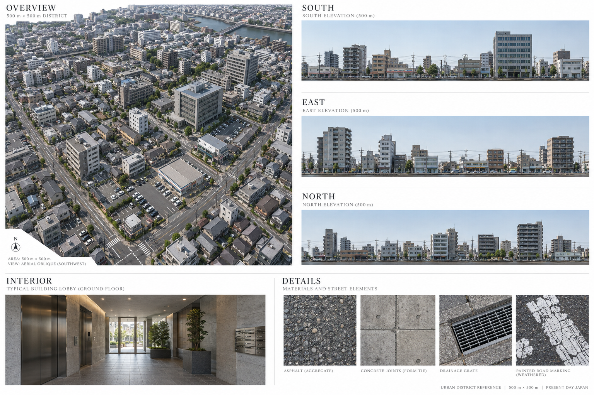
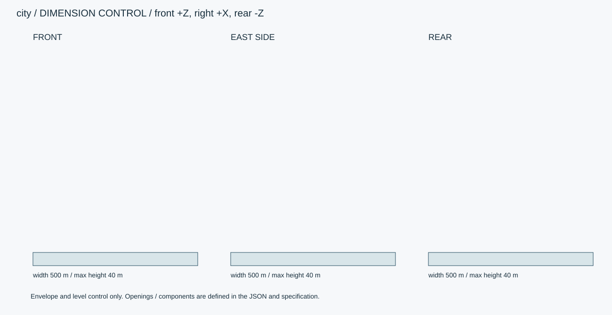
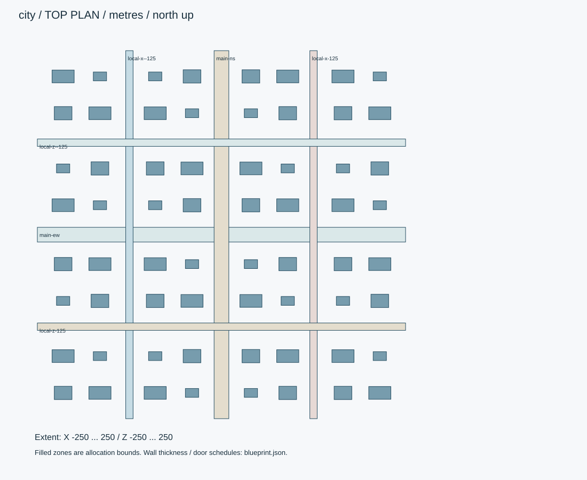

# 汐見町・500m街区

日本の現代的な住宅・商業混在街区。500mは一辺として採用。平坦地で構成し、街路・敷地・全建物の内部を設計する。

ID: `city` / category: `city` / kind: `environment` / status: `design_review`

## 設計の基準

右手系: +X東/画面右、+Y上、+Z南/正面。北=-Z。人物の解剖学的右は-X。
数値JSON > 寸法SVG > 仕様書 > 参考画像

```json
{
  "envelope_xyz_m": [
    500,
    40,
    500
  ],
  "origin": "地面・床面の平面中心。女性は裸足の両足接地中央。",
  "axis": "右手系: +X東/画面右、+Y上、+Z南/正面。北=-Z。人物の解剖学的右は-X。",
  "priority": "数値JSON > 寸法SVG > 仕様書 > 参考画像"
}
```

## 全体・正面・側面・背面・細部イメージ



画像はAI生成の参考図。寸法・配置・階数に不一致がある場合は数値仕様を優先する。実モデルを検証した画像ではない。





## 平面区画

|ID|X/Z範囲（m）|用途|
|---|---|---|
|main-ew|[-250, -10, 250, 10]|東西幹線: 車道12m+歩道各4m|
|main-ns|[-10, -250, 10, 250]|南北幹線: 車道12m+歩道各4m|
|local-x--125|[-130, -250, -120, 250]|生活道路: 車道6m+歩道各2m|
|local-x-125|[120, -250, 130, 250]|生活道路: 車道6m+歩道各2m|
|local-z--125|[-250, -130, 250, -120]|生活道路: 車道6m+歩道各2m|
|local-z-125|[-250, 120, 250, 130]|生活道路: 車道6m+歩道各2m|

## 形状・微細構造

- 合計64棟。マンション・コンビニ・オフィスの3設計を再利用し、位置をplacementsで確定。500m四方の外にはモデルを作らない。
- 歩道を除く街区の空地は植栽・駐車場・搬入路に使用。街灯は生活道路沿い25mピッチ、電柱35mピッチ。交差点周囲8mは配置禁止。
- 道路区画線幅150mm、車線3m、横断歩道縞450mm/間450mm。形状はゲーム用設計値で交通規制・施工図ではない。
- 街区LODは外観共有メッシュと屋内別チャンク。全建物に床・壁・階段・入口・固定設備を用意し、家具の反復配置は別レイヤー。

## パーツ分解

|ID|名称|中心XYZ（m）|サイズXYZ（m）|材質・備考|
|---|---|---|---|---|
|ground|地盤|[0, -0.15, 0]|[500, 0.3, 500]|asphalt / |
|curb|縁石標準|[0, 0.075, 0]|[1, 0.15, 0.18]|concrete / 曲線部は別部品。歩道上面150mm。|

包絡パーツは中実メッシュの指示ではない。建物は外壁・内壁・床・天井・開口・建具・固定設備へ分解する。

## PBR材質・テクスチャ

|材質|色 sRGB|Roughness|Metallic|微細構造|
|---|---|---|---|---|
|asphalt|#434647|[0.8, 0.95]|0|骨材2–12mm、路面法線振幅0.8mm、補修パッチは別マスク。白線厚1.5mm、摩耗15%。|
|concrete|#B6B5B0|[0.65, 0.85]|0|型枠目地900×1800mm、Pコン径22mm・深さ3mm。雨筋は上端と排水近傍だけ。大域変形は最大1mm。|
|tile|#D7D3C8|[0.35, 0.55]|0|外壁45×95mm、目地5mm・深さ2mm。色差は明度±3%。床用は300角・目地3mm。|
|metal|#45494A|[0.25, 0.4]|1|アルミ・ステンレス。ヘアラインを部材長手方向へ。切断端ベベル0.5–1mm、汚れは継ぎ目に限定。|
|glass|#D7E2E0|[0.03, 0.12]|0|建築ガラス厚6–12mm。透明・反射を別設定、IOR目標1.5。透過は現行APIとの差分実装対象。汚れ1%以下。|
|paint|#E5E4DA|[0.45, 0.65]|0|塗装鋼板は非金属の塗膜として扱う。下地金属露出は角の面積0.3%以下。|

数値は制作初期値。色・粗さ・法線・金属度は別マップ。0.5mm未満の凹凸は原則法線、輪郭に現れる縫い目・溝・欠けは形状で表す。

## 可動部

|ID|方式|支点XYZ（m）|軸|範囲|動作|
|---|---|---|---|---|---|

角度範囲は読みやすさのため度。promodelerへ渡す際はラジアンへ変換。支点は閉じた状態・1階のローカル座標、階・住戸ごとに平行移動する。

## 実装と納品条件

```json
{
  "engine": "Unity / HDRP を主想定。バージョンはモデル実装時に固定。",
  "exports": [
    "編集可能な制作ソース",
    "GLB（形状・PBR・ベイクした骨アニメ）",
    "Unity用物理設定",
    "検証PNGとMP4"
  ],
  "triangles_lod0_max": 8000000,
  "texture_resolution_max": 4096,
  "texture_policy": "共有材2K、主役・顔4K。BaseColor=sRGB、Normal/Roughness/Metallic=linear。AOをBaseColorへ焼き込まない。",
  "texel_density_px_per_m": 512,
  "lod_ratios": [
    1,
    0.5,
    0.2,
    0.08
  ],
  "triangles_visible_target": 2000000,
  "streaming_cell_m": 50,
  "texture_resident_budget_mib": 768
}
```

`blueprint.json` は設計データであり、promodelerのレシピJSONと互換ではない。実装担当がPythonのAsset/Part/Rigへ変換する。

## 未実装機能・差分

- チャンクストリーミング、インスタンス共有、屋内カリングはランタイム側実装。
- 参考画像中の河川・橋・背景の街は本設計の生成対象外。正確な配置はlayout.svgを優先。

## 受入基準（モデル生成後に検証）

- [ ] 全64棟の配置矩形が道路・他建物と交差しない。
- [ ] 250m四方の4象限を歩行し、全入口から内部へ移動できる。
- [ ] 500m境界で切断面や浮いた道路端がない。
- [ ] 生成後にGLBと編集可能なソースを再読込し、単位・法線・UV・パーツIDを照合。
- [ ] 画像は設計参考であり実モデルの検証証拠ではない。モデル未生成のチェックは未確認のまま。
- [ ] LOD0予算、法線マップの接線系、透明材のソート、衝突形状を対象エンジンで確認。

## 管理・権利情報

```json
{
  "tags": [
    "日本",
    "現代",
    "写実",
    "city"
  ],
  "usage": "PC向けリアルタイム探索・映像用のモデル設計",
  "license": "独自制作物として管理。現段階は私有・配布許諾未設定。販売用ライセンスは公開時に別途設定。",
  "approval": "モデル未生成・販売未承認"
}
```
