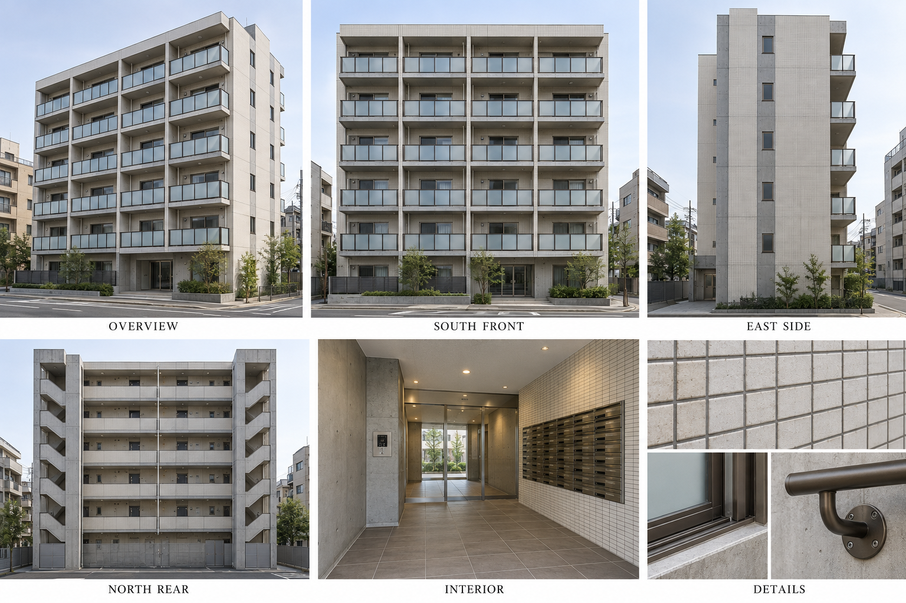
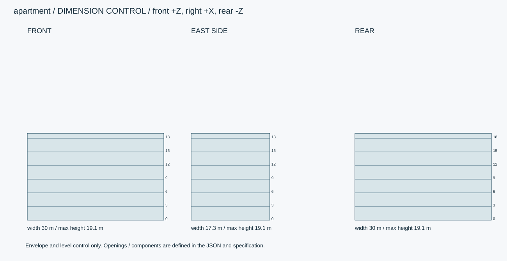
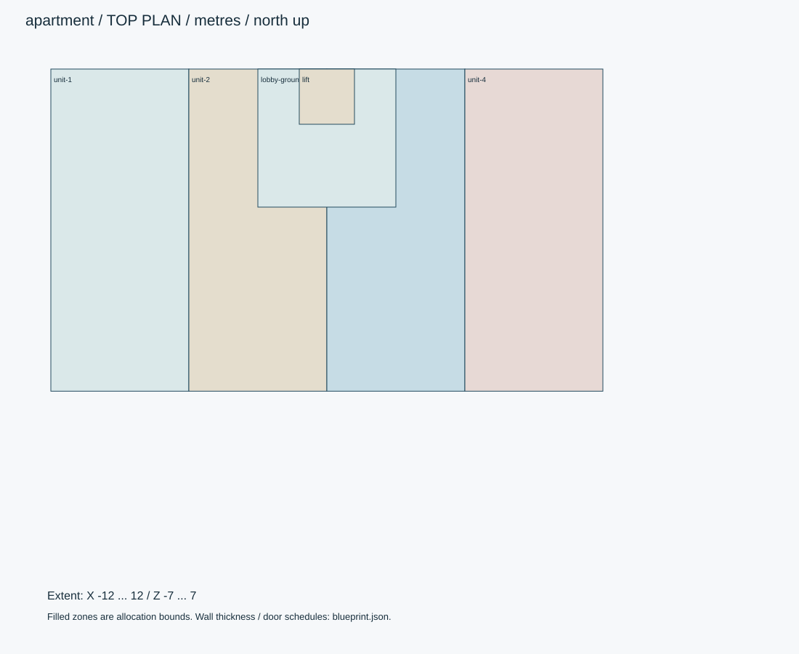

# 汐見レジデンス・6階建て

本体24×14m、南バルコニー1.5m・北廊下1.8m、東西階段各3mを付加。北入り共用動線と南向き住戸。

ID: `apartment` / category: `apartment-building` / kind: `architecture` / status: `design_review`

## 設計の基準

右手系: +X東/画面右、+Y上、+Z南/正面。北=-Z。人物の解剖学的右は-X。
数値JSON > 寸法SVG > 仕様書 > 参考画像

```json
{
  "envelope_xyz_m": [
    30,
    19.1,
    17.3
  ],
  "origin": "地面・床面の平面中心。女性は裸足の両足接地中央。",
  "axis": "右手系: +X東/画面右、+Y上、+Z南/正面。北=-Z。人物の解剖学的右は-X。",
  "priority": "数値JSON > 寸法SVG > 仕様書 > 参考画像",
  "body_xyz_m": [
    24,
    18,
    14
  ],
  "floor_to_floor_m": 3,
  "clear_ceiling_m": 2.55,
  "slab_m": 0.2,
  "outer_wall_m": 0.2,
  "partition_m": 0.12,
  "parapet_m": 1.1
}
```

## 全体・正面・側面・背面・細部イメージ



画像はAI生成の参考図。寸法・配置・階数に不一致がある場合は数値仕様を優先する。実モデルを検証した画像ではない。





## 平面区画

|ID|X/Z範囲（m）|用途|
|---|---|---|
|unit-1|[-12, -7, -6, 7]|2–6階: 住戸6×14mグロス。北玄関、水回り、中央廊下、南LDK。|
|unit-2|[-6, -7, 0, 7]|2–6階: 住戸6×14mグロス。北玄関、水回り、中央廊下、南LDK。|
|unit-3|[0, -7, 6, 7]|2–6階: 住戸6×14mグロス。北玄関、水回り、中央廊下、南LDK。|
|unit-4|[6, -7, 12, 7]|2–6階: 住戸6×14mグロス。北玄関、水回り、中央廊下、南LDK。|
|lobby-ground|[-3, -7, 3, -1]|1階中央共用玄関・EV前室。1階は両端2住戸、中央は共用部。|
|lift|[-1.2, -7, 1.2, -4.6]|EVシャフト2.4×2.4m、全階連続|

## 形状・微細構造

- 22住戸: 上階4戸×5階+1階2戸。1階中央2ベイはロビー・管理・設備。6階・4ベイの反復が正。
- 外壁は小口タイル。手すり高さ1.1m、ガラス8mm、笠木幅60mm。防水床に排水勾配1/100。
- 階段は各階18段、蹴上0.166667m、踏面0.28m、2ラン各9段、踊場奥行1.2m、有効幅1.1m。
- EVは北廊下側の共用設備として住戸から切り欠く。該当住戸の北側収納を縮小して整合させる。

## パーツ分解

|ID|名称|中心XYZ（m）|サイズXYZ（m）|材質・備考|
|---|---|---|---|---|
|body|本体包絡|[0, 9, 0]|[24, 18, 14]|tile / 中実Boxではない。各階床・外壁・開口へ分解。|
|balcony|南バルコニー範囲|[0, 9, 7.75]|[24, 18, 1.5]|concrete / |
|corridor|北廊下範囲|[0, 9, -7.9]|[24, 18, 1.8]|concrete / |
|stair-west|西折返し階段コア|[-13.5, 9, -3]|[3, 18, 8]|concrete / |
|stair-east|東折返し階段コア|[13.5, 9, -3]|[3, 18, 8]|concrete / |

包絡パーツは中実メッシュの指示ではない。建物は外壁・内壁・床・天井・開口・建具・固定設備へ分解する。

## PBR材質・テクスチャ

|材質|色 sRGB|Roughness|Metallic|微細構造|
|---|---|---|---|---|
|concrete|#B6B5B0|[0.65, 0.85]|0|型枠目地900×1800mm、Pコン径22mm・深さ3mm。雨筋は上端と排水近傍だけ。大域変形は最大1mm。|
|tile|#D7D3C8|[0.35, 0.55]|0|外壁45×95mm、目地5mm・深さ2mm。色差は明度±3%。床用は300角・目地3mm。|
|metal|#45494A|[0.25, 0.4]|1|アルミ・ステンレス。ヘアラインを部材長手方向へ。切断端ベベル0.5–1mm、汚れは継ぎ目に限定。|
|glass|#D7E2E0|[0.03, 0.12]|0|建築ガラス厚6–12mm。透明・反射を別設定、IOR目標1.5。透過は現行APIとの差分実装対象。汚れ1%以下。|
|wood|#C8AB80|[0.35, 0.5]|0|オーク床幅90mm、長さ900mm、継ぎ目0.8mm。木目は長手方向、表面起伏0.1mm以下。|
|wallpaper|#EEECE5|[0.8, 0.9]|0|ビニルクロスの梨地。高さ0.15mm、継ぎ目は幅900mmごと、遠景は法線に統合。|

数値は制作初期値。色・粗さ・法線・金属度は別マップ。0.5mm未満の凹凸は原則法線、輪郭に現れる縫い目・溝・欠けは形状で表す。

## 可動部

|ID|方式|支点XYZ（m）|軸|範囲|動作|
|---|---|---|---|---|---|
|entry-door|hinge|[-0.9, 0, -7.02]|[0, 1, 0]|[0, 100] degree|幅1.8m両開き、右扉は符号反転。|
|unit-south-sash|slide|[-9, 1.1, 7]|[1, 0, 0]|[0, 1.1] m|2.4×2.1m掃出窓、各住戸ローカルへ複製。|
|elevator|slide|[0, 0, -5.8]|[0, 1, 0]|[0, 15] m|籠の上下。扉は別Xスライド±0.5m、扉閉鎖後のみ移動。|

角度範囲は読みやすさのため度。promodelerへ渡す際はラジアンへ変換。支点は閉じた状態・1階のローカル座標、階・住戸ごとに平行移動する。

## 住戸内の区画

```json
{
  "gross_xz_m": [
    6,
    14
  ],
  "zones_local_xz_m": {
    "entry": [
      0,
      0,
      6,
      2
    ],
    "bath_laundry": [
      0,
      2,
      2.4,
      5
    ],
    "bedroom": [
      0,
      5,
      2.4,
      8
    ],
    "hall": [
      2.4,
      2,
      3.6,
      8
    ],
    "kitchen_storage": [
      3.6,
      2,
      6,
      8
    ],
    "living": [
      0,
      8,
      6,
      14
    ]
  },
  "coordinates": "住戸北西角起点、+u東/+v南。壁厚を各ゾーンから差し引く。",
  "doors": "玄関幅0.9m、居室0.8m、水回り0.7m。中央廊下から各室へ接続。"
}
```

## 実装と納品条件

```json
{
  "engine": "Unity / HDRP を主想定。バージョンはモデル実装時に固定。",
  "exports": [
    "編集可能な制作ソース",
    "GLB（形状・PBR・ベイクした骨アニメ）",
    "Unity用物理設定",
    "検証PNGとMP4"
  ],
  "triangles_lod0_max": 650000,
  "texture_resolution_max": 4096,
  "texture_policy": "共有材2K、主役・顔4K。BaseColor=sRGB、Normal/Roughness/Metallic=linear。AOをBaseColorへ焼き込まない。",
  "texel_density_px_per_m": 512,
  "lod_ratios": [
    1,
    0.5,
    0.2,
    0.08
  ]
}
```

`blueprint.json` は設計データであり、promodelerのレシピJSONと互換ではない。実装担当がPythonのAsset/Part/Rigへ変換する。

## 未実装機能・差分


## 受入基準（モデル生成後に検証）

- [ ] 6階の床高さ0/3/6/9/12/15m、屋根18m。
- [ ] 全22住戸の浴室・便所・キッチン・建具を実装し、独立した06-roomを流用しない。
- [ ] 扉・窓全開時に手すり・壁・隣扉と干渉しない。
- [ ] 生成後にGLBと編集可能なソースを再読込し、単位・法線・UV・パーツIDを照合。
- [ ] 画像は設計参考であり実モデルの検証証拠ではない。モデル未生成のチェックは未確認のまま。
- [ ] LOD0予算、法線マップの接線系、透明材のソート、衝突形状を対象エンジンで確認。

## 管理・権利情報

```json
{
  "tags": [
    "日本",
    "現代",
    "写実",
    "apartment-building"
  ],
  "usage": "PC向けリアルタイム探索・映像用のモデル設計",
  "license": "独自制作物として管理。現段階は私有・配布許諾未設定。販売用ライセンスは公開時に別途設定。",
  "approval": "モデル未生成・販売未承認"
}
```
