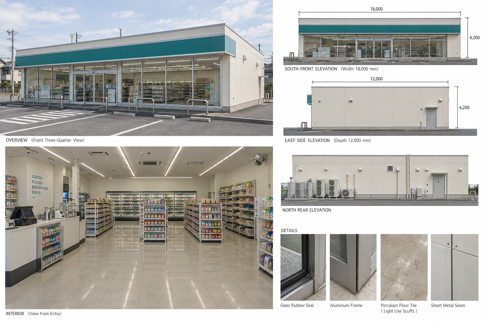
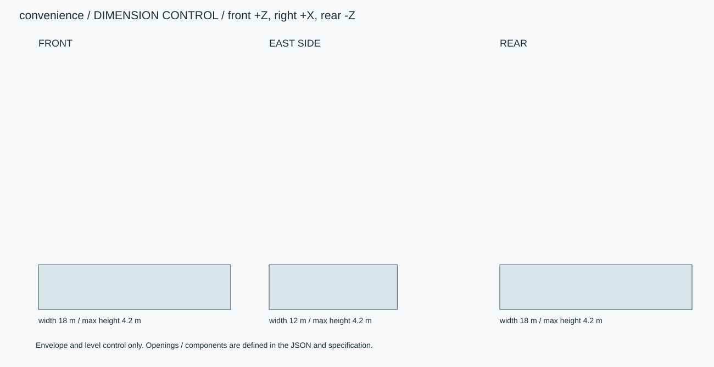
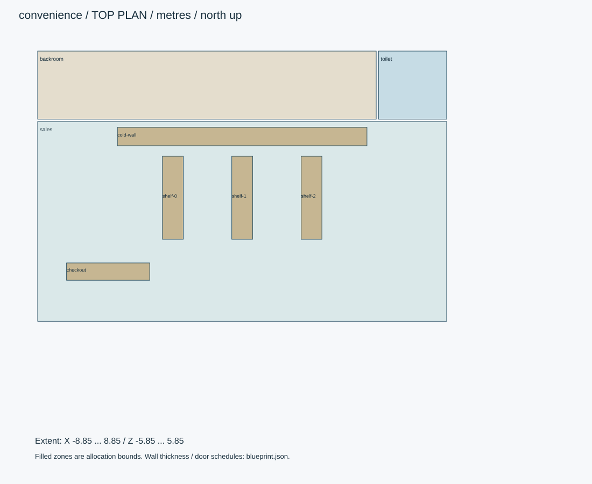

# 汐見マート・平屋店舗

架空ブランドのコンビニ。売場・バックヤード・トイレを含む。看板は無地の青緑。

ID: `convenience` / category: `convenience-store` / kind: `architecture` / status: `design_review`

## 設計の基準

右手系: +X東/画面右、+Y上、+Z南/正面。北=-Z。人物の解剖学的右は-X。
数値JSON > 寸法SVG > 仕様書 > 参考画像

```json
{
  "envelope_xyz_m": [
    18,
    4.2,
    12
  ],
  "origin": "地面・床面の平面中心。女性は裸足の両足接地中央。",
  "axis": "右手系: +X東/画面右、+Y上、+Z南/正面。北=-Z。人物の解剖学的右は-X。",
  "priority": "数値JSON > 寸法SVG > 仕様書 > 参考画像",
  "clear_ceiling_m": 2.8,
  "outer_wall_m": 0.15,
  "partition_m": 0.1,
  "roof_slab_m": 0.18
}
```

## 全体・正面・側面・背面・細部イメージ



画像はAI生成の参考図。寸法・配置・階数に不一致がある場合は数値仕様を優先する。実モデルを検証した画像ではない。





## 平面区画

|ID|X/Z範囲（m）|用途|
|---|---|---|
|sales|[-8.85, -2.8, 8.85, 5.85]|売場|
|backroom|[-8.85, -5.85, 5.8, -2.9]|在庫・搬入・従業員通路|
|toilet|[5.9, -5.85, 8.85, -2.9]|客用便所・洗面|

## 形状・微細構造

- 南正面のガラスは1.5mモジュール。腰壁0.15m、ガラス上端2.8m、看板下端3.05m・高さ0.65m。
- 床300mm角タイル。天井600mm角、照明1200×150mm。冷蔵庫下部に通気グリル幅8mm。
- 商品は無地パッケージ形状を別ファイルで参照。画像の文字・パッケージは設計対象外。部屋モデルの家具除外指定とは別扱い。
- 棚とレジは取外し可能パーツ。固定設備を含む初期レイアウトで、通路有効幅1.2m以上を確保。

## パーツ分解

|ID|名称|中心XYZ（m）|サイズXYZ（m）|材質・備考|
|---|---|---|---|---|
|checkout|固定レジ台|[-5.8, 0.45, 3.7]|[3.6, 0.9, 0.75]|paint / |
|cold-wall|壁面冷蔵陳列|[0, 1.05, -2.15]|[10.8, 2.1, 0.8]|metal / |
|shelf-0|陳列棚|[-3, 0.75, 0.5]|[0.9, 1.5, 3.6]|paint / 棚板厚25mm、棚間隔300mm。商品は別サブアセット。|
|shelf-1|陳列棚|[0, 0.75, 0.5]|[0.9, 1.5, 3.6]|paint / 棚板厚25mm、棚間隔300mm。商品は別サブアセット。|
|shelf-2|陳列棚|[3, 0.75, 0.5]|[0.9, 1.5, 3.6]|paint / 棚板厚25mm、棚間隔300mm。商品は別サブアセット。|

包絡パーツは中実メッシュの指示ではない。建物は外壁・内壁・床・天井・開口・建具・固定設備へ分解する。

## PBR材質・テクスチャ

|材質|色 sRGB|Roughness|Metallic|微細構造|
|---|---|---|---|---|
|paint|#E5E4DA|[0.45, 0.65]|0|塗装鋼板は非金属の塗膜として扱う。下地金属露出は角の面積0.3%以下。|
|glass|#D7E2E0|[0.03, 0.12]|0|建築ガラス厚6–12mm。透明・反射を別設定、IOR目標1.5。透過は現行APIとの差分実装対象。汚れ1%以下。|
|metal|#45494A|[0.25, 0.4]|1|アルミ・ステンレス。ヘアラインを部材長手方向へ。切断端ベベル0.5–1mm、汚れは継ぎ目に限定。|
|tile|#D7D3C8|[0.35, 0.55]|0|外壁45×95mm、目地5mm・深さ2mm。色差は明度±3%。床用は300角・目地3mm。|
|concrete|#B6B5B0|[0.65, 0.85]|0|型枠目地900×1800mm、Pコン径22mm・深さ3mm。雨筋は上端と排水近傍だけ。大域変形は最大1mm。|

数値は制作初期値。色・粗さ・法線・金属度は別マップ。0.5mm未満の凹凸は原則法線、輪郭に現れる縫い目・溝・欠けは形状で表す。

## 可動部

|ID|方式|支点XYZ（m）|軸|範囲|動作|
|---|---|---|---|---|---|
|entry-left|slide|[-0.45, 0, 6]|[1, 0, 0]|[-0.9, 0] m|幅0.9×高2.2m。右扉は+0.9m。開閉1.2秒、待機2秒。|
|delivery|hinge|[6.5, 0, -6]|[0, 1, 0]|[0, 100] degree|搬入扉1.2×2.1m、外開き。|
|cooler|hinge|[-5.4, 0, -1.75]|[0, 1, 0]|[0, 95] degree|幅0.6mずつ。各扉に独立ピボット。|

角度範囲は読みやすさのため度。promodelerへ渡す際はラジアンへ変換。支点は閉じた状態・1階のローカル座標、階・住戸ごとに平行移動する。

## 実装と納品条件

```json
{
  "engine": "Unity / HDRP を主想定。バージョンはモデル実装時に固定。",
  "exports": [
    "編集可能な制作ソース",
    "GLB（形状・PBR・ベイクした骨アニメ）",
    "Unity用物理設定",
    "検証PNGとMP4"
  ],
  "triangles_lod0_max": 350000,
  "texture_resolution_max": 4096,
  "texture_policy": "共有材2K、主役・顔4K。BaseColor=sRGB、Normal/Roughness/Metallic=linear。AOをBaseColorへ焼き込まない。",
  "texel_density_px_per_m": 512,
  "lod_ratios": [
    1,
    0.5,
    0.2,
    0.08
  ]
}
```

`blueprint.json` は設計データであり、promodelerのレシピJSONと互換ではない。実装担当がPythonのAsset/Part/Rigへ変換する。

## 未実装機能・差分


## 受入基準（モデル生成後に検証）

- [ ] 売場→バックヤードの0.9m扉と売場→便所の0.8m扉を確保。
- [ ] 冷蔵庫扉を95度まで開いても棚と干渉しない。
- [ ] 入口から全棚を回れる連続経路を確保。
- [ ] 生成後にGLBと編集可能なソースを再読込し、単位・法線・UV・パーツIDを照合。
- [ ] 画像は設計参考であり実モデルの検証証拠ではない。モデル未生成のチェックは未確認のまま。
- [ ] LOD0予算、法線マップの接線系、透明材のソート、衝突形状を対象エンジンで確認。

## 管理・権利情報

```json
{
  "tags": [
    "日本",
    "現代",
    "写実",
    "convenience-store"
  ],
  "usage": "PC向けリアルタイム探索・映像用のモデル設計",
  "license": "独自制作物として管理。現段階は私有・配布許諾未設定。販売用ライセンスは公開時に別途設定。",
  "approval": "モデル未生成・販売未承認"
}
```
