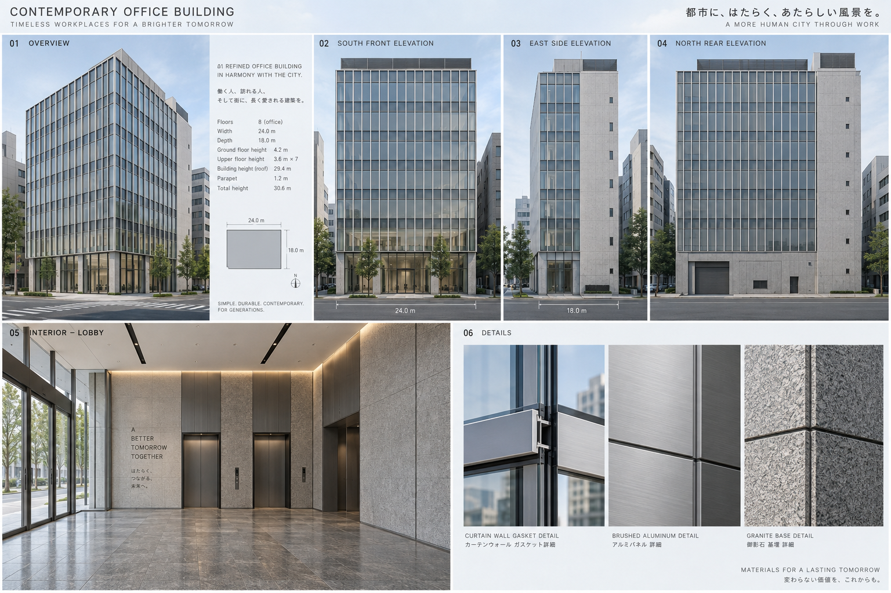
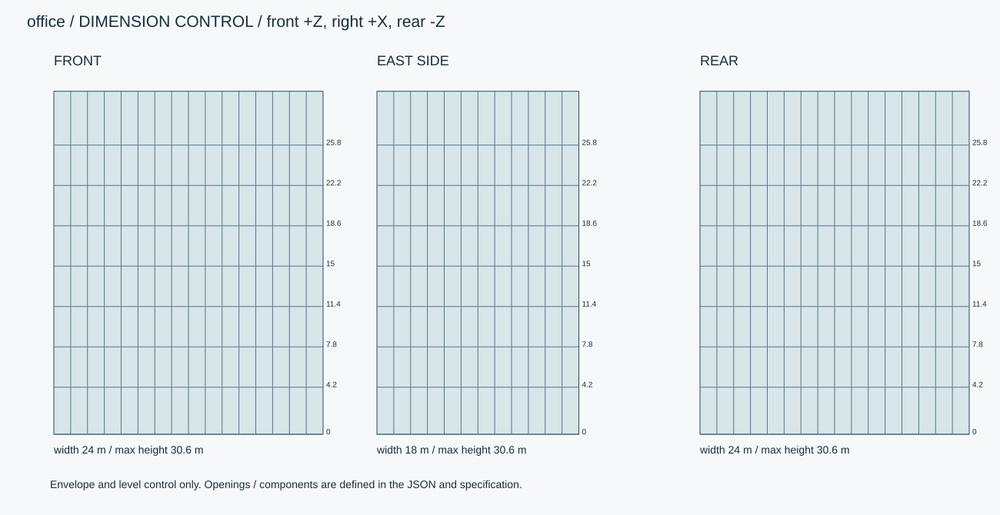
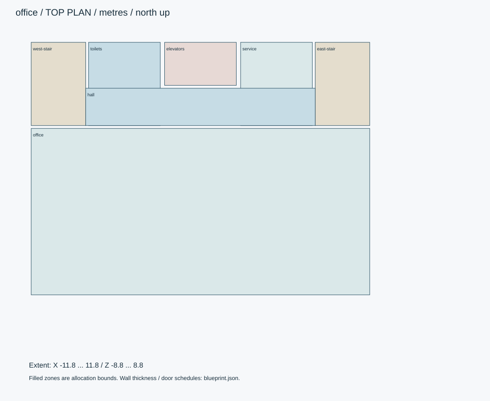

# 汐見スクエア・8階オフィス

現代日本の中規模オフィス。全8階、1階ロビー・上階貸室・水回り・階段・EVを含む。

ID: `office` / category: `office-building` / kind: `architecture` / status: `design_review`

## 設計の基準

右手系: +X東/画面右、+Y上、+Z南/正面。北=-Z。人物の解剖学的右は-X。
数値JSON > 寸法SVG > 仕様書 > 参考画像

```json
{
  "envelope_xyz_m": [
    24,
    30.6,
    18
  ],
  "origin": "地面・床面の平面中心。女性は裸足の両足接地中央。",
  "axis": "右手系: +X東/画面右、+Y上、+Z南/正面。北=-Z。人物の解剖学的右は-X。",
  "priority": "数値JSON > 寸法SVG > 仕様書 > 参考画像",
  "floor_levels_m": [
    0,
    4.2,
    7.8,
    11.4,
    15,
    18.6,
    22.2,
    25.8
  ],
  "roof_m": 29.4,
  "parapet_m": 1.2,
  "slab_m": 0.25,
  "clear_ceiling_ground_m": 3.6,
  "clear_ceiling_upper_m": 3,
  "outer_wall_m": 0.2
}
```

## 全体・正面・側面・背面・細部イメージ



画像はAI生成の参考図。寸法・配置・階数に不一致がある場合は数値仕様を優先する。実モデルを検証した画像ではない。





## 平面区画

|ID|X/Z範囲（m）|用途|
|---|---|---|
|office|[-11.8, -2.8, 11.8, 8.8]|貸室・1階ロビー。可動家具なし。|
|west-stair|[-11.8, -8.8, -8, -3]|避難階段|
|toilets|[-7.8, -8.8, -2.8, -3]|トイレ・給湯|
|elevators|[-2.5, -8.8, 2.5, -5.8]|EV2基|
|service|[2.8, -8.8, 7.8, -3]|機械・清掃・EPS|
|east-stair|[8, -8.8, 11.8, -3]|避難階段|
|hall|[-8, -5.6, 8, -3]|中央共用通路。設備室の南側を切り欠く。|

## 形状・微細構造

- ガラス面は平面のまま色・粗さに小差。板を波打たせて写実感を作らない。シール目地15mm、ガスケット6mm。
- 1階床は600角石材。上階床は500角カーペットタイル、OA床高100mmを別レイヤー。
- 上階階段は20段×0.18m、1階は24段×0.175m。踏面0.28m、折返し、幅1.2m、踊場1.2m。
- 上階全室は空室内装。階ごとに床・天井・壁・建具・水回りを用意。ガラス越しに単色空洞が見えない。

## パーツ分解

|ID|名称|中心XYZ（m）|サイズXYZ（m）|材質・備考|
|---|---|---|---|---|
|envelope|全体包絡|[0, 15.3, 0]|[24, 30.6, 18]|glass / スラブ・柱・マリオンを別生成。|
|facade-module|標準マリオン|[0, 1.8, 9]|[0.06, 3.6, 0.15]|metal / 幅1.5mピッチ。正面16列、側面12列。|
|roof-screen|屋上設備目隠し|[0, 30, 0]|[8, 1.2, 6]|metal / 屋上高さ上限30.6m。|

包絡パーツは中実メッシュの指示ではない。建物は外壁・内壁・床・天井・開口・建具・固定設備へ分解する。

## PBR材質・テクスチャ

|材質|色 sRGB|Roughness|Metallic|微細構造|
|---|---|---|---|---|
|glass|#D7E2E0|[0.03, 0.12]|0|建築ガラス厚6–12mm。透明・反射を別設定、IOR目標1.5。透過は現行APIとの差分実装対象。汚れ1%以下。|
|metal|#45494A|[0.25, 0.4]|1|アルミ・ステンレス。ヘアラインを部材長手方向へ。切断端ベベル0.5–1mm、汚れは継ぎ目に限定。|
|concrete|#B6B5B0|[0.65, 0.85]|0|型枠目地900×1800mm、Pコン径22mm・深さ3mm。雨筋は上端と排水近傍だけ。大域変形は最大1mm。|
|tile|#D7D3C8|[0.35, 0.55]|0|外壁45×95mm、目地5mm・深さ2mm。色差は明度±3%。床用は300角・目地3mm。|
|paint|#E5E4DA|[0.45, 0.65]|0|塗装鋼板は非金属の塗膜として扱う。下地金属露出は角の面積0.3%以下。|

数値は制作初期値。色・粗さ・法線・金属度は別マップ。0.5mm未満の凹凸は原則法線、輪郭に現れる縫い目・溝・欠けは形状で表す。

## 可動部

|ID|方式|支点XYZ（m）|軸|範囲|動作|
|---|---|---|---|---|---|
|lobby-entry|slide|[-0.6, 0, 9]|[1, 0, 0]|[-1.2, 0] m|右扉は逆方向、クリア幅2.4m。|
|stair-door|hinge|[-8, 0, -3]|[0, 1, 0]|[0, 100] degree|幅0.9×高2.1m。踊場の有効幅を侵さない。|
|lift-cabin|slide|[-1.25, 0, -7.3]|[0, 1, 0]|[0, 25.8] m|8停止点。ドア閉鎖→移動→停止→開放の順。|

角度範囲は読みやすさのため度。promodelerへ渡す際はラジアンへ変換。支点は閉じた状態・1階のローカル座標、階・住戸ごとに平行移動する。

## 実装と納品条件

```json
{
  "engine": "Unity / HDRP を主想定。バージョンはモデル実装時に固定。",
  "exports": [
    "編集可能な制作ソース",
    "GLB（形状・PBR・ベイクした骨アニメ）",
    "Unity用物理設定",
    "検証PNGとMP4"
  ],
  "triangles_lod0_max": 900000,
  "texture_resolution_max": 4096,
  "texture_policy": "共有材2K、主役・顔4K。BaseColor=sRGB、Normal/Roughness/Metallic=linear。AOをBaseColorへ焼き込まない。",
  "texel_density_px_per_m": 512,
  "lod_ratios": [
    1,
    0.5,
    0.2,
    0.08
  ]
}
```

`blueprint.json` は設計データであり、promodelerのレシピJSONと互換ではない。実装担当がPythonのAsset/Part/Rigへ変換する。

## 未実装機能・差分


## 受入基準（モデル生成後に検証）

- [ ] 床レベルはfloor_levels_mに完全一致。
- [ ] 東西2階段とEV2基に全階から到達できる。
- [ ] 前面16列・側面12列のマリオン割付を寸法図で照合。
- [ ] 生成後にGLBと編集可能なソースを再読込し、単位・法線・UV・パーツIDを照合。
- [ ] 画像は設計参考であり実モデルの検証証拠ではない。モデル未生成のチェックは未確認のまま。
- [ ] LOD0予算、法線マップの接線系、透明材のソート、衝突形状を対象エンジンで確認。

## 管理・権利情報

```json
{
  "tags": [
    "日本",
    "現代",
    "写実",
    "office-building"
  ],
  "usage": "PC向けリアルタイム探索・映像用のモデル設計",
  "license": "独自制作物として管理。現段階は私有・配布許諾未設定。販売用ライセンスは公開時に別途設定。",
  "approval": "モデル未生成・販売未承認"
}
```
