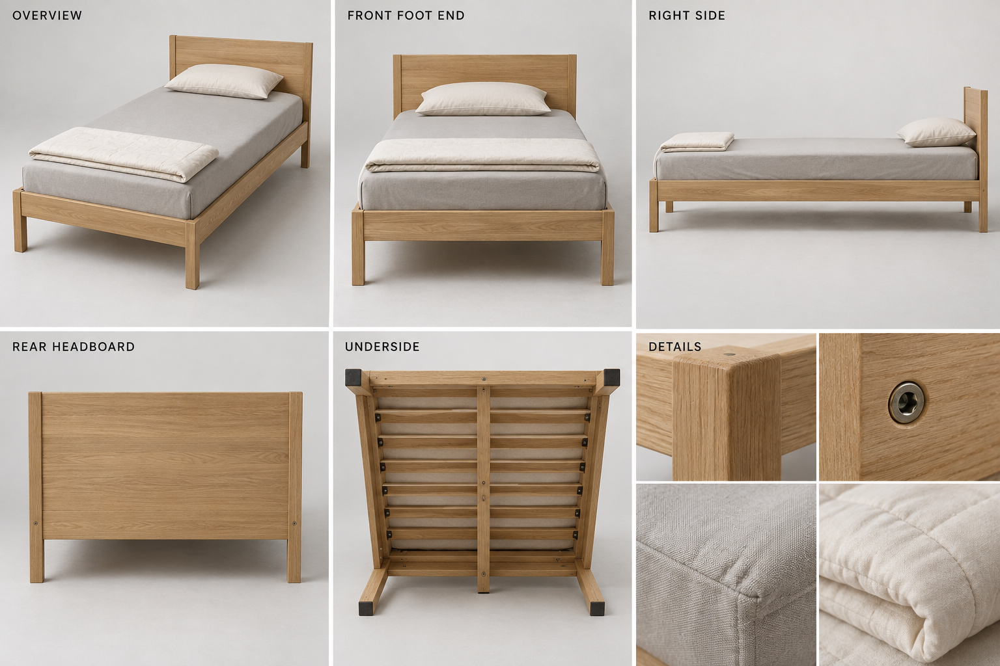
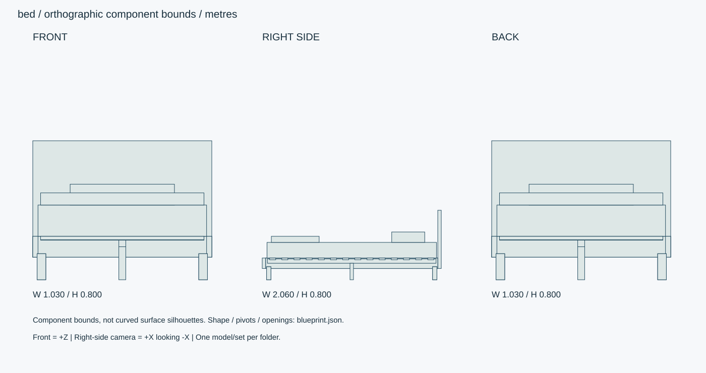

# オークフレーム・シングルベッド

1K向けのシングルベッド。オークフレーム・マットレス・枕1個・薄掛け布団を独立パーツで構成。

ID: `bed` / category: `bed` / kind: `prop` / status: `design_review`

## 設計の基準

右手系: +X右、+Y上、+Z正面。sideは+Xから-Xへ、画面右が-Z。
数値JSON > 寸法SVG > 仕様文 > 参考画像

```json
{
  "envelope_xyz_m": [
    1.03,
    0.8,
    2.06
  ],
  "origin": "床/設置面の中心、閉じた基準状態。天井灯のみ天井取付面中心。",
  "axis": "右手系: +X右、+Y上、+Z正面。sideは+Xから-Xへ、画面右が-Z。",
  "priority": "数値JSON > 寸法SVG > 仕様文 > 参考画像",
  "mattress_xyz_m": [
    0.97,
    0.18,
    1.95
  ],
  "mattress_top_m": 0.43,
  "headboard_top_m": 0.8,
  "under_frame_clearance_m": 0.13
}
```

## 全体・正面・側面・背面・細部イメージ



画像はAI生成の参考図。寸法・配置・階数に不一致がある場合は数値仕様を優先する。実モデルを検証した画像ではない。




## 形状・微細構造

- ベッドの正面は足元+Z、背面はヘッドボード-Z。左右・高さを全ビューで統一。
- フレーム継手は脚とレールのボルト留め、M6外観表現・六角穴4mm。すのこ14枚と中央支持脚1本。
- マットレスの縫合線は上端から20mm、キルティング120mmピッチ・深さ2mm。側面生地の織り方向を揃える。
- 寝具はセットに含めるが別メッシュ。空室モデルには組み込まない。
- 基準状態は静的モデル。構造上の関節や開閉機構はなし。任意の圧縮変形やパーツ移動は別仕様として記載。

## パーツ分解

|ID|名称|中心XYZ（m）|サイズXYZ（m）|材質・備考|
|---|---|---|---|---|
|headboard|ヘッドボード|[0, 0.465, -1.01]|[1.03, 0.67, 0.04]|oak / 角R6mm。|
|footboard|フットボード|[0, 0.19, 1.01]|[1.03, 0.12, 0.04]|oak / |
|rail-left|左側フレーム|[-0.5, 0.19, 0]|[0.03, 0.12, 1.98]|oak / |
|rail-right|右側フレーム|[0.5, 0.19, 0]|[0.03, 0.12, 1.98]|oak / |
|center-beam|中央支持桟|[0, 0.215, 0]|[0.04, 0.05, 1.94]|oak / |
|mattress|マットレス|[0, 0.34, 0]|[0.97, 0.18, 1.95]|fabric / 角R35mm。圧縮芯は非表示。|
|pillow|枕|[0, 0.49, -0.65]|[0.6, 0.12, 0.38]|fabric / 縁のパイピング2mm。|
|duvet-folded|薄掛け布団（畳み）|[0, 0.465, 0.65]|[0.94, 0.07, 0.55]|fabric / 厚み・縫い目を表現。|
|leg-0-0|脚|[-0.465, 0.075, -0.955]|[0.05, 0.15, 0.05]|oak / |
|leg-0-1|脚|[-0.465, 0.075, 0.955]|[0.05, 0.15, 0.05]|oak / |
|leg-1-0|脚|[0.465, 0.075, -0.955]|[0.05, 0.15, 0.05]|oak / |
|leg-1-1|脚|[0.465, 0.075, 0.955]|[0.05, 0.15, 0.05]|oak / |
|slat-00|すのこ|[0, 0.24, -0.91]|[0.94, 0.02, 0.07]|oak / 等間隔、木目X方向。|
|slat-01|すのこ|[0, 0.24, -0.77]|[0.94, 0.02, 0.07]|oak / 等間隔、木目X方向。|
|slat-02|すのこ|[0, 0.24, -0.63]|[0.94, 0.02, 0.07]|oak / 等間隔、木目X方向。|
|slat-03|すのこ|[0, 0.24, -0.49]|[0.94, 0.02, 0.07]|oak / 等間隔、木目X方向。|
|slat-04|すのこ|[0, 0.24, -0.35]|[0.94, 0.02, 0.07]|oak / 等間隔、木目X方向。|
|slat-05|すのこ|[0, 0.24, -0.20999999999999996]|[0.94, 0.02, 0.07]|oak / 等間隔、木目X方向。|
|slat-06|すのこ|[0, 0.24, -0.06999999999999995]|[0.94, 0.02, 0.07]|oak / 等間隔、木目X方向。|
|slat-07|すのこ|[0, 0.24, 0.07000000000000006]|[0.94, 0.02, 0.07]|oak / 等間隔、木目X方向。|
|slat-08|すのこ|[0, 0.24, 0.21000000000000008]|[0.94, 0.02, 0.07]|oak / 等間隔、木目X方向。|
|slat-09|すのこ|[0, 0.24, 0.3500000000000002]|[0.94, 0.02, 0.07]|oak / 等間隔、木目X方向。|
|slat-10|すのこ|[0, 0.24, 0.4900000000000001]|[0.94, 0.02, 0.07]|oak / 等間隔、木目X方向。|
|slat-11|すのこ|[0, 0.24, 0.63]|[0.94, 0.02, 0.07]|oak / 等間隔、木目X方向。|
|slat-12|すのこ|[0, 0.24, 0.7700000000000001]|[0.94, 0.02, 0.07]|oak / 等間隔、木目X方向。|
|slat-13|すのこ|[0, 0.24, 0.9100000000000003]|[0.94, 0.02, 0.07]|oak / 等間隔、木目X方向。|
|center-foot|中央支持脚|[0, 0.095, 0]|[0.04, 0.19, 0.04]|oak / |

包絡パーツは中実メッシュの指示ではない。建物は外壁・内壁・床・天井・開口・建具・固定設備へ分解する。

## PBR材質・テクスチャ

|材質|色 sRGB|Roughness|Metallic|微細構造|
|---|---|---|---|---|
|oak|#C4A77E|[0.35, 0.5]|0|オークの長手木目。導管0.1–0.3mm、木口は繊維に直交。クリア塗装、擦れは接触縁のみ。|
|fabric|#CCCBC4|[0.7, 0.9]|0|綿混/ポリエステルの織り目0.4mm。色差±2%、毛羽は法線。縫い糸径0.25mm・ピッチ3mm。|
|foam|#E1DDD4|[0.8, 0.95]|0|露出しないクッション芯。圧縮変形の支持形状として管理。|
|metal|#45494A|[0.25, 0.4]|1|アルミ・ステンレス。ヘアラインを部材長手方向へ。切断端ベベル0.5–1mm、汚れは継ぎ目に限定。|

数値は制作初期値。色・粗さ・法線・金属度は別マップ。0.5mm未満の凹凸は原則法線、輪郭に現れる縫い目・溝・欠けは形状で表す。

## 可動部

|ID|方式|支点XYZ（m）|軸|範囲|動作|
|---|---|---|---|---|---|

角度範囲は読みやすさのため度。promodelerへ渡す際はラジアンへ変換。支点は閉じた状態・1階のローカル座標、階・住戸ごとに平行移動する。

## 検証クリップ

```json
[]
```

## 実装と納品条件

```json
{
  "engine": "Unity / HDRP を主想定。バージョンはモデル実装時に固定。",
  "exports": [
    "編集可能な制作ソース",
    "GLB（形状・PBR・ベイクした骨アニメ）",
    "Unity用物理設定",
    "検証PNGとMP4"
  ],
  "triangles_lod0_max": 65000,
  "texture_resolution_max": 2048,
  "texture_policy": "共有材2K、主役・顔4K。BaseColor=sRGB、Normal/Roughness/Metallic=linear。AOをBaseColorへ焼き込まない。",
  "texel_density_px_per_m": 1024,
  "lod_ratios": [
    1,
    0.5,
    0.2,
    0.08
  ],
  "texture_resident_budget_mib": 48
}
```

`blueprint.json` は設計データであり、promodelerのレシピJSONと互換ではない。実装担当がPythonのAsset/Part/Rigへ変換する。

## 未実装機能・差分


## 受入基準（モデル生成後に検証）

- [ ] マットレス幅0.97m、床から上面0.43m。すのこ14枚・脚5点を確認。
- [ ] 寝具を非表示にした裏側画像でフレームの接続と支持を確認。
- [ ] 生成後にGLBと編集可能なソースを再読込し、単位・法線・UV・パーツIDを照合。
- [ ] 画像は設計参考であり実モデルの検証証拠ではない。モデル未生成のチェックは未確認のまま。
- [ ] LOD0予算、法線マップの接線系、透明材のソート、衝突形状を対象エンジンで確認。

## 管理・権利情報

```json
{
  "tags": [
    "日本",
    "現代",
    "写実",
    "独立アセット",
    "bed"
  ],
  "usage": "PC向けリアルタイム探索・映像用のモデル設計",
  "license": "独自制作物として管理。現段階は私有・配布許諾未設定。販売用ライセンスは公開時に別途設定。",
  "approval": "モデル未生成・販売未承認",
  "description": "1K向けのシングルベッド。オークフレーム・マットレス・枕1個・薄掛け布団を独立パーツで構成。"
}
```

## interfaces

```json
[
  "設置床=Y0。頭側の壁余裕20mm、ベッド側面の推奨通行余裕500mm。配置先は別途決定。"
]
```

## deformation

```json
{
  "mattress": "座面局所の静的圧縮0–35mmを任意morphとして追加可能。物理ソルバ未実装。",
  "bedding": "基準形状は静的ドレープ。布のリアルタイム物理は初期納品要件に含めない。"
}
```
