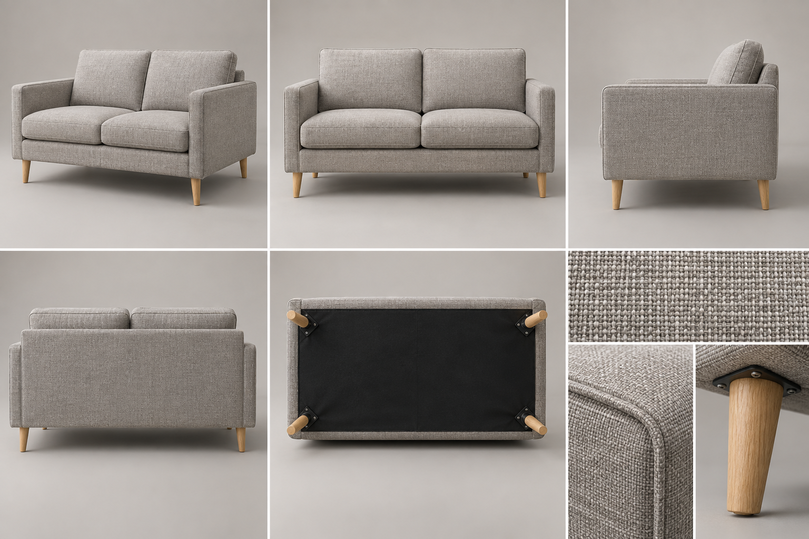
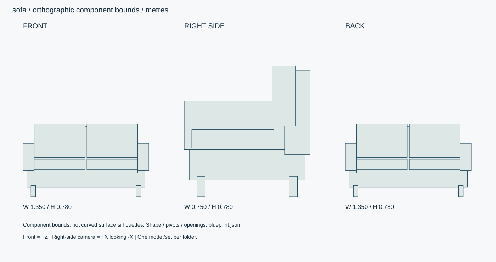

# ファブリック・コンパクト2人掛け

淡いグレーの2人掛けソファー。座クッション2枚、背クッション2枚、オーク脚4本。

ID: `sofa` / category: `sofa` / kind: `prop` / status: `design_review`

## 設計の基準

右手系: +X右、+Y上、+Z正面。sideは+Xから-Xへ、画面右が-Z。
数値JSON > 寸法SVG > 仕様文 > 参考画像

```json
{
  "envelope_xyz_m": [
    1.35,
    0.78,
    0.75
  ],
  "origin": "床/設置面の中心、閉じた基準状態。天井灯のみ天井取付面中心。",
  "axis": "右手系: +X右、+Y上、+Z正面。sideは+Xから-Xへ、画面右が-Z。",
  "priority": "数値JSON > 寸法SVG > 仕様文 > 参考画像",
  "seat_height_m": 0.4,
  "seat_clear_width_m": 1.11,
  "seat_depth_m": 0.49,
  "arm_height_m": 0.57,
  "back_recline_deg": 8
}
```

## 全体・正面・側面・背面・細部イメージ



画像はAI生成の参考図。寸法・配置・階数に不一致がある場合は数値仕様を優先する。実モデルを検証した画像ではない。




## 形状・微細構造

- 張地は0.4mm織り。パイピング径3mm、裏面ファスナーはクッション後縁に配置。
- 座面の中央に大きなくぼみを作らず、荷重なし状態では沈み2–4mm以内。縁の縫い目にだけ軽いしわ。
- 裏面は黒い不織布、脚取付プレート60×60×2mm、ネジ頭径5mm。
- 基準状態は静的モデル。構造上の関節や開閉機構はなし。任意の圧縮変形やパーツ移動は別仕様として記載。

## パーツ分解

|ID|名称|中心XYZ（m）|サイズXYZ（m）|材質・備考|
|---|---|---|---|---|
|base|座枠|[0, 0.19, 0]|[1.27, 0.18, 0.69]|fabric / |
|arm-L|左肘|[-0.615, 0.425, 0]|[0.12, 0.29, 0.75]|fabric / |
|arm-R|右肘|[0.615, 0.425, 0]|[0.12, 0.29, 0.75]|fabric / |
|back-frame|背枠|[0, 0.5, -0.3]|[1.11, 0.5, 0.15]|fabric / |
|seat-0|座クッション|[-0.2825, 0.345, 0.085]|[0.545, 0.11, 0.49]|fabric / 角R35mm、中央谷10mm。|
|back-0|背クッション|[-0.2825, 0.6, -0.22]|[0.545, 0.36, 0.14]|fabric / 後傾8度、角R40mm。|
|seat-1|座クッション|[0.2825, 0.345, 0.085]|[0.545, 0.11, 0.49]|fabric / 角R35mm、中央谷10mm。|
|back-1|背クッション|[0.2825, 0.6, -0.22]|[0.545, 0.36, 0.14]|fabric / 後傾8度、角R40mm。|
|leg-0-0|オーク脚|[-0.565, 0.06, -0.275]|[0.05, 0.12, 0.05]|oak / 先端へ35mmまでテーパー。|
|leg-0-1|オーク脚|[-0.565, 0.06, 0.275]|[0.05, 0.12, 0.05]|oak / 先端へ35mmまでテーパー。|
|leg-1-0|オーク脚|[0.565, 0.06, -0.275]|[0.05, 0.12, 0.05]|oak / 先端へ35mmまでテーパー。|
|leg-1-1|オーク脚|[0.565, 0.06, 0.275]|[0.05, 0.12, 0.05]|oak / 先端へ35mmまでテーパー。|

包絡パーツは中実メッシュの指示ではない。建物は外壁・内壁・床・天井・開口・建具・固定設備へ分解する。

## PBR材質・テクスチャ

|材質|色 sRGB|Roughness|Metallic|微細構造|
|---|---|---|---|---|
|fabric|#CCCBC4|[0.7, 0.9]|0|綿混/ポリエステルの織り目0.4mm。色差±2%、毛羽は法線。縫い糸径0.25mm・ピッチ3mm。|
|oak|#C4A77E|[0.35, 0.5]|0|オークの長手木目。導管0.1–0.3mm、木口は繊維に直交。クリア塗装、擦れは接触縁のみ。|
|foam|#E1DDD4|[0.8, 0.95]|0|露出しないクッション芯。圧縮変形の支持形状として管理。|
|black-plastic|#292D30|[0.45, 0.65]|0|チャコール樹脂、指触部に粗さ差0.05。黒つぶれを避ける。|
|metal|#45494A|[0.25, 0.4]|1|アルミ・ステンレス。ヘアラインを部材長手方向へ。切断端ベベル0.5–1mm、汚れは継ぎ目に限定。|

数値は制作初期値。色・粗さ・法線・金属度は別マップ。0.5mm未満の凹凸は原則法線、輪郭に現れる縫い目・溝・欠けは形状で表す。

## 可動部

|ID|方式|支点XYZ（m）|軸|範囲|動作|
|---|---|---|---|---|---|

角度範囲は読みやすさのため度。promodelerへ渡す際はラジアンへ変換。支点は閉じた状態・1階のローカル座標、階・住戸ごとに平行移動する。

## 検証クリップ

```json
[]
```

## 実装と納品条件

```json
{
  "engine": "Unity / HDRP を主想定。バージョンはモデル実装時に固定。",
  "exports": [
    "編集可能な制作ソース",
    "GLB（形状・PBR・ベイクした骨アニメ）",
    "Unity用物理設定",
    "検証PNGとMP4"
  ],
  "triangles_lod0_max": 60000,
  "texture_resolution_max": 2048,
  "texture_policy": "共有材2K、主役・顔4K。BaseColor=sRGB、Normal/Roughness/Metallic=linear。AOをBaseColorへ焼き込まない。",
  "texel_density_px_per_m": 1024,
  "lod_ratios": [
    1,
    0.5,
    0.2,
    0.08
  ],
  "texture_resident_budget_mib": 48
}
```

`blueprint.json` は設計データであり、promodelerのレシピJSONと互換ではない。実装担当がPythonのAsset/Part/Rigへ変換する。

## 未実装機能・差分


## 受入基準（モデル生成後に検証）

- [ ] 座面高0.40m・2座/2背・4脚を三面で一致。
- [ ] 縫い目と木脚の接合を接写、床接触点4点に浮きがない。
- [ ] 生成後にGLBと編集可能なソースを再読込し、単位・法線・UV・パーツIDを照合。
- [ ] 画像は設計参考であり実モデルの検証証拠ではない。モデル未生成のチェックは未確認のまま。
- [ ] LOD0予算、法線マップの接線系、透明材のソート、衝突形状を対象エンジンで確認。

## 管理・権利情報

```json
{
  "tags": [
    "日本",
    "現代",
    "写実",
    "独立アセット",
    "sofa"
  ],
  "usage": "PC向けリアルタイム探索・映像用のモデル設計",
  "license": "独自制作物として管理。現段階は私有・配布許諾未設定。販売用ライセンスは公開時に別途設定。",
  "approval": "モデル未生成・販売未承認",
  "description": "淡いグレーの2人掛けソファー。座クッション2枚、背クッション2枚、オーク脚4本。"
}
```

## interfaces

```json
[
  "床Y0。座る側+Zに450mm以上の空間を別途確保。クッションは着脱可能な別Part。"
]
```

## deformation

```json
{
  "seat": "optional morph: 上面最大40mm圧縮、クッション側面の膨らみ最大8mm。",
  "back": "optional morph: 最大20mm押込み。静的基準では未変形。"
}
```
