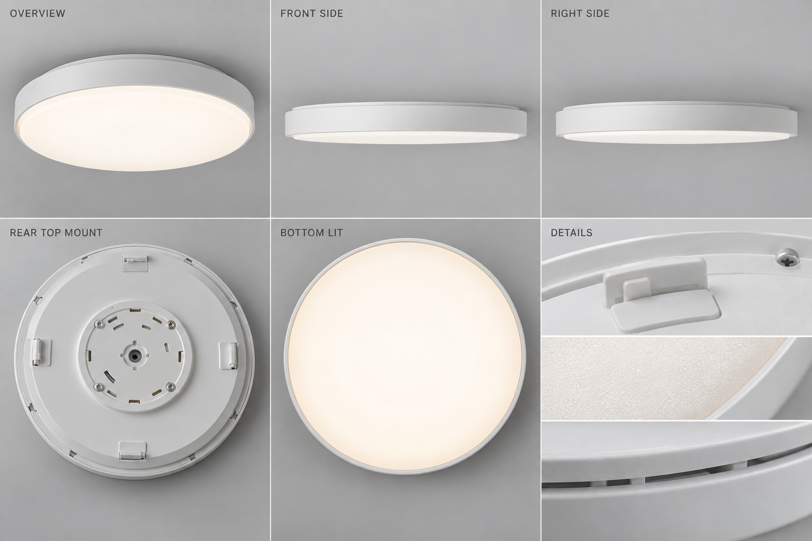
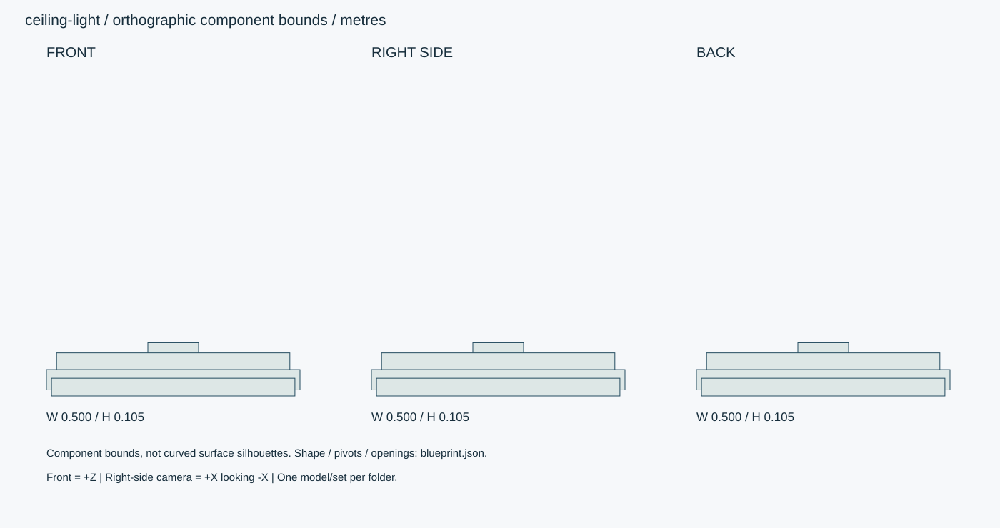

# 乳白カバー・LEDシーリングライト

円形薄型の天井直付けLED照明。取付アダプター、本体、乳白カバーを分離。

ID: `ceiling-light` / category: `ceiling-light` / kind: `prop` / status: `design_review`

## 設計の基準

右手系: +X右、+Y上、+Z正面。sideは+Xから-Xへ、画面右が-Z。
数値JSON > 寸法SVG > 仕様文 > 参考画像

```json
{
  "envelope_xyz_m": [
    0.5,
    0.105,
    0.5
  ],
  "origin": "天井取付面中心Y=0。本体は下方向-Yに0.105m。",
  "axis": "右手系: +X右、+Y上、+Z正面。sideは+Xから-Xへ、画面右が-Z。",
  "priority": "数値JSON > 寸法SVG > 仕様文 > 参考画像",
  "diameter_m": 0.5,
  "lower_surface_y_m": -0.105,
  "cover_thickness_m": 0.0015
}
```

## 全体・正面・側面・背面・細部イメージ



画像はAI生成の参考図。寸法・配置・階数に不一致がある場合は数値仕様を優先する。実モデルを検証した画像ではない。




## 形状・微細構造

- 正面/側面は厚み105mmの浅い円盤。背面は天井側取付部、BOTTOMは室内から見上げた発光面として区別。
- カバーの係合爪3か所120度ピッチ、爪厚2.5mm、通気隙間2mm。取付部は使用者向け電気施工図ではなく外観形状。
- 消灯時は乳白、点灯時に中央だけ白飛びしない。縁の減光を緩やかに表現。

## パーツ分解

|ID|名称|中心XYZ（m）|サイズXYZ（m）|材質・備考|
|---|---|---|---|---|
|mount|取付アダプター|[0, -0.012, 0]|[0.1, 0.024, 0.1]|polymer / 円形径100mm。|
|chassis|金属本体|[0, -0.04, 0]|[0.46, 0.04, 0.46]|white-steel / 回転体、板厚0.7mm。|
|rim|外周リム|[0, -0.073, 0]|[0.5, 0.04, 0.5]|polymer / 環状、外径500mm/内径480mm。|
|diffuser|乳白カバー|[0, -0.0875, 0]|[0.48, 0.035, 0.48]|opal / 浅い回転楕円殻、最下面-0.105m。|

包絡パーツは中実メッシュの指示ではない。建物は外壁・内壁・床・天井・開口・建具・固定設備へ分解する。

## PBR材質・テクスチャ

|材質|色 sRGB|Roughness|Metallic|微細構造|
|---|---|---|---|---|
|opal|#F1F0E8|[0.35, 0.55]|0|乳白PC拡散板、厚1.5mm。均一な光、縁は透過が弱い。発光と材質透過を別設定。|
|polymer|#E5E5DF|[0.3, 0.5]|0|射出成形樹脂の梨地。パーティングライン0.1mm、角R0.5–2mm。|
|white-steel|#E6E7E3|[0.3, 0.5]|0|白い塗装鋼板、厚0.6–0.8mm。塗膜は非金属。折返し端のRと接合隙間を作る。|
|metal|#45494A|[0.25, 0.4]|1|アルミ・ステンレス。ヘアラインを部材長手方向へ。切断端ベベル0.5–1mm、汚れは継ぎ目に限定。|

数値は制作初期値。色・粗さ・法線・金属度は別マップ。0.5mm未満の凹凸は原則法線、輪郭に現れる縫い目・溝・欠けは形状で表す。

## 可動部

|ID|方式|支点XYZ（m）|軸|範囲|動作|
|---|---|---|---|---|---|
|cover-release|hinge|[0, -0.07, 0]|[0, 1, 0]|[0, 20] degree|固定解除20度回転→カバーを下に60mm。別の移動段階とする。|
|cover-drop|slide|[0, -0.07, 0]|[0, 1, 0]|[-0.06, 0] m|回転解除後のみ。分解デモ用。|

角度範囲は読みやすさのため度。promodelerへ渡す際はラジアンへ変換。支点は閉じた状態・1階のローカル座標、階・住戸ごとに平行移動する。

## 検証クリップ

```json
[
  {
    "id": "light-states",
    "duration_s": 6,
    "description": "消灯→3000K→4000Kを各2秒。カバー脱着は別クリップ。"
  }
]
```

## 実装と納品条件

```json
{
  "engine": "Unity / HDRP を主想定。バージョンはモデル実装時に固定。",
  "exports": [
    "編集可能な制作ソース",
    "GLB（形状・PBR・ベイクした骨アニメ）",
    "Unity用物理設定",
    "検証PNGとMP4"
  ],
  "triangles_lod0_max": 24000,
  "texture_resolution_max": 2048,
  "texture_policy": "共有材2K、主役・顔4K。BaseColor=sRGB、Normal/Roughness/Metallic=linear。AOをBaseColorへ焼き込まない。",
  "texel_density_px_per_m": 1024,
  "lod_ratios": [
    1,
    0.5,
    0.2,
    0.08
  ],
  "texture_resident_budget_mib": 48
}
```

`blueprint.json` は設計データであり、promodelerのレシピJSONと互換ではない。実装担当がPythonのAsset/Part/Rigへ変換する。

## 未実装機能・差分

- 発光材だけで室内を照らした扱いにしない。Unity側の光源・調光制御が必要。

## 受入基準（モデル生成後に検証）

- [ ] 直径0.5m・下がり0.105m、カバーと本体が閉状態で接触貫通しない。
- [ ] 消灯/調光/点灯を同じ露出で記録。裏面取付部と下面を取り違えない。
- [ ] 生成後にGLBと編集可能なソースを再読込し、単位・法線・UV・パーツIDを照合。
- [ ] 画像は設計参考であり実モデルの検証証拠ではない。モデル未生成のチェックは未確認のまま。
- [ ] LOD0予算、法線マップの接線系、透明材のソート、衝突形状を対象エンジンで確認。

## 管理・権利情報

```json
{
  "tags": [
    "日本",
    "現代",
    "写実",
    "独立アセット",
    "ceiling-light"
  ],
  "usage": "PC向けリアルタイム探索・映像用のモデル設計",
  "license": "独自制作物として管理。現段階は私有・配布許諾未設定。販売用ライセンスは公開時に別途設定。",
  "approval": "モデル未生成・販売未承認",
  "description": "円形薄型の天井直付けLED照明。取付アダプター、本体、乳白カバーを分離。"
}
```

## interfaces

```json
[
  "取付面Y0を天井下面に合わせる。シーン側の光源IDとカバーPart IDを関連付ける。"
]
```

## light

```json
{
  "states": [
    "off",
    "warm",
    "neutral"
  ],
  "cct_kelvin": [
    3000,
    4000
  ],
  "nominal_flux_lm": 3000,
  "dimming_range": [
    0.1,
    1
  ],
  "geometry_emission": "カバーの発光見た目",
  "scene_light": "別の面光源。実装時に対象エンジンで照度を調整。",
  "note": "3000lmは設計上の目標値。測光データではない。"
}
```
