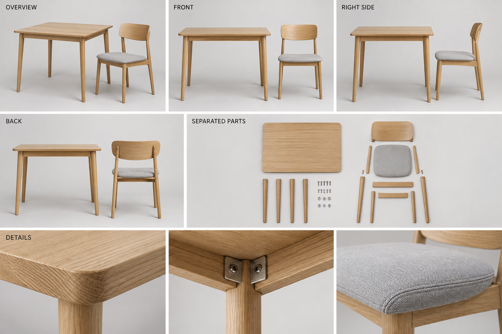
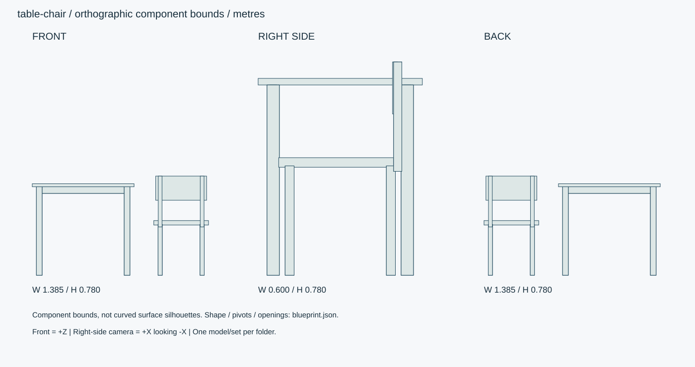

# オーク机と椅子・コンパクトセット

幅80cmの汎用机と椅子1脚のセット。食事・筆記用で、PCデスクとは別アセット。

ID: `table-chair` / category: `table-chair-set` / kind: `prop` / status: `design_review`

## 設計の基準

右手系: +X右、+Y上、+Z正面。sideは+Xから-Xへ、画面右が-Z。
数値JSON > 寸法SVG > 仕様文 > 参考画像

```json
{
  "envelope_xyz_m": [
    1.42,
    0.78,
    0.6
  ],
  "origin": "床/設置面の中心、閉じた基準状態。天井灯のみ天井取付面中心。",
  "axis": "右手系: +X右、+Y上、+Z正面。sideは+Xから-Xへ、画面右が-Z。",
  "priority": "数値JSON > 寸法SVG > 仕様文 > 参考画像",
  "table_xyz_m": [
    0.8,
    0.72,
    0.6
  ],
  "chair_xyz_m": [
    0.43,
    0.78,
    0.48
  ],
  "chair_seat_height_m": 0.43,
  "table_top_thickness_m": 0.024,
  "assembly_note": "比較用の基準配置:机中心X=-0.28、椅子中心X=+0.49。組立後は独立ルートとして移動。"
}
```

## 全体・正面・側面・背面・細部イメージ



画像はAI生成の参考図。寸法・配置・階数に不一致がある場合は数値仕様を優先する。実モデルを検証した画像ではない。




## 形状・微細構造

- 机の天板木目はX方向。脚木目はY方向。幕板は天板下に位置し膝空間高さ0.644mを確保。
- 椅子座面は淡いグレー、四隅R25mm。背板は18mm厚、外周R3mm、座面裏は固定プレートとネジを再現。
- 椅子を机へ収める際は椅子中心を机中心Xに合わせ、+Z側から挿入。隣置きは参考シート用の配置。
- 基準状態は静的モデル。構造上の関節や開閉機構はなし。任意の圧縮変形やパーツ移動は別仕様として記載。

## パーツ分解

|ID|名称|中心XYZ（m）|サイズXYZ（m）|材質・備考|
|---|---|---|---|---|
|table-top|机天板|[-0.28, 0.708, 0]|[0.8, 0.024, 0.6]|oak / 平面角R15mm、上下縁R2mm。|
|apron-front|前幕板|[-0.28, 0.67, 0.245]|[0.69, 0.052, 0.025]|oak / |
|apron-back|後幕板|[-0.28, 0.67, -0.245]|[0.69, 0.052, 0.025]|oak / |
|table-leg-0-0|机脚|[-0.625, 0.348, -0.245]|[0.045, 0.696, 0.045]|oak / 床側へ30mmにテーパー。|
|table-leg-0-1|机脚|[-0.625, 0.348, 0.245]|[0.045, 0.696, 0.045]|oak / 床側へ30mmにテーパー。|
|table-leg-1-0|机脚|[0.065, 0.348, -0.245]|[0.045, 0.696, 0.045]|oak / 床側へ30mmにテーパー。|
|table-leg-1-1|机脚|[0.065, 0.348, 0.245]|[0.045, 0.696, 0.045]|oak / 床側へ30mmにテーパー。|
|chair-seat|椅子座面|[0.49, 0.4125, 0.015]|[0.43, 0.035, 0.42]|fabric / 上面Y0.43。|
|chair-back|椅子背板|[0.49, 0.685, -0.2]|[0.4, 0.19, 0.018]|oak / 合板の曲率半径0.65m。|
|chair-leg-0-0|椅子脚|[0.325, 0.2, -0.185]|[0.033, 0.4, 0.033]|oak / |
|chair-leg-0-1|椅子脚|[0.325, 0.2, 0.185]|[0.033, 0.4, 0.033]|oak / |
|chair-leg-1-0|椅子脚|[0.655, 0.2, -0.185]|[0.033, 0.4, 0.033]|oak / |
|chair-leg-1-1|椅子脚|[0.655, 0.2, 0.185]|[0.033, 0.4, 0.033]|oak / |
|back-post-0.325|背支柱|[0.325, 0.58, -0.21]|[0.03, 0.4, 0.03]|oak / |
|back-post-0.655|背支柱|[0.655, 0.58, -0.21]|[0.03, 0.4, 0.03]|oak / |

包絡パーツは中実メッシュの指示ではない。建物は外壁・内壁・床・天井・開口・建具・固定設備へ分解する。

## PBR材質・テクスチャ

|材質|色 sRGB|Roughness|Metallic|微細構造|
|---|---|---|---|---|
|oak|#C4A77E|[0.35, 0.5]|0|オークの長手木目。導管0.1–0.3mm、木口は繊維に直交。クリア塗装、擦れは接触縁のみ。|
|fabric|#CCCBC4|[0.7, 0.9]|0|綿混/ポリエステルの織り目0.4mm。色差±2%、毛羽は法線。縫い糸径0.25mm・ピッチ3mm。|
|metal|#45494A|[0.25, 0.4]|1|アルミ・ステンレス。ヘアラインを部材長手方向へ。切断端ベベル0.5–1mm、汚れは継ぎ目に限定。|
|black-plastic|#292D30|[0.45, 0.65]|0|チャコール樹脂、指触部に粗さ差0.05。黒つぶれを避ける。|

数値は制作初期値。色・粗さ・法線・金属度は別マップ。0.5mm未満の凹凸は原則法線、輪郭に現れる縫い目・溝・欠けは形状で表す。

## 可動部

|ID|方式|支点XYZ（m）|軸|範囲|動作|
|---|---|---|---|---|---|

角度範囲は読みやすさのため度。promodelerへ渡す際はラジアンへ変換。支点は閉じた状態・1階のローカル座標、階・住戸ごとに平行移動する。

## 検証クリップ

```json
[]
```

## 実装と納品条件

```json
{
  "engine": "Unity / HDRP を主想定。バージョンはモデル実装時に固定。",
  "exports": [
    "編集可能な制作ソース",
    "GLB（形状・PBR・ベイクした骨アニメ）",
    "Unity用物理設定",
    "検証PNGとMP4"
  ],
  "triangles_lod0_max": 42000,
  "texture_resolution_max": 2048,
  "texture_policy": "共有材2K、主役・顔4K。BaseColor=sRGB、Normal/Roughness/Metallic=linear。AOをBaseColorへ焼き込まない。",
  "texel_density_px_per_m": 1024,
  "lod_ratios": [
    1,
    0.5,
    0.2,
    0.08
  ],
  "texture_resident_budget_mib": 48
}
```

`blueprint.json` は設計データであり、promodelerのレシピJSONと互換ではない。実装担当がPythonのAsset/Part/Rigへ変換する。

## 未実装機能・差分


## 受入基準（モデル生成後に検証）

- [ ] 机4脚・椅子4脚、机天板0.72m・座面0.43m。
- [ ] 椅子挿入時に机の脚間内寸0.645mへ椅子幅0.43mが収まり、座面上の膝空間を確認。
- [ ] 生成後にGLBと編集可能なソースを再読込し、単位・法線・UV・パーツIDを照合。
- [ ] 画像は設計参考であり実モデルの検証証拠ではない。モデル未生成のチェックは未確認のまま。
- [ ] LOD0予算、法線マップの接線系、透明材のソート、衝突形状を対象エンジンで確認。

## 管理・権利情報

```json
{
  "tags": [
    "日本",
    "現代",
    "写実",
    "独立アセット",
    "table-chair-set"
  ],
  "usage": "PC向けリアルタイム探索・映像用のモデル設計",
  "license": "独自制作物として管理。現段階は私有・配布許諾未設定。販売用ライセンスは公開時に別途設定。",
  "approval": "モデル未生成・販売未承認",
  "description": "幅80cmの汎用机と椅子1脚のセット。食事・筆記用で、PCデスクとは別アセット。"
}
```

## interfaces

```json
[
  "机と椅子を独立したGLBノードとしてエクスポート。室内配置の座標をアセットへ固定しない。"
]
```

## roots

```json
[
  {
    "id": "table-root",
    "children_prefix": [
      "table-",
      "apron-"
    ]
  },
  {
    "id": "chair-root",
    "children_prefix": [
      "chair-",
      "back-post-"
    ]
  }
]
```
