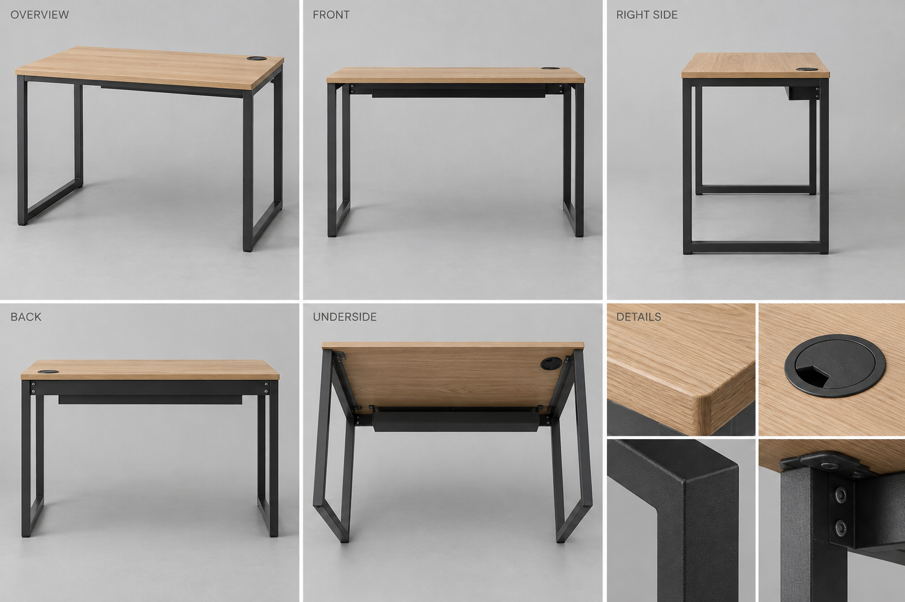
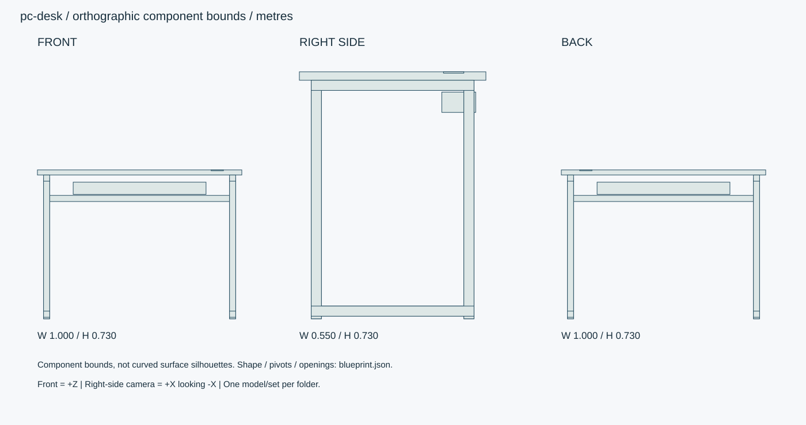

# オーク天板・スチールPCデスク

幅100cmのPC専用デスク。オーク天板、チャコール脚、配線トレー。PC・椅子は含まない。

ID: `pc-desk` / category: `pc-desk` / kind: `prop` / status: `design_review`

## 設計の基準

右手系: +X右、+Y上、+Z正面。sideは+Xから-Xへ、画面右が-Z。
数値JSON > 寸法SVG > 仕様文 > 参考画像

```json
{
  "envelope_xyz_m": [
    1,
    0.73,
    0.55
  ],
  "origin": "床/設置面の中心、閉じた基準状態。天井灯のみ天井取付面中心。",
  "axis": "右手系: +X右、+Y上、+Z正面。sideは+Xから-Xへ、画面右が-Z。",
  "priority": "数値JSON > 寸法SVG > 仕様文 > 参考画像",
  "top_thickness_m": 0.025,
  "tube_section_m": 0.03,
  "knee_clear_height_m": 0.675,
  "grommet_diameter_m": 0.06
}
```

## 全体・正面・側面・背面・細部イメージ



画像はAI生成の参考図。寸法・配置・階数に不一致がある場合は数値仕様を優先する。実モデルを検証した画像ではない。




## 形状・微細構造

- 脚は左右2組のU字下枠と天板受け。4本の支柱位置を全ビューで一致させる。
- 木目X方向、薄い粉体塗装の鋼管、六角ボルト頭径10mm。脚底アジャスター径22mm・高さ7.5mm。
- 天板は孔位置を除いて中実。配線孔が底まで貫通すること。トレーは天板下35mmの配線空間を残す。

## パーツ分解

|ID|名称|中心XYZ（m）|サイズXYZ（m）|材質・備考|
|---|---|---|---|---|
|top|天板|[0, 0.7175, 0]|[1, 0.025, 0.55]|oak / 四辺R3mm。|
|rear-bar|後部横桟|[0, 0.59, -0.225]|[0.88, 0.03, 0.03]|charcoal-steel / |
|cable-tray|配線トレー|[0, 0.64, -0.195]|[0.65, 0.06, 0.1]|charcoal-steel / 上面開放、板厚1mm、通線穴20mm。|
|grommet|配線孔キャップ|[0.38, 0.728, -0.18]|[0.06, 0.004, 0.06]|black-plastic / 円形穴・切欠き12mm。|
|leg-0-0|支柱|[-0.455, 0.345, -0.225]|[0.03, 0.69, 0.03]|charcoal-steel / |
|leg-0-1|支柱|[-0.455, 0.345, 0.225]|[0.03, 0.69, 0.03]|charcoal-steel / |
|foot-bar-0|U脚底桟|[-0.455, 0.0225, 0]|[0.03, 0.03, 0.48]|charcoal-steel / |
|top-bar-0|天板受け桟|[-0.455, 0.69, 0]|[0.03, 0.03, 0.48]|charcoal-steel / |
|leg-1-0|支柱|[0.455, 0.345, -0.225]|[0.03, 0.69, 0.03]|charcoal-steel / |
|leg-1-1|支柱|[0.455, 0.345, 0.225]|[0.03, 0.69, 0.03]|charcoal-steel / |
|foot-bar-1|U脚底桟|[0.455, 0.0225, 0]|[0.03, 0.03, 0.48]|charcoal-steel / |
|top-bar-1|天板受け桟|[0.455, 0.69, 0]|[0.03, 0.03, 0.48]|charcoal-steel / |

包絡パーツは中実メッシュの指示ではない。建物は外壁・内壁・床・天井・開口・建具・固定設備へ分解する。

## PBR材質・テクスチャ

|材質|色 sRGB|Roughness|Metallic|微細構造|
|---|---|---|---|---|
|oak|#C4A77E|[0.35, 0.5]|0|オークの長手木目。導管0.1–0.3mm、木口は繊維に直交。クリア塗装、擦れは接触縁のみ。|
|charcoal-steel|#343B3E|[0.5, 0.7]|0|粉体塗装鋼管。表面梨地、下地金属は組付穴だけ。溶接ビードは接合部のみ高さ0.6mm。|
|black-plastic|#292D30|[0.45, 0.65]|0|チャコール樹脂、指触部に粗さ差0.05。黒つぶれを避ける。|
|metal|#45494A|[0.25, 0.4]|1|アルミ・ステンレス。ヘアラインを部材長手方向へ。切断端ベベル0.5–1mm、汚れは継ぎ目に限定。|

数値は制作初期値。色・粗さ・法線・金属度は別マップ。0.5mm未満の凹凸は原則法線、輪郭に現れる縫い目・溝・欠けは形状で表す。

## 可動部

|ID|方式|支点XYZ（m）|軸|範囲|動作|
|---|---|---|---|---|---|
|grommet-cap|hinge|[0.38, 0.728, -0.18]|[0, 1, 0]|[0, 180] degree|通線切欠きの向きを変更する回転。|

角度範囲は読みやすさのため度。promodelerへ渡す際はラジアンへ変換。支点は閉じた状態・1階のローカル座標、階・住戸ごとに平行移動する。

## 検証クリップ

```json
[]
```

## 実装と納品条件

```json
{
  "engine": "Unity / HDRP を主想定。バージョンはモデル実装時に固定。",
  "exports": [
    "編集可能な制作ソース",
    "GLB（形状・PBR・ベイクした骨アニメ）",
    "Unity用物理設定",
    "検証PNGとMP4"
  ],
  "triangles_lod0_max": 32000,
  "texture_resolution_max": 2048,
  "texture_policy": "共有材2K、主役・顔4K。BaseColor=sRGB、Normal/Roughness/Metallic=linear。AOをBaseColorへ焼き込まない。",
  "texel_density_px_per_m": 1024,
  "lod_ratios": [
    1,
    0.5,
    0.2,
    0.08
  ],
  "texture_resident_budget_mib": 48
}
```

`blueprint.json` は設計データであり、promodelerのレシピJSONと互換ではない。実装担当がPythonのAsset/Part/Rigへ変換する。

## 未実装機能・差分


## 受入基準（モデル生成後に検証）

- [ ] 天板1×0.55m、4接地点、配線孔径60mm。
- [ ] モニター台座と配線トレーが干渉せず、下から孔が見える。
- [ ] 生成後にGLBと編集可能なソースを再読込し、単位・法線・UV・パーツIDを照合。
- [ ] 画像は設計参考であり実モデルの検証証拠ではない。モデル未生成のチェックは未確認のまま。
- [ ] LOD0予算、法線マップの接線系、透明材のソート、衝突形状を対象エンジンで確認。

## 管理・権利情報

```json
{
  "tags": [
    "日本",
    "現代",
    "写実",
    "独立アセット",
    "pc-desk"
  ],
  "usage": "PC向けリアルタイム探索・映像用のモデル設計",
  "license": "独自制作物として管理。現段階は私有・配布許諾未設定。販売用ライセンスは公開時に別途設定。",
  "approval": "モデル未生成・販売未承認",
  "description": "幅100cmのPC専用デスク。オーク天板、チャコール脚、配線トレー。PC・椅子は含まない。"
}
```

## interfaces

```json
[
  "天板Y0.73。PCセットは各ルートを天板高へ平行移動して配置する。PCタワーは別置きも可能。"
]
```
