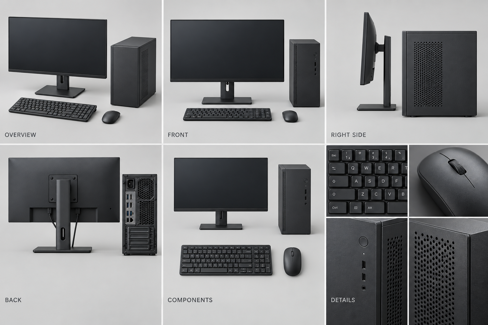
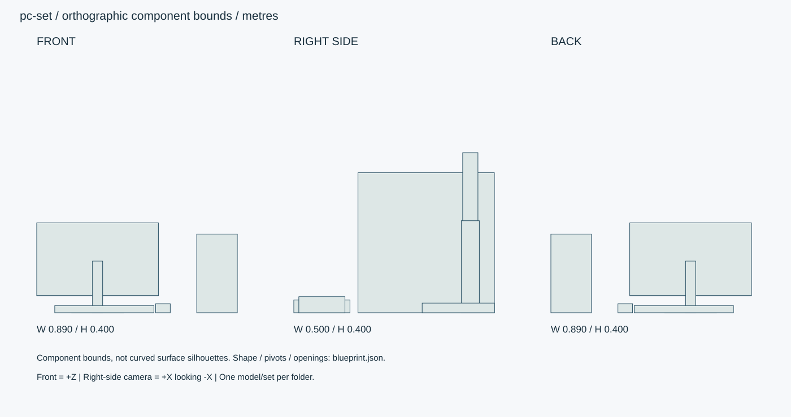

# コンパクトPC・周辺機器セット

小型デスクトップ本体・24型モニター・フルサイズキーボード・マウスの4点セット。

ID: `pc-set` / category: `pc-set` / kind: `prop` / status: `design_review`

## 設計の基準

右手系: +X右、+Y上、+Z正面。sideは+Xから-Xへ、画面右が-Z。
数値JSON > 寸法SVG > 仕様文 > 参考画像

```json
{
  "envelope_xyz_m": [
    1,
    0.4,
    0.6
  ],
  "origin": "床/設置面の中心、閉じた基準状態。天井灯のみ天井取付面中心。",
  "axis": "右手系: +X右、+Y上、+Z正面。sideは+Xから-Xへ、画面右が-Z。",
  "priority": "数値JSON > 寸法SVG > 仕様文 > 参考画像",
  "tower_xyz_m": [
    0.18,
    0.35,
    0.34
  ],
  "monitor_xyz_m": [
    0.54,
    0.4,
    0.18
  ],
  "keyboard_xyz_m": [
    0.44,
    0.032,
    0.14
  ],
  "mouse_xyz_m": [
    0.065,
    0.04,
    0.115
  ],
  "screen_diagonal_inch": 24
}
```

## 全体・正面・側面・背面・細部イメージ



画像はAI生成の参考図。寸法・配置・階数に不一致がある場合は数値仕様を優先する。実モデルを検証した画像ではない。




## 形状・微細構造

- 本体の前面吸気孔は径2mm・ピッチ3mm、背面ファン径92mm。端子はHDMI/DisplayPort/USB/電源の外形を独立部品にする。
- モニター表示面は暗いニュートラル色。UIや商標は描かない。背面VESA穴100mmピッチ、ねじ穴径4mm。
- キー間隙2mm、キートップR0.6mm。キー刻印はオリジナルの汎用記号。マウス左右ボタンの隙間0.6mm。
- PC内部基板の全再現は対象外。側面を開いた際の簡易シャーシとファンまでを対象にする。
- 電源ケーブル2本と映像ケーブル1本は任意の独立カーブ資産、端子間経路を配置先で決める。無線マウス。

## パーツ分解

|ID|名称|中心XYZ（m）|サイズXYZ（m）|材質・備考|
|---|---|---|---|---|
|tower|PC本体|[0.36, 0.175, -0.04]|[0.18, 0.35, 0.34]|charcoal-steel / 右パネルは着脱、内部はファンと取付板だけの簡易構造。|
|monitor-panel|モニターパネル|[-0.17, 0.238, -0.15]|[0.54, 0.324, 0.038]|black-plastic / 画面有効531×299mm、ベゼルは左右4.5mm/上下12.5mm。|
|monitor-stand|モニター支柱|[-0.17, 0.115, -0.15]|[0.045, 0.23, 0.045]|metal / |
|monitor-base|モニター台座|[-0.17, 0.012, -0.12]|[0.23, 0.024, 0.18]|black-plastic / |
|keyboard|キーボード|[-0.14, 0.016, 0.22]|[0.44, 0.032, 0.14]|black-plastic / テンキー付きフルサイズ、汎用104キー配列。キーは別Part/インスタンス。|
|mouse|マウス|[0.12, 0.02, 0.22]|[0.065, 0.04, 0.115]|black-plastic / |

包絡パーツは中実メッシュの指示ではない。建物は外壁・内壁・床・天井・開口・建具・固定設備へ分解する。

## PBR材質・テクスチャ

|材質|色 sRGB|Roughness|Metallic|微細構造|
|---|---|---|---|---|
|black-plastic|#292D30|[0.45, 0.65]|0|チャコール樹脂、指触部に粗さ差0.05。黒つぶれを避ける。|
|charcoal-steel|#343B3E|[0.5, 0.7]|0|粉体塗装鋼管。表面梨地、下地金属は組付穴だけ。溶接ビードは接合部のみ高さ0.6mm。|
|glass|#D7E2E0|[0.03, 0.12]|0|建築ガラス厚6–12mm。透明・反射を別設定、IOR目標1.5。透過は現行APIとの差分実装対象。汚れ1%以下。|
|metal|#45494A|[0.25, 0.4]|1|アルミ・ステンレス。ヘアラインを部材長手方向へ。切断端ベベル0.5–1mm、汚れは継ぎ目に限定。|
|rubber|#E5E3DC|[0.65, 0.85]|0|白スニーカー底厚25mm、側面細溝0.7mm、底溝深2mm。接地縁に薄い灰色摩耗。|

数値は制作初期値。色・粗さ・法線・金属度は別マップ。0.5mm未満の凹凸は原則法線、輪郭に現れる縫い目・溝・欠けは形状で表す。

## 可動部

|ID|方式|支点XYZ（m）|軸|範囲|動作|
|---|---|---|---|---|---|
|monitor-tilt|hinge|[-0.17, 0.238, -0.169]|[1, 0, 0]|[-5, 20] degree|モニターのみ。スタンドは固定。|
|monitor-height|slide|[-0.17, 0.13, -0.15]|[0, 1, 0]|[0, 0.08] m|初期高さ0.40m、最大0.48m。|
|power-button|slide|[0.36, 0.29, 0.131]|[0, 0, 1]|[-0.001, 0] m|PC前面ボタン。|
|key-press|slide|[-0.14, 0.032, 0.22]|[0, 1, 0]|[-0.002, 0] m|各キーの位置へ複製。|
|mouse-wheel|hinge|[0.12, 0.038, 0.2]|[1, 0, 0]|[-180, 180] degree|連続回転、実装時は無限循環。|

角度範囲は読みやすさのため度。promodelerへ渡す際はラジアンへ変換。支点は閉じた状態・1階のローカル座標、階・住戸ごとに平行移動する。

## 検証クリップ

```json
[
  {
    "id": "display-on",
    "duration_s": 2,
    "description": "黒画面から無地ニュートラル画面へ。発光は控えめ。"
  },
  {
    "id": "input-demo",
    "duration_s": 3,
    "description": "キー押下・マウスホイール・電源ボタン。"
  }
]
```

## 実装と納品条件

```json
{
  "engine": "Unity / HDRP を主想定。バージョンはモデル実装時に固定。",
  "exports": [
    "編集可能な制作ソース",
    "GLB（形状・PBR・ベイクした骨アニメ）",
    "Unity用物理設定",
    "検証PNGとMP4"
  ],
  "triangles_lod0_max": 90000,
  "texture_resolution_max": 2048,
  "texture_policy": "共有材2K、主役・顔4K。BaseColor=sRGB、Normal/Roughness/Metallic=linear。AOをBaseColorへ焼き込まない。",
  "texel_density_px_per_m": 1024,
  "lod_ratios": [
    1,
    0.5,
    0.2,
    0.08
  ],
  "texture_resident_budget_mib": 48
}
```

`blueprint.json` は設計データであり、promodelerのレシピJSONと互換ではない。実装担当がPythonのAsset/Part/Rigへ変換する。

## 未実装機能・差分


## 受入基準（モデル生成後に検証）

- [ ] モニター有効画面比率16:9、対角約0.61m。
- [ ] 4点すべての正面・背面・接続端子を確認。
- [ ] スタンド最高位と最大チルトで本体が台座から離脱せず、キーボードキーは底を貫通しない。
- [ ] 生成後にGLBと編集可能なソースを再読込し、単位・法線・UV・パーツIDを照合。
- [ ] 画像は設計参考であり実モデルの検証証拠ではない。モデル未生成のチェックは未確認のまま。
- [ ] LOD0予算、法線マップの接線系、透明材のソート、衝突形状を対象エンジンで確認。

## 管理・権利情報

```json
{
  "tags": [
    "日本",
    "現代",
    "写実",
    "独立アセット",
    "pc-set"
  ],
  "usage": "PC向けリアルタイム探索・映像用のモデル設計",
  "license": "独自制作物として管理。現段階は私有・配布許諾未設定。販売用ライセンスは公開時に別途設定。",
  "approval": "モデル未生成・販売未承認",
  "description": "小型デスクトップ本体・24型モニター・フルサイズキーボード・マウスの4点セット。"
}
```

## interfaces

```json
[
  "セットの展示配置はJSONのparts参照。机に置く際は4点を個別配置。モニター台座は天板へ密着。"
]
```

## roots

```json
[
  {
    "id": "tower-root"
  },
  {
    "id": "monitor-root"
  },
  {
    "id": "keyboard-root"
  },
  {
    "id": "mouse-root"
  }
]
```
