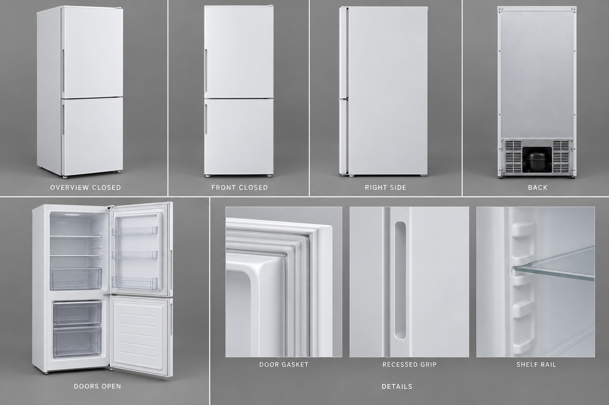
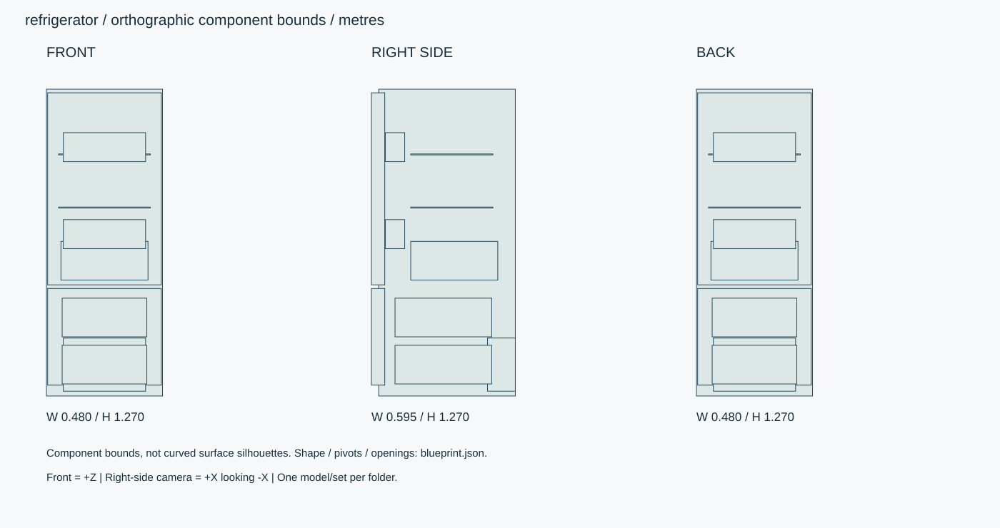

# 白い2ドア・コンパクト冷蔵庫

上段冷蔵・下段冷凍の2ドア冷蔵庫。正面から見て右ヒンジ・左側くぼみ取手。内部棚・ポケット・冷凍ケースあり。

ID: `refrigerator` / category: `refrigerator` / kind: `prop` / status: `design_review`

## 設計の基準

右手系: +X右、+Y上、+Z正面。sideは+Xから-Xへ、画面右が-Z。
数値JSON > 寸法SVG > 仕様文 > 参考画像

```json
{
  "envelope_xyz_m": [
    0.48,
    1.28,
    0.595
  ],
  "origin": "床/設置面の中心、閉じた基準状態。天井灯のみ天井取付面中心。",
  "axis": "右手系: +X右、+Y上、+Z正面。sideは+Xから-Xへ、画面右が-Z。",
  "priority": "数値JSON > 寸法SVG > 仕様文 > 参考画像",
  "upper_door_y_range_m": [
    0.47,
    1.265
  ],
  "lower_door_y_range_m": [
    0.055,
    0.455
  ],
  "door_thickness_m": 0.055,
  "cabinet_insulation_nominal_m": 0.045,
  "back_clearance_design_m": 0.05,
  "side_clearance_design_m": 0.02,
  "clearance_note": "配置用の仮定値。実製品の据付基準ではない。"
}
```

## 全体・正面・側面・背面・細部イメージ



画像はAI生成の参考図。寸法・配置・階数に不一致がある場合は数値仕様を優先する。実モデルを検証した画像ではない。




## 形状・微細構造

- 扉の縦方向ヒンジ軸・取手位置を開閉図で統一。ドア間15mm、上端15mm、下端55mm。
- パッキン断面は幅12mmの蛇腹3山、圧縮量0–2mm。扉内板と一緒に動かす。
- 庫内壁R12mm、棚受け幅8mm、透明部品厚2.5mm。冷蔵室照明は右上、扉開で点灯。
- 閉時庫内の棚は扉ポケットと干渉しない奥行へ調整。背面は低部機械室と通風口、裏側にも材質・ねじを用意。

## パーツ分解

|ID|名称|中心XYZ（m）|サイズXYZ（m）|材質・備考|
|---|---|---|---|---|
|cabinet-shell|断熱キャビネット|[0, 0.645, -0.015]|[0.48, 1.27, 0.565]|white-steel / 中空。内壁を残して庫内を切り抜く。|
|upper-door|冷蔵扉|[0, 0.8675, 0.27]|[0.47, 0.795, 0.055]|white-steel / 右ヒンジ。左縁にくぼみ取手。|
|lower-door|冷凍扉|[0, 0.255, 0.27]|[0.47, 0.4, 0.055]|white-steel / |
|crisper|野菜ケース|[0, 0.57, -0.045]|[0.36, 0.16, 0.36]|polymer / 前面透明樹脂、上面開放。|
|compressor-bay|背面機械室|[0, 0.14, -0.24]|[0.34, 0.22, 0.115]|black-plastic / 下部のみ。|
|shelf-0|ガラス棚|[0, 0.79, -0.035]|[0.38, 0.004, 0.34]|glass / 前縁樹脂リム8mm。|
|shelf-1|ガラス棚|[0, 1.01, -0.035]|[0.38, 0.004, 0.34]|glass / 前縁樹脂リム8mm。|
|freezer-bin-0|冷凍ケース|[0, 0.14, 0]|[0.35, 0.16, 0.4]|polymer / 引出し0.22m。|
|freezer-bin-1|冷凍ケース|[0, 0.335, 0]|[0.35, 0.16, 0.4]|polymer / 引出し0.22m。|
|door-pocket-0|ドアポケット|[0, 0.68, 0.2]|[0.34, 0.12, 0.08]|polymer / 冷蔵扉の子。庫内棚前端との隙間10mm以上。|
|door-pocket-1|ドアポケット|[0, 1.04, 0.2]|[0.34, 0.12, 0.08]|polymer / 冷蔵扉の子。庫内棚前端との隙間10mm以上。|

包絡パーツは中実メッシュの指示ではない。建物は外壁・内壁・床・天井・開口・建具・固定設備へ分解する。

## PBR材質・テクスチャ

|材質|色 sRGB|Roughness|Metallic|微細構造|
|---|---|---|---|---|
|white-steel|#E6E7E3|[0.3, 0.5]|0|白い塗装鋼板、厚0.6–0.8mm。塗膜は非金属。折返し端のRと接合隙間を作る。|
|polymer|#E5E5DF|[0.3, 0.5]|0|射出成形樹脂の梨地。パーティングライン0.1mm、角R0.5–2mm。|
|glass|#D7E2E0|[0.03, 0.12]|0|建築ガラス厚6–12mm。透明・反射を別設定、IOR目標1.5。透過は現行APIとの差分実装対象。汚れ1%以下。|
|gasket|#B7B9B4|[0.7, 0.85]|0|軟質パッキンの蛇腹・角の溶着線。開閉に伴う圧縮は0–2mm。|
|metal|#45494A|[0.25, 0.4]|1|アルミ・ステンレス。ヘアラインを部材長手方向へ。切断端ベベル0.5–1mm、汚れは継ぎ目に限定。|
|black-plastic|#292D30|[0.45, 0.65]|0|チャコール樹脂、指触部に粗さ差0.05。黒つぶれを避ける。|

数値は制作初期値。色・粗さ・法線・金属度は別マップ。0.5mm未満の凹凸は原則法線、輪郭に現れる縫い目・溝・欠けは形状で表す。

## 可動部

|ID|方式|支点XYZ（m）|軸|範囲|動作|
|---|---|---|---|---|---|
|upper-door|hinge|[0.235, 0.47, 0.2675]|[0, 1, 0]|[0, 110] degree|正面+Zから見て右ヒンジ、左取手。右端支点で手前へ開く。|
|lower-door|hinge|[0.235, 0.055, 0.2675]|[0, 1, 0]|[0, 110] degree|同じ右ヒンジ。|
|crisper|slide|[0, 0.57, -0.005]|[0, 0, 1]|[0, 0.22] m|冷蔵扉100度以上開いてから。|
|freezer-bin|slide|[0, 0.14, 0]|[0, 0, 1]|[0, 0.22] m|冷凍扉100度以上。上下2ケースは独立。|

角度範囲は読みやすさのため度。promodelerへ渡す際はラジアンへ変換。支点は閉じた状態・1階のローカル座標、階・住戸ごとに平行移動する。

## 検証クリップ

```json
[
  {
    "id": "open-and-pull",
    "duration_s": 6,
    "description": "閉→上扉110度→ケース220mm引出し→戻す→閉。下扉も別実行。"
  }
]
```

## 実装と納品条件

```json
{
  "engine": "Unity / HDRP を主想定。バージョンはモデル実装時に固定。",
  "exports": [
    "編集可能な制作ソース",
    "GLB（形状・PBR・ベイクした骨アニメ）",
    "Unity用物理設定",
    "検証PNGとMP4"
  ],
  "triangles_lod0_max": 65000,
  "texture_resolution_max": 2048,
  "texture_policy": "共有材2K、主役・顔4K。BaseColor=sRGB、Normal/Roughness/Metallic=linear。AOをBaseColorへ焼き込まない。",
  "texel_density_px_per_m": 1024,
  "lod_ratios": [
    1,
    0.5,
    0.2,
    0.08
  ],
  "texture_resident_budget_mib": 48
}
```

`blueprint.json` は設計データであり、promodelerのレシピJSONと互換ではない。実装担当がPythonのAsset/Part/Rigへ変換する。

## 未実装機能・差分


## 受入基準（モデル生成後に検証）

- [ ] 閉時包絡0.48×1.28×0.595m。上冷蔵/下冷凍。
- [ ] 右ヒンジ・左取手が全画像とモデルで一致。
- [ ] 扉110度・引出し220mmでパッキン/棚/ポケットの相互貫通なし。
- [ ] 生成後にGLBと編集可能なソースを再読込し、単位・法線・UV・パーツIDを照合。
- [ ] 画像は設計参考であり実モデルの検証証拠ではない。モデル未生成のチェックは未確認のまま。
- [ ] LOD0予算、法線マップの接線系、透明材のソート、衝突形状を対象エンジンで確認。

## 管理・権利情報

```json
{
  "tags": [
    "日本",
    "現代",
    "写実",
    "独立アセット",
    "refrigerator"
  ],
  "usage": "PC向けリアルタイム探索・映像用のモデル設計",
  "license": "独自制作物として管理。現段階は私有・配布許諾未設定。販売用ライセンスは公開時に別途設定。",
  "approval": "モデル未生成・販売未承認",
  "description": "上段冷蔵・下段冷凍の2ドア冷蔵庫。正面から見て右ヒンジ・左側くぼみ取手。内部棚・ポケット・冷凍ケースあり。"
}
```

## interfaces

```json
[
  "床Y0、正面+Z。冷蔵庫上に電子レンジを自動配置しない。天板耐荷重や実製品の据付条件は本設計の対象外。"
]
```

## hierarchy

```json
{
  "upper-door": [
    "door-pocket-0",
    "door-pocket-1",
    "upper-gasket"
  ],
  "lower-door": [
    "lower-gasket"
  ],
  "cabinet-root": [
    "shelf-0",
    "shelf-1",
    "crisper",
    "freezer-bin-0",
    "freezer-bin-1"
  ]
}
```
