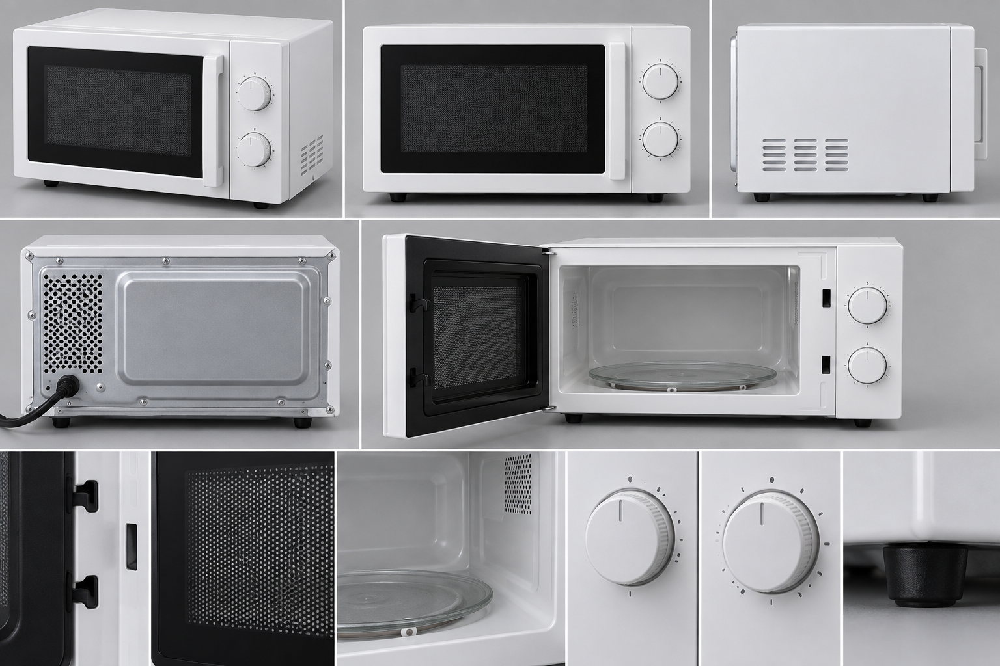
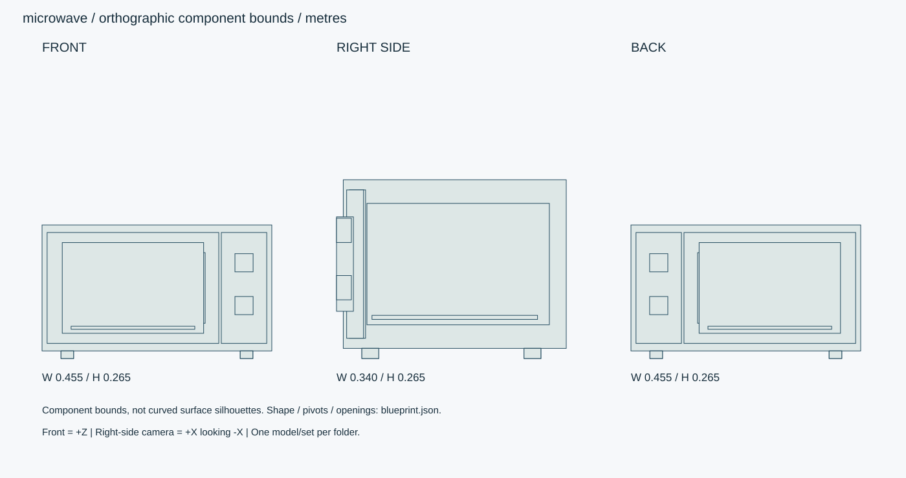

# 白いダイヤル式・電子レンジ

白い小型電子レンジ。左ヒンジ扉、扉右端の縦取手、右操作パネルにダイヤル2個。

ID: `microwave` / category: `microwave` / kind: `prop` / status: `design_review`

## 設計の基準

右手系: +X右、+Y上、+Z正面。sideは+Xから-Xへ、画面右が-Z。
数値JSON > 寸法SVG > 仕様文 > 参考画像

```json
{
  "envelope_xyz_m": [
    0.455,
    0.265,
    0.34
  ],
  "origin": "床/設置面の中心、閉じた基準状態。天井灯のみ天井取付面中心。",
  "axis": "右手系: +X右、+Y上、+Z正面。sideは+Xから-Xへ、画面右が-Z。",
  "priority": "数値JSON > 寸法SVG > 仕様文 > 参考画像",
  "cavity_xyz_m": [
    0.28,
    0.18,
    0.27
  ],
  "turntable_diameter_m": 0.245,
  "door_open_deg": 100,
  "vent_clearance_design_m": {
    "rear": 0.1,
    "top": 0.15,
    "sides": 0.1
  },
  "clearance_note": "室内配置用の仮定値。実家電の取扱説明書ではない。"
}
```

## 全体・正面・側面・背面・細部イメージ



画像はAI生成の参考図。寸法・配置・階数に不一致がある場合は数値仕様を優先する。実モデルを検証した画像ではない。




## 形状・微細構造

- 扉窓は幅230×高さ130mm、金属網の穴径0.8mm・ピッチ1.2mm。近景は形状、遠景は法線/不透明パターンで再現。
- ラッチ爪2点は扉右側、高さ差100mm。取手とダイヤルが重ならない。
- 庫内底からガラス皿上面まで14mm。奥隅R8mm、後面の小穴と通風口を形状で表現。
- 電源コードは背面左下から独立カーブで出す。ケーブルは設置時に配線するため閉状態の包絡寸法に含めない。

## パーツ分解

|ID|名称|中心XYZ（m）|サイズXYZ（m）|材質・備考|
|---|---|---|---|---|
|shell|外装|[0, 0.14, -0.005]|[0.455, 0.25, 0.33]|white-steel / 中空、板厚0.7mm、脚を含む総高265mm。|
|door|前扉|[-0.0475, 0.14, 0.139]|[0.34, 0.22, 0.024]|black-plastic / 左ヒンジ、金属網入り窓。|
|control-panel|操作パネル|[0.1725, 0.14, 0.1425]|[0.09, 0.22, 0.025]|white-steel / |
|handle|縦取手|[0.0875, 0.14, 0.1575]|[0.016, 0.14, 0.025]|polymer / 前方へ出る。最大包絡Zを超える場合は外装後面を基準に深さへ算入。|
|cavity|庫内|[-0.0475, 0.14, -0.01]|[0.28, 0.18, 0.27]|enamel / 体積は空洞。|
|turntable|ガラス皿|[-0.0475, 0.061, -0.005]|[0.245, 0.006, 0.245]|glass / 円形、厚6mm、中央ハブ。|
|dial-0|操作ダイヤル|[0.1725, 0.19, 0.159]|[0.036, 0.036, 0.022]|polymer / 円柱軸+Z。|
|dial-1|操作ダイヤル|[0.1725, 0.105, 0.159]|[0.036, 0.036, 0.022]|polymer / 円柱軸+Z。|
|foot-0-0|ゴム脚|[-0.1775, 0.0075, -0.12]|[0.025, 0.015, 0.025]|rubber / 円形。|
|foot-0-1|ゴム脚|[-0.1775, 0.0075, 0.12]|[0.025, 0.015, 0.025]|rubber / 円形。|
|foot-1-0|ゴム脚|[0.1775, 0.0075, -0.12]|[0.025, 0.015, 0.025]|rubber / 円形。|
|foot-1-1|ゴム脚|[0.1775, 0.0075, 0.12]|[0.025, 0.015, 0.025]|rubber / 円形。|

包絡パーツは中実メッシュの指示ではない。建物は外壁・内壁・床・天井・開口・建具・固定設備へ分解する。

## PBR材質・テクスチャ

|材質|色 sRGB|Roughness|Metallic|微細構造|
|---|---|---|---|---|
|white-steel|#E6E7E3|[0.3, 0.5]|0|白い塗装鋼板、厚0.6–0.8mm。塗膜は非金属。折返し端のRと接合隙間を作る。|
|black-plastic|#292D30|[0.45, 0.65]|0|チャコール樹脂、指触部に粗さ差0.05。黒つぶれを避ける。|
|glass|#D7E2E0|[0.03, 0.12]|0|建築ガラス厚6–12mm。透明・反射を別設定、IOR目標1.5。透過は現行APIとの差分実装対象。汚れ1%以下。|
|enamel|#D9DAD5|[0.25, 0.4]|0|白グレーの庫内塗膜。コーナーR8mm以上。微細オレンジピール0.05mm。|
|metal|#45494A|[0.25, 0.4]|1|アルミ・ステンレス。ヘアラインを部材長手方向へ。切断端ベベル0.5–1mm、汚れは継ぎ目に限定。|
|rubber|#E5E3DC|[0.65, 0.85]|0|白スニーカー底厚25mm、側面細溝0.7mm、底溝深2mm。接地縁に薄い灰色摩耗。|
|polymer|#E5E5DF|[0.3, 0.5]|0|射出成形樹脂の梨地。パーティングライン0.1mm、角R0.5–2mm。|

数値は制作初期値。色・粗さ・法線・金属度は別マップ。0.5mm未満の凹凸は原則法線、輪郭に現れる縫い目・溝・欠けは形状で表す。

## 可動部

|ID|方式|支点XYZ（m）|軸|範囲|動作|
|---|---|---|---|---|---|
|door|hinge|[-0.2175, 0.03, 0.139]|[0, 1, 0]|[0, -100] degree|左ヒンジ、右取手、左手前へ開く。|
|dial-upper|hinge|[0.1725, 0.19, 0.159]|[0, 0, 1]|[-120, 120] degree|出力設定の表示用回転。|
|dial-lower|hinge|[0.1725, 0.105, 0.159]|[0, 0, 1]|[0, 300] degree|時間設定の表示用回転。|
|turntable|hinge|[-0.0475, 0.061, -0.005]|[0, 1, 0]|[0, 360] degree|6秒/回転、扉閉かつ運転状態のみ。|

角度範囲は読みやすさのため度。promodelerへ渡す際はラジアンへ変換。支点は閉じた状態・1階のローカル座標、階・住戸ごとに平行移動する。

## 検証クリップ

```json
[
  {
    "id": "door-cycle",
    "duration_s": 4,
    "description": "閉→100度開→閉。"
  },
  {
    "id": "running",
    "duration_s": 6,
    "description": "扉閉、庫内灯ON、皿1回転。開扉で灯・皿停止。"
  }
]
```

## 実装と納品条件

```json
{
  "engine": "Unity / HDRP を主想定。バージョンはモデル実装時に固定。",
  "exports": [
    "編集可能な制作ソース",
    "GLB（形状・PBR・ベイクした骨アニメ）",
    "Unity用物理設定",
    "検証PNGとMP4"
  ],
  "triangles_lod0_max": 42000,
  "texture_resolution_max": 2048,
  "texture_policy": "共有材2K、主役・顔4K。BaseColor=sRGB、Normal/Roughness/Metallic=linear。AOをBaseColorへ焼き込まない。",
  "texel_density_px_per_m": 1024,
  "lod_ratios": [
    1,
    0.5,
    0.2,
    0.08
  ],
  "texture_resident_budget_mib": 48
}
```

`blueprint.json` は設計データであり、promodelerのレシピJSONと互換ではない。実装担当がPythonのAsset/Part/Rigへ変換する。

## 未実装機能・差分


## 受入基準（モデル生成後に検証）

- [ ] 左ヒンジ、取手は扉右端、ダイヤルは前面右側。
- [ ] 扉100度で外装に干渉しない。取手を含めた総奥行0.34m以内。
- [ ] 庫内は開扉時に実際の空洞として見え、皿は壁を貫通しない。
- [ ] 生成後にGLBと編集可能なソースを再読込し、単位・法線・UV・パーツIDを照合。
- [ ] 画像は設計参考であり実モデルの検証証拠ではない。モデル未生成のチェックは未確認のまま。
- [ ] LOD0予算、法線マップの接線系、透明材のソート、衝突形状を対象エンジンで確認。

## 管理・権利情報

```json
{
  "tags": [
    "日本",
    "現代",
    "写実",
    "独立アセット",
    "microwave"
  ],
  "usage": "PC向けリアルタイム探索・映像用のモデル設計",
  "license": "独自制作物として管理。現段階は私有・配布許諾未設定。販売用ライセンスは公開時に別途設定。",
  "approval": "モデル未生成・販売未承認",
  "description": "白い小型電子レンジ。左ヒンジ扉、扉右端の縦取手、右操作パネルにダイヤル2個。"
}
```

## interfaces

```json
[
  "設置面Y0、扉正面+Z。机/ラック/冷蔵庫への配置は別工程。"
]
```

## hierarchy

```json
{
  "door": [
    "handle",
    "window-mesh",
    "latch-upper",
    "latch-lower"
  ],
  "shell-root": [
    "control-panel",
    "dial-0",
    "dial-1",
    "cavity",
    "turntable"
  ]
}
```
