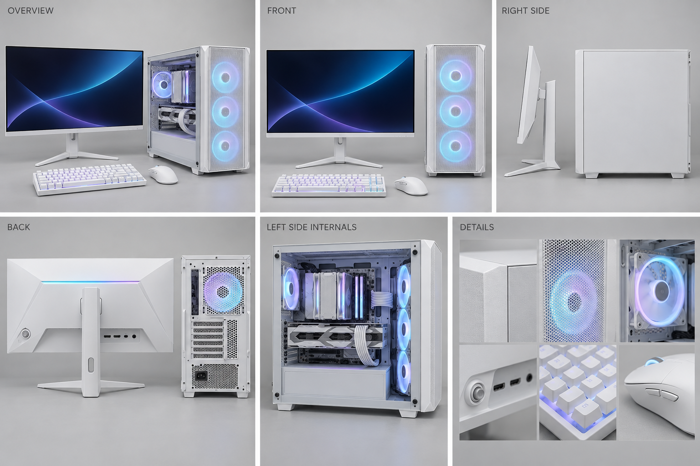
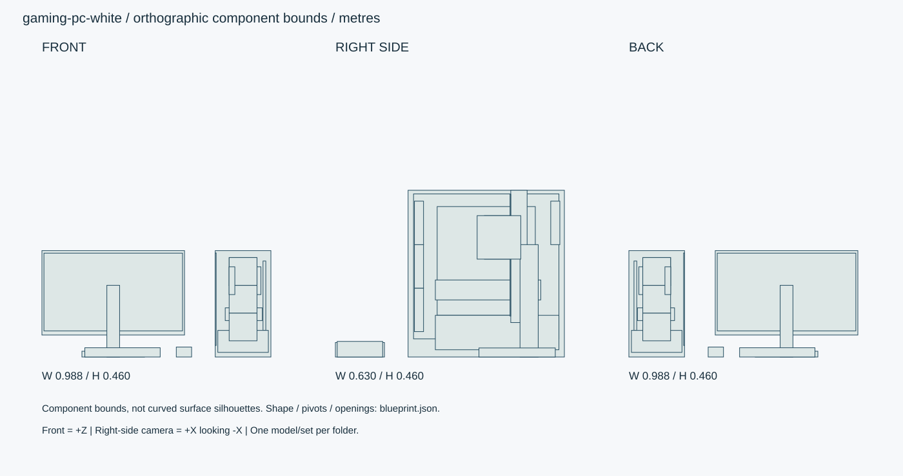

# ホワイト・ゲーミングPCとディスプレイ

ホワイトのゲーミングPC本体・27型フラットディスプレイ・75%キーボード・マウスの独立セット。透明側板、RGBファン、背面発光を備える。

ID: `gaming-pc-white` / category: `pc-set` / kind: `prop` / status: `design_review`

## 設計の基準

右手系、+X右・+Y上・+Z正面。PC左側=-Xにガラス。
数値JSON > 寸法SVG > 仕様文 > 参考画像

```json
{
  "envelope_xyz_m": [
    1.12,
    0.46,
    0.74
  ],
  "tower_xyz_m": [
    0.24,
    0.46,
    0.43
  ],
  "monitor_xyz_m": [
    0.615,
    0.46,
    0.21
  ],
  "monitor_panel_xyz_m": [
    0.615,
    0.365,
    0.045
  ],
  "active_screen_xy_m": [
    0.5976,
    0.33615
  ],
  "screen_diagonal_inch": 27,
  "keyboard_xyz_m": [
    0.325,
    0.04,
    0.135
  ],
  "mouse_xyz_m": [
    0.066,
    0.043,
    0.125
  ],
  "origin": "各機器の設置面中央。partsの座標はセット展示時の共通座標。",
  "axis": "右手系、+X右・+Y上・+Z正面。PC左側=-Xにガラス。",
  "priority": "数値JSON > 寸法SVG > 仕様文 > 参考画像"
}
```

## 全体・正面・側面・背面・細部イメージ



画像はAI生成の参考図。寸法・配置・階数に不一致がある場合は数値仕様を優先する。実モデルを検証した画像ではない。




## 形状・微細構造

- 白とピンクは同じ寸法・パーツ構成・UVで色違いにする。RGB色も別プリセット。既存の黒いコンパクトPCとは別の形状設計。
- PC前面は3ファンが見えるメッシュ、左側は透明ガラス、右側は配線用不透明板。背面は排気ファン・拡張スロット・電源・USB/映像端子。
- ケースメッシュ径1.5mm・ピッチ2.5mm。LOD0は近景穴形状、遠景は不透明パターンと法線へ切替。側板隙間1.5mm、ねじ頭径6mm。
- GPUの奥行290mm、背面側から固定。クーラーとケーブルがガラスに触れないよう最低8mmの隙間を確保。
- モニターは有効画面597.6×336.15mm。背面VESA穴100mmピッチ、映像/電源端子は下向き。RGBライン幅3mm、ジョイスティック径8mm。
- 75%キーは84個、ピッチ19mmを基準に端の機能列を詰めて幅325mm内に収める。キー間隙1mm、文字は汎用記号。
- マウス長125mm、サイドボタン各12×4mm、クリック移動0.5mm、ホイール径24mm。ケーブルは着脱可能な別パーツ。

## パーツ分解

|ID|名称|中心XYZ（m）|サイズXYZ（m）|材質・備考|
|---|---|---|---|---|
|tower-shell|PCキャビネット|[0.32, 0.23, -0.055]|[0.24, 0.46, 0.43]|case-coat / 中空の0.8mm鋼板、前メッシュ、右裏配線パネル。|
|left-glass|左透明側板|[0.202, 0.25, -0.055]|[0.004, 0.4, 0.4]|glass / 4点固定、上方へ20mm動かして取外し。|
|motherboard|基板とコネクター|[0.412, 0.265, -0.055]|[0.012, 0.3, 0.27]|case-coat / 右側トレーに平行。汎用形状、メーカー刻印なし。|
|gpu|水平GPU|[0.323, 0.185, -0.06]|[0.16, 0.055, 0.29]|case-coat / 白/ピンクのクーラー外装。PCI側は背面-Z。|
|cpu-cooler|CPUタワークーラー|[0.337, 0.33, -0.09]|[0.12, 0.12, 0.08]|metal / フィン間1.8mm、側面ファン。|
|psu-shroud|電源シュラウド|[0.32, 0.0675, -0.085]|[0.218, 0.095, 0.34]|case-coat / 前面ファン後端との隙間32.5mmを確保。|
|monitor-panel|27型モニター|[-0.24, 0.2775, -0.145]|[0.615, 0.365, 0.045]|shell-plastic / 上端Y0.46。フラット。背面角面はR3mm。|
|active-screen|表示面|[-0.24, 0.281, -0.1215]|[0.5976, 0.33615, 0.002]|dark-screen / |
|monitor-stand|昇降支柱|[-0.24, 0.155, -0.173]|[0.055, 0.31, 0.05]|case-coat / |
|monitor-base|V字台座包絡|[-0.24, 0.0125, -0.14]|[0.27, 0.025, 0.21]|case-coat / 左右2本の脚へ分割、足幅25mm、先端R5mm。|
|keyboard|75%キーボード|[-0.2, 0.02, 0.2925]|[0.325, 0.04, 0.135]|shell-plastic / 84キー設計。ケースとキーを分離。|
|mouse|ゲーミングマウス|[0.065, 0.0215, 0.2925]|[0.066, 0.043, 0.125]|shell-plastic / 右利き、左側ボタン2個、底スケート。|
|fan-front-0|120mm前面吸気ファン|[0.32, 0.13, 0.13]|[0.12, 0.12, 0.025]|rgb-diffuser / 枠・7枚羽根・RGBリングを別メッシュ。軸Z。|
|fan-front-1|120mm前面吸気ファン|[0.32, 0.25, 0.13]|[0.12, 0.12, 0.025]|rgb-diffuser / 枠・7枚羽根・RGBリングを別メッシュ。軸Z。|
|fan-front-2|120mm前面吸気ファン|[0.32, 0.37, 0.13]|[0.12, 0.12, 0.025]|rgb-diffuser / 枠・7枚羽根・RGBリングを別メッシュ。軸Z。|
|fan-rear|120mm排気ファン|[0.32, 0.37, -0.245]|[0.12, 0.12, 0.025]|rgb-diffuser / 軸Z。|
|fan-cpu|CPUファン|[0.272, 0.33, -0.09]|[0.025, 0.12, 0.12]|case-coat / 軸X。|

包絡パーツは中実メッシュの指示ではない。建物は外壁・内壁・床・天井・開口・建具・固定設備へ分解する。

## PBR材質・テクスチャ

|材質|色 sRGB|Roughness|Metallic|微細構造|
|---|---|---|---|---|
|case-coat|#EEEFEA|[0.32, 0.48]|0|粉体塗装、板厚0.8mm。縁R1mm。ロゴなし。|
|shell-plastic|#EEEFEA|[0.35, 0.5]|0|モニター外装とマウス。同じ基調色で微細梨地。|
|keycap|#F5F4EE|[0.5, 0.7]|0|PBT風の梨地。主要キーと筐体で明度差をつける。|
|glass|#DDE5E7|[0.025, 0.06]|0|左側板4mm厚の透明ガラス、端R0.5mm。透過は追加実装対象。|
|dark-screen|#101822|[0.12, 0.22]|0|アンチグレア画面。画面に淡い抽象グラデーション、商標UIなし。|
|rgb-diffuser|#BCECF4|[0.3, 0.45]|0|乳白拡散材。発光色は別チャンネルで制御。|
|metal|#AEB4B8|[0.25, 0.4]|1|露出ねじ・端子・ヒートシンク。ヘアラインは部材長手。|
|rubber|#52555A|[0.75, 0.9]|0|脚の防振パッド、厚3mm。マウス底スケートは別樹脂。|

数値は制作初期値。色・粗さ・法線・金属度は別マップ。0.5mm未満の凹凸は原則法線、輪郭に現れる縫い目・溝・欠けは形状で表す。

## 可動部

|ID|方式|支点XYZ（m）|軸|範囲|動作|
|---|---|---|---|---|---|
|monitor-height|slide|[-0.24, 0.155, -0.173]|[0, 1, 0]|[0, 0.1] m|画面上端0.46→0.56m。|
|monitor-tilt|hinge|[-0.24, 0.2775, -0.168]|[1, 0, 0]|[-5, 20] degree|パネルと画面・背面ライトを一体で回転。|
|monitor-swivel|hinge|[-0.24, 0.155, -0.173]|[0, 1, 0]|[-20, 20] degree|左右各20度。|
|glass-release|slide|[0.202, 0.25, -0.055]|[0, 1, 0]|[0, 0.02] m|固定ねじを外した分解表示。通常は閉じたまま。|
|glass-remove|slide|[0.202, 0.27, -0.055]|[1, 0, 0]|[-0.15, 0] m|上方解除後に左へ取外す。|
|fan-front|hinge|[0.32, 0.13, 0.13]|[0, 0, 1]|[0, 360] degree|各ファン中心へ複製、羽根のみ回転。|
|fan-cpu|hinge|[0.272, 0.33, -0.09]|[1, 0, 0]|[0, 360] degree|CPUファンはX軸。|
|key-press|slide|[-0.2, 0.04, 0.2925]|[0, 1, 0]|[-0.0035, 0] m|キー別位置で独立押下。|
|mouse-wheel|hinge|[0.065, 0.039, 0.265]|[1, 0, 0]|[0, 360] degree|回転と中クリックを分離。|

角度範囲は読みやすさのため度。promodelerへ渡す際はラジアンへ変換。支点は閉じた状態・1階のローカル座標、階・住戸ごとに平行移動する。

## 検証クリップ

```json
[
  {
    "id": "rgb-cycle",
    "duration_s": 12,
    "description": "消灯4秒→定常4秒→呼吸4秒。"
  },
  {
    "id": "fan-demo",
    "duration_s": 4,
    "description": "外観確認用回転。実RPMを模した性能検証ではない。"
  },
  {
    "id": "monitor-adjust",
    "duration_s": 8,
    "description": "昇降100mm・チルト・左右旋回を順に示す。"
  },
  {
    "id": "glass-removal",
    "duration_s": 4,
    "description": "上方20mm→左150mm。"
  }
]
```

## 実装と納品条件

```json
{
  "engine": "Unity / HDRP を主想定。バージョンはモデル実装時に固定。",
  "exports": [
    "編集可能な制作ソース",
    "GLB（形状・PBR・ベイクした骨アニメ）",
    "Unity用物理設定",
    "検証PNGとMP4"
  ],
  "triangles_lod0_max": 150000,
  "texture_resolution_max": 4096,
  "texture_policy": "筐体・周辺機器2K、画面と主役用ディテール4K。色のみsRGB、粗さ/金属/法線はlinear。",
  "texel_density_px_per_m": 1024,
  "lod_ratios": [
    1,
    0.5,
    0.2,
    0.08
  ],
  "texture_resident_budget_mib": 96,
  "triangles_by_group": {
    "tower_exterior": 30000,
    "tower_internals": 55000,
    "monitor": 30000,
    "keyboard": 25000,
    "mouse": 10000
  }
}
```

`blueprint.json` は設計データであり、promodelerのレシピJSONと互換ではない。実装担当がPythonのAsset/Part/Rigへ変換する。

## 未実装機能・差分

- ガラス透過、RGB制御、モニター連動ジョイントは対象エンジンで実装・検証。
- モデルは未生成。冷却性能や電子回路の設計ではなく、視覚アセットの仕様。

## 受入基準（モデル生成後に検証）

- [ ] 白/ピンクのパーツID・寸法・ファン5基・表示面比率が一致。
- [ ] 正面、右、左透明側、背面、端子と微細材質の画像をモデル生成後に確認。
- [ ] 画面の実寸比16:9、ディスプレイの最大高さ0.56m。
- [ ] 昇降・旋回でスタンドから離脱せず、ケース内のGPU/クーラー/側板が交差しない。
- [ ] RGB消灯時と点灯時の両方で塗装の基調色とガラス内部が判読可能。
- [ ] 生成後にGLBと編集可能なソースを再読込し、単位・法線・UV・パーツIDを照合。
- [ ] 画像は設計参考であり実モデルの検証証拠ではない。モデル未生成のチェックは未確認のまま。
- [ ] LOD0予算、法線マップの接線系、透明材のソート、衝突形状を対象エンジンで確認。

## 管理・権利情報

```json
{
  "tags": [
    "日本",
    "現代",
    "写実",
    "ゲーミング",
    "pc-set",
    "ホワイト"
  ],
  "usage": "PC向けリアルタイム探索・映像用のモデル設計",
  "license": "独自制作物として管理。現段階は私有・配布許諾未設定。販売用ライセンスは公開時に別途設定。",
  "approval": "モデル未生成・販売未承認",
  "description": "ホワイトのゲーミングPC本体・27型フラットディスプレイ・75%キーボード・マウスの独立セット。透明側板、RGBファン、背面発光を備える。"
}
```

## gaming_features

```json
{
  "design_only": true,
  "pc": "汎用ハイエンド風の外観設計。実在CPU/GPU型番、処理性能、互換性の保証は定義しない。",
  "monitor": "27型16:9フラット、可変スタンド、背面RGB。解像度・リフレッシュレートは3D形状仕様に含めない。",
  "cooling": "前面120mm×3、背面120mm×1、CPU120mm×1。配線とGPU補助電源をガラス越しに確認できる。",
  "peripherals": "75%メカニカル風キーボード、ホイール・サイド2ボタン付きマウス。"
}
```

## lighting

```json
{
  "zones": [
    "3前面リング",
    "背面ファンリング",
    "モニター背面ライン",
    "キー下発光",
    "マウス背面細線"
  ],
  "presets": [
    "off",
    "steady-pastel",
    "slow-breathe"
  ],
  "colors_srgb": [
    "#A7E7F2",
    "#C5B7EF"
  ],
  "breathe_period_s": 4,
  "emission_policy": "塗装色と発光を分離。消灯時も白/ピンクが成立。ガラス越しに白飛びしない強さへ調整。",
  "gpu_status": "RGBをPCの実際の性能指標として扱わない。"
}
```

## interfaces

```json
[
  "tower/monitor/keyboard/mouseの4ルートで独立配置。展示位置はPCデスクへの確定配置ではない。",
  "幅1mの既存PCデスクに載せる際は配線・画面回転余裕を確認し、タワーは床へ別置き可能。",
  "UVとパーツIDを両色で共有。色切替は材質プリセットで行い、各フォルダは単体でも参照できる。"
]
```

## roots

```json
[
  {
    "id": "tower-root"
  },
  {
    "id": "monitor-root"
  },
  {
    "id": "keyboard-root"
  },
  {
    "id": "mouse-root"
  }
]
```
