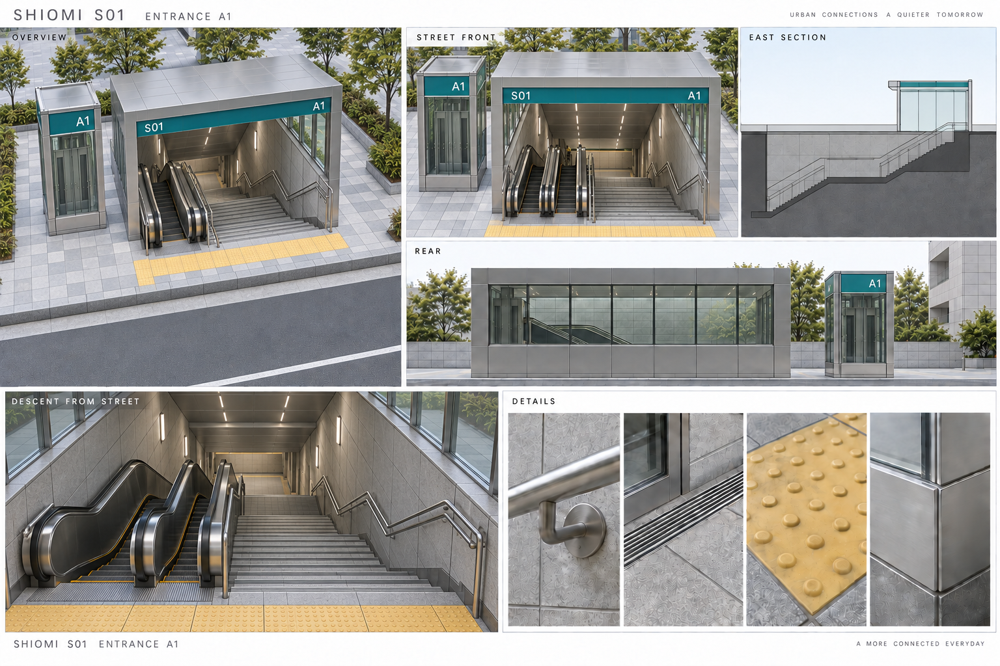
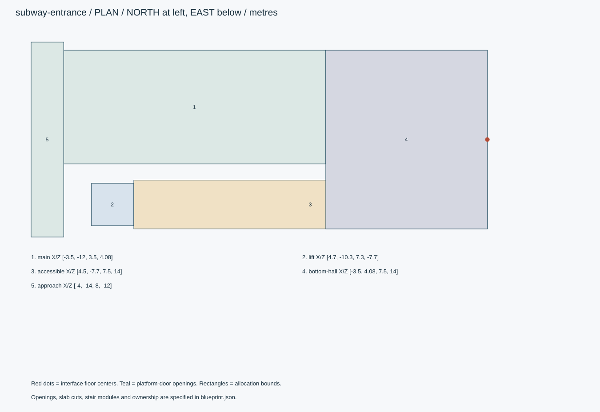
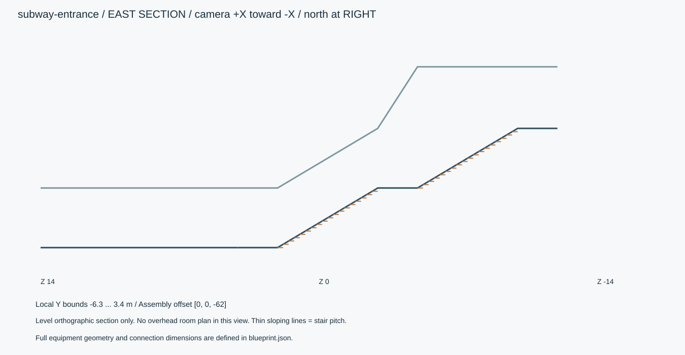
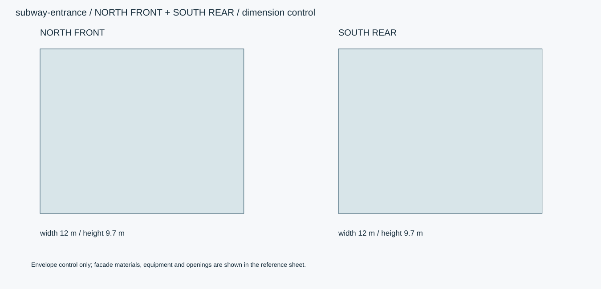

# 汐見駅S01・地上入口A1

地上の階段・エスカレーター入口と隣接エレベーター。地下1階の共通接続口までを含む。

現行モデルでは、上下エスカレーターの傾斜段と水平踊場を連続させ、両側をガラス欄干、上端を平坦なゴム手すりとする。床は目地付きタイル、黄色の誘導・警告ブロックは凸条・点状突起を実形状で設ける。

ID `subway-entrance` / category `subway-entrance` / 設計レビュー

## 全体・正面・側面・背面・細部



画像は外観参考です。施工や実モデルの検証証拠ではありません。寸法・設備数・接続は数値仕様を優先します。

## 数値図







## 寸法と原点

```json
{
  "local_bounds_xyz_m": [
    [
      -4,
      -6.3,
      -14
    ],
    [
      8,
      3.4,
      14
    ]
  ],
  "envelope_xyz_m": [
    12,
    9.7,
    28
  ],
  "assembly_translation_m": [
    0,
    0,
    -62
  ],
  "assembly_rotation_rad": [
    0,
    0,
    0
  ],
  "axis": "右手系: +X東、+Y上、+Z南。正面は駅北側-Z。",
  "origin": "アセットごとのローカル原点をassembly_translation_mで駅共通座標へ平行移動する。",
  "priority": "数値JSON・接続座標 > 寸法図 > 仕様文 > 参考画像",
  "ground_y_m": 0,
  "b1_y_m": -6,
  "main_entrance_width_m": 7,
  "canopy_height_m": 3.4,
  "lower_corridor_clear_height_m": 3
}
```

## 接続口

```json
[
  {
    "id": "to-concourse",
    "floor_center_local_m": [
      2,
      -6,
      14
    ],
    "outward_normal_xyz": [
      0,
      0,
      1
    ],
    "clear_width_m": 11,
    "clear_height_m": 3,
    "connects_to": "subway-concourse:from-entrance"
  }
]
```

## 生成範囲と所有

```json
{
  "owns": [
    "地上庇・階段・地上B1エスカレーター2基・地上B1エレベーター・下部ホール"
  ],
  "boundary": "ローカルZ14（駅共通Z=-48）で壁・床を止める。接続面を塞ぐ壁は作らない。"
}
```

## 平面区画

```json
[
  {
    "id": "main",
    "rect_xz_m": [
      -3.5,
      -12,
      3.5,
      4.08
    ],
    "use": "主動線:階段・上り下りエスカレーター"
  },
  {
    "id": "lift",
    "rect_xz_m": [
      4.7,
      -10.3,
      7.3,
      -7.7
    ],
    "use": "地上-B1エレベーター"
  },
  {
    "id": "accessible",
    "rect_xz_m": [
      4.5,
      -7.7,
      7.5,
      14
    ],
    "use": "B1バリアフリー通路"
  },
  {
    "id": "bottom-hall",
    "rect_xz_m": [
      -3.5,
      4.08,
      7.5,
      14
    ],
    "use": "B1下部ホール・改札階への接続"
  },
  {
    "id": "approach",
    "rect_xz_m": [
      -4,
      -14,
      8,
      -12
    ],
    "use": "地上前面アプローチ。エレベーターへ東側で回り込む。"
  }
]
```

## パーツと形状

|ID|名称|中心XYZ m|寸法XYZ m|材質・備考|
|---|---|---|---|---|
|canopy-frame|地上庇の包絡|[0, 3.25, -8.48]|[7, 0.3, 7.04]|stainless / 柱・梁・ガラスに分解。|
|lift-shaft|昇降路|[6, -1.4, -9]|[2.6, 9.6, 2.6]|glass / 下端-6.2、上端3.4。|
|lower-floor|B1床|[2, -6.15, 9.04]|[11, 0.3, 9.92]|floor-tile / |
|station-sign|入口サイン|[0, 2.75, -12.05]|[5.8, 0.45, 0.12]|teal / 表示は汐見駅/S01/A1。|

包絡は中実のBoxを指示するものではありません。床・壁・内部空間・可動パネル・開口へ分解してください。

## 微細構造

- 駅の北側に道路面を想定。地上入口正面は-Z側。エレベーター地上出入口は+Z側に向き、東側舗装で接近する。
- 階段とエスカレーターの床高に合わせて屋根下面を段階的に下げる。入口の地上スラブを階段頭上に通して頭を塞がない。
- 主入口の床開口はX=-3.5〜3.5、Z=-12〜4.08。B1の入口ホールでは階段と昇降機通路が合流。
- 手すり径40mm、金属アンカー120mm角、排水スリット幅15mm。雨掛かり部と地下の汚れを分ける。
- 設備脇の黄色い点字ブロックは移動路と停止位置を区別し、階段へ向かう線と昇降機へ向かう線を分岐。

## 材質・テクスチャ

|ID|sRGB色|粗さ|金属度|細部|
|---|---|---|---|---|
|wall-tile|#E4E6E2|[0.4, 0.6]|0|壁150×300mm、目地3mm/深1.5mm。壁下部に少量の擦れ。割れを一様に散布しない。|
|floor-tile|#9C9F9C|[0.38, 0.52]|0|床300角、目地4mm。少しだけ艶を残し、淡い色差と局所的な汚れ・くすみを付ける。|
|tactile|#D7B741|[0.6, 0.8]|0|線状/点状ブロックを別部品。300角、凸高さ5mm。配置は本アセットの設計値。|
|stainless|#B2B9BC|[0.22, 0.4]|1|手すり・建具、長手ヘアライン。角R1mm、指触部に薄い粗さ差。|
|paint|#E1E3E0|[0.45, 0.65]|0|天井・設備の塗装鋼板、継目2mm、露出金属と塗膜を分離。|
|teal|#287F87|[0.35, 0.5]|0|架空駅共通の案内帯。実在鉄道のロゴ・路線色を転用しない。|
|glass|#DBE4E5|[0.03, 0.12]|0|厚8mmの設備ガラス、欄干12mm。透明/反射は別チャンネル、透過実装が必要。|
|rubber|#363B3D|[0.65, 0.85]|0|エスカレーターの手すり、扉パッキン。手すりの滑り方向に微細筋。|
|concrete|#A6AAA8|[0.7, 0.9]|0|RC構造・床下・トンネル壁。目地と施工区画に沿う汚れ。|
|rail-steel|#656F73|[0.22, 0.65]|1|レール頭は研磨、側面は低彩度の酸化色。締結金物を独立パーツに。|
|light|#EDF1EC|[0.3, 0.4]|0|拡散カバー。発光と照明用ライトを別設定。|
|dark-display|#18272D|[0.1, 0.25]|0|券売機/改札/案内の表示面。汎用UIで実在運賃・時刻表は使わない。|

## 階段

```json
[
  {
    "id": "entry-stair",
    "clear_width_m": 2.0,
    "riser_count": 36,
    "rise_m": 0.16666666666666666,
    "tread_m": 0.28,
    "flights": 2,
    "flight_treads": 18,
    "upper_landing_depth_m": 2,
    "mid_landing_depth_m": 2,
    "lower_landing_depth_m": 2,
    "top_floor_y_m": 0,
    "bottom_floor_y_m": -6,
    "start_z_m": -12,
    "end_z_m": 4.080000000000002,
    "direction_z": 1,
    "x_range_m": [
      -3.1,
      -1.1
    ],
    "section_profile_zy": [
      [
        -12,
        0
      ],
      [
        -10,
        0
      ],
      [
        -4.959999999999999,
        -3.0
      ],
      [
        -2.959999999999999,
        -3.0
      ],
      [
        2.080000000000002,
        -6
      ],
      [
        4.080000000000002,
        -6
      ]
    ],
    "handrail": {
      "height_above_pitch_m": 0.85,
      "tube_diameter_m": 0.04,
      "extension_m": 0.3
    },
    "note": "段と踊場の高さはtreadsを正とする。断面図の斜線は段鼻を結ぶ基準線。"
  }
]
```

## エスカレーター

```json
[
  {
    "id": "entry-es-up",
    "center_x_m": -0.05,
    "overall_width_m": 1.5,
    "step_clear_width_m": 1.0,
    "vertical_drop_m": 6,
    "slope_deg": 30,
    "horizontal_slope_run_m": 10.392304845413264,
    "landing_run_each_m": 2,
    "top_floor_y_m": 0,
    "bottom_floor_y_m": -6,
    "direction_z": 1,
    "travel": "up",
    "speed_m_s": 0.5,
    "handrail_speed_ratio": 1,
    "step_pitch_m": 0.4,
    "section_profile_zy": [
      [
        -12,
        0
      ],
      [
        -10,
        0
      ],
      [
        0.39230484541326405,
        -6
      ],
      [
        2.392304845413264,
        -6
      ]
    ],
    "animation": "上・下の水平区間→傾斜区間→床下の戻り区間で閉ループ。運転面だけを直線移動して端で消す方式は不可。",
    "details": "櫛板の歯ピッチ5mm、踏面溝3mm、端に黄色ライン20mm。ガラス欄干上端は踏面上0.9m。"
  },
  {
    "id": "entry-es-down",
    "center_x_m": 1.65,
    "overall_width_m": 1.5,
    "step_clear_width_m": 1.0,
    "vertical_drop_m": 6,
    "slope_deg": 30,
    "horizontal_slope_run_m": 10.392304845413264,
    "landing_run_each_m": 2,
    "top_floor_y_m": 0,
    "bottom_floor_y_m": -6,
    "direction_z": 1,
    "travel": "down",
    "speed_m_s": 0.5,
    "handrail_speed_ratio": 1,
    "step_pitch_m": 0.4,
    "section_profile_zy": [
      [
        -12,
        0
      ],
      [
        -10,
        0
      ],
      [
        0.39230484541326405,
        -6
      ],
      [
        2.392304845413264,
        -6
      ]
    ],
    "animation": "上・下の水平区間→傾斜区間→床下の戻り区間で閉ループ。運転面だけを直線移動して端で消す方式は不可。",
    "details": "櫛板の歯ピッチ5mm、踏面溝3mm、端に黄色ライン20mm。ガラス欄干上端は踏面上0.9m。"
  }
]
```

## エレベーター

```json
{
  "id": "entry-lift",
  "shaft_center_xz_m": [
    6,
    -9
  ],
  "shaft_size_xz_m": [
    2.6,
    2.6
  ],
  "cabin_clear_xyz_m": [
    1.6,
    2.2,
    1.5
  ],
  "stops_y_m": [
    0,
    -6
  ],
  "door_normal_xyz": [
    0,
    0,
    1
  ],
  "door_clear_wh_m": [
    0.9,
    2.1
  ],
  "door_floor_center_xz_m": [
    6,
    -7.7
  ],
  "travel_speed_m_s": 1.0,
  "door_open_time_s": 1.8
}
```

## 可動部

```json
[
  {
    "id": "lift-cabin",
    "type": "slide",
    "pivot_m": [
      6,
      0,
      -9
    ],
    "axis": [
      0,
      1,
      0
    ],
    "range": [
      -6,
      0
    ],
    "unit": "m",
    "note": "地上/B1。停止・扉閉確認後に移動。"
  },
  {
    "id": "lift-door-left",
    "type": "slide",
    "pivot_m": [
      5.775,
      0,
      -7.7
    ],
    "axis": [
      1,
      0,
      0
    ],
    "range": [
      -0.45,
      0
    ],
    "unit": "m",
    "note": "右扉は逆方向。"
  },
  {
    "id": "closure-shutter",
    "type": "slide",
    "pivot_m": [
      0,
      0,
      -12
    ],
    "axis": [
      0,
      1,
      0
    ],
    "range": [
      0,
      2.6
    ],
    "unit": "m",
    "note": "入口の閉鎖シャッター、営業時は全開。"
  }
]
```

## 視点の定義

```json
{
  "front": {
    "camera_direction_xyz": [
      0,
      0,
      1
    ],
    "screen_right_xyz": [
      -1,
      0,
      0
    ],
    "note": "北から南へ。画像右が西。"
  },
  "east_section": {
    "camera_direction_xyz": [
      -1,
      0,
      0
    ],
    "screen_right_xyz": [
      0,
      0,
      -1
    ],
    "note": "東から西へ。画像右が北。側断面に上面図を混ぜない。"
  },
  "rear": {
    "camera_direction_xyz": [
      0,
      0,
      -1
    ],
    "screen_right_xyz": [
      1,
      0,
      0
    ],
    "note": "南から北へ。画像右が東。"
  }
}
```

## 動作確認

```json
[
  {
    "id": "walkthrough",
    "duration_s": 20,
    "description": "正面入口→主動線→次の接続口を連続移動して床切れ/衝突を確認。"
  },
  {
    "id": "equipment-cycle",
    "duration_s": 12,
    "description": "各可動設備を個別に停止→動作→停止させる。単体試験と接続した駅全体で確認。"
  },
  {
    "id": "emergency-lighting",
    "duration_s": 6,
    "description": "通常照明→非常照明、案内と床の視認性を同じカメラで記録。"
  }
]
```

## 対象と納品

```json
{
  "engine": "Unity / HDRP（実装時にバージョン固定）",
  "exports": [
    "制作ソース",
    "GLB（静的形状・PBR・ベイク済み動作）",
    "Unityの制御設定",
    "正面/側面/背面/細部PNGと動作MP4"
  ],
  "triangles_lod0_max": 600000,
  "texture_resolution_max": 4096,
  "texture_policy": "共有材2K、案内表示/近接設備4K。BaseColor=sRGB、Normal/Roughness/Metallic=linear。",
  "texel_density_px_per_m": 512,
  "lod_ratios": [
    1,
    0.5,
    0.2,
    0.08
  ],
  "streaming": "入口・B1・B2を別チャンク。反復設備は共有形状、可動部を別ノード。",
  "texture_resident_budget_mib": 256,
  "texture_detail_policy": "長い床・壁は実寸タイリング材とデカールを併用。駅全長を1枚の4Kテクスチャに詰めない。接写部品だけ固有UV。"
}
```

## 管理情報

```json
{
  "tags": [
    "日本",
    "現代",
    "写実",
    "地下鉄",
    "subway-entrance"
  ],
  "usage": "PC向けリアルタイム探索・映像用の架空地下鉄駅。数値は視覚アセットの設計値。",
  "license": "独自制作物として管理。現段階は私有・配布許諾未設定。販売用ライセンスは公開時に別途設定。",
  "approval": "モデル未生成・販売未承認",
  "description": "地上の階段・エスカレーター入口と隣接エレベーター。地下1階の共通接続口までを含む。"
}
```

階段の全段座標はJSONのstairs[].treadsに収録。回転は仕様書では度、promodeler実装ではラジアンへ変換します。

## 実装上の差分

- エスカレーターの無限循環、ドア状態制御、ガラス透過、照明・表示のランタイム実装は別途必要。

独自設計JSONであり、promodelerのrecipeとして直接実行できません。全体接続は[駅の組立仕様](../subway-assembly.json)を参照してください。

## モデル生成後の受入条件

- [ ] 36段×1/6m=6m、踊場を含む上下の床高が0/-6mに一致。
- [ ] 地上東側アプローチ→EV→B1東通路→下部ホールに連続した床がある。
- [ ] to-concourseの位置・幅・高さが改札通路のfrom-entranceと一致。
- [ ] 参考画像ではなく生成済みモデルから正面・背面・斜め・細部・必要な動きの証拠を保存。

## 改訂2：地上入口の下り方向

地上の参考画像は、歩道と同じ高さの踊場から地下を見下ろす視点へ変更。最初の段から下り、途中踊場はY=-3m、B1はY=-6mです。地上正面の写真風画像は正投影立面ではありません。形状寸法はJSONと断面図を参照してください。旧画像はimages/reference-sheet.pngに保持。
