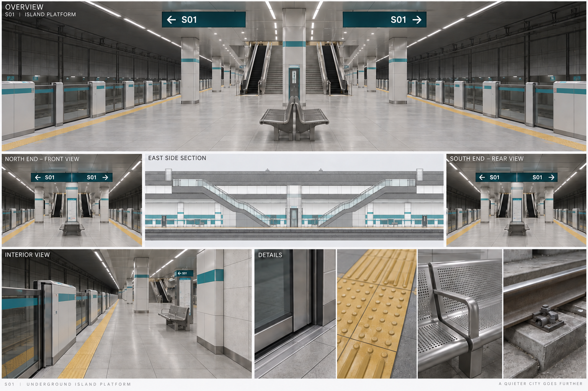
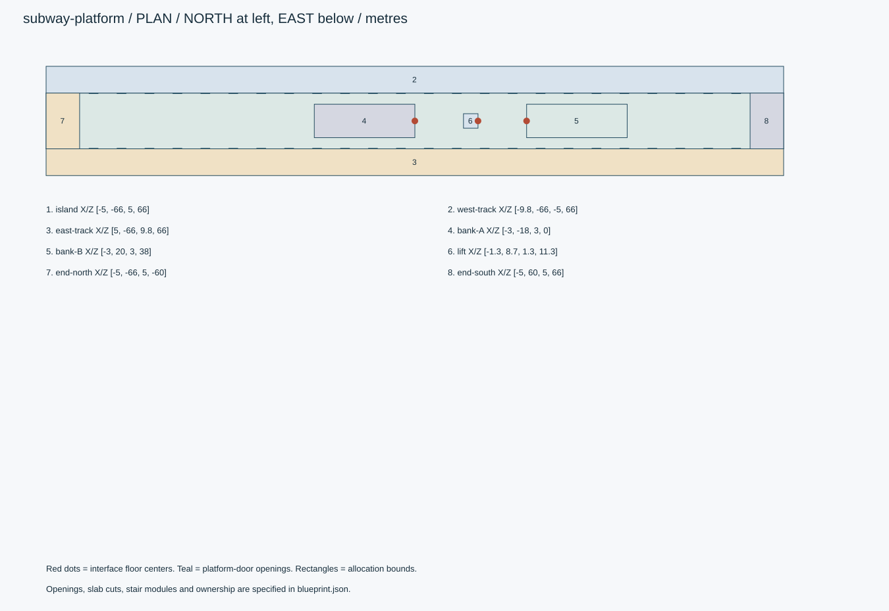
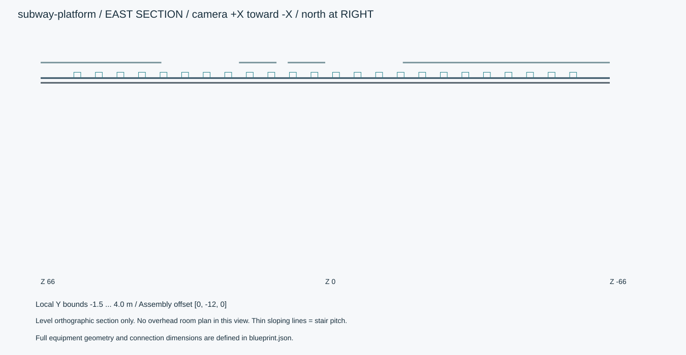
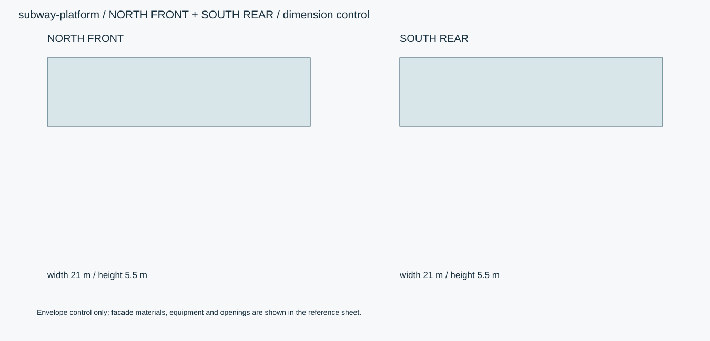

# 汐見駅S01・地下2階島式ホーム

両側2線に挟まれた132mの島式ホーム。6両編成向けのホームドアと付帯設備を含む。列車は含まない。

ID `subway-platform` / category `subway-platform` / 設計レビュー

## 全体・正面・側面・背面・細部



画像は外観参考です。施工や実モデルの検証証拠ではありません。寸法・設備数・接続は数値仕様を優先します。

## 数値図







## 寸法と原点

```json
{
  "local_bounds_xyz_m": [
    [
      -10.5,
      -1.5,
      -66
    ],
    [
      10.5,
      4.0,
      66
    ]
  ],
  "envelope_xyz_m": [
    21.0,
    5.5,
    132
  ],
  "assembly_translation_m": [
    0,
    -12,
    0
  ],
  "assembly_rotation_rad": [
    0,
    0,
    0
  ],
  "axis": "右手系: +X東、+Y上、+Z南。正面は駅北側-Z。",
  "origin": "アセットごとのローカル原点をassembly_translation_mで駅共通座標へ平行移動する。",
  "priority": "数値JSON・接続座標 > 寸法図 > 仕様文 > 参考画像",
  "platform_width_m": 10,
  "platform_length_m": 132,
  "platform_floor_local_y_m": 0,
  "clear_ceiling_m": 3.6,
  "track_center_x_m": [
    -6.6,
    6.6
  ],
  "rail_top_y_m": -1.1,
  "design_track_gauge_m": 1.435,
  "track_gauge_note": "架空駅の形状設定値。特定事業者の路線仕様を示すものではない。",
  "platform_door_height_m": 1.35
}
```

## 接続口

```json
[
  {
    "id": "bank-A-arrival",
    "floor_center_local_m": [
      0,
      0,
      0
    ],
    "outward_normal_xyz": [
      0,
      0,
      -1
    ],
    "clear_width_m": 6,
    "clear_height_m": 3,
    "connects_to": "subway-concourse:bank-A-exit"
  },
  {
    "id": "bank-B-arrival",
    "floor_center_local_m": [
      0,
      0,
      20
    ],
    "outward_normal_xyz": [
      0,
      0,
      1
    ],
    "clear_width_m": 6,
    "clear_height_m": 3,
    "connects_to": "subway-concourse:bank-B-exit"
  },
  {
    "id": "lift-arrival",
    "floor_center_local_m": [
      0,
      0,
      11.3
    ],
    "outward_normal_xyz": [
      0,
      0,
      -1
    ],
    "clear_width_m": 0.9,
    "clear_height_m": 2.1,
    "connects_to": "subway-concourse:lift-exit"
  }
]
```

## 生成範囲と所有

```json
{
  "owns": [
    "B2ホーム床・軌道・壁・天井・ホームドア・案内・ベンチ・照明・非常設備"
  ],
  "references": [
    "concourseの階段/エスカレーター/EV"
  ],
  "boundary": "Z±66で軌道・トンネルを止める。続きのトンネルは外部接続先。"
}
```

## 平面区画

```json
[
  {
    "id": "island",
    "rect_xz_m": [
      -5,
      -66,
      5,
      66
    ],
    "use": "島式ホーム床。中央設備帯を除き歩行可。"
  },
  {
    "id": "west-track",
    "rect_xz_m": [
      -9.8,
      -66,
      -5,
      66
    ],
    "use": "西線路領域"
  },
  {
    "id": "east-track",
    "rect_xz_m": [
      5,
      -66,
      9.8,
      66
    ],
    "use": "東線路領域"
  },
  {
    "id": "bank-A",
    "rect_xz_m": [
      -3,
      -18,
      3,
      0
    ],
    "use": "concourse所有の昇降設備、生成参照のみ"
  },
  {
    "id": "bank-B",
    "rect_xz_m": [
      -3,
      20,
      3,
      38
    ],
    "use": "concourse所有の昇降設備、生成参照のみ"
  },
  {
    "id": "lift",
    "rect_xz_m": [
      -1.3,
      8.7,
      1.3,
      11.3
    ],
    "use": "concourse所有のEV、生成参照のみ"
  },
  {
    "id": "end-north",
    "rect_xz_m": [
      -5,
      -66,
      5,
      -60
    ],
    "use": "北端余裕6m"
  },
  {
    "id": "end-south",
    "rect_xz_m": [
      -5,
      60,
      5,
      66
    ],
    "use": "南端余裕6m"
  }
]
```

## 天井開口

```json
[
  {
    "id": "A-ceiling",
    "rect_xz_m": [
      -3,
      -18,
      3,
      0
    ],
    "use": "天井の昇降設備開口"
  },
  {
    "id": "B-ceiling",
    "rect_xz_m": [
      -3,
      20,
      3,
      38
    ],
    "use": "天井の昇降設備開口"
  },
  {
    "id": "lift-ceiling",
    "rect_xz_m": [
      -1.3,
      8.7,
      1.3,
      11.3
    ],
    "use": "EV貫通"
  }
]
```

## パーツと形状

|ID|名称|中心XYZ m|寸法XYZ m|材質・備考|
|---|---|---|---|---|
|island-floor|ホーム床|[0, -0.15, 0]|[10, 0.3, 132]|floor-tile / |
|track-bed-west|西軌道床|[-6.6, -1.35, 0]|[4.8, 0.3, 132]|concrete / |
|track-bed-east|東軌道床|[6.6, -1.35, 0]|[4.8, 0.3, 132]|concrete / |
|ceiling|ホーム天井|[0, 3.8, 0]|[21, 0.4, 132]|paint / ceiling_cutoutsを差し引く。|
|tactile-west|西縁点状ブロック|[-4.35, 0.0025, 0]|[0.3, 0.005, 120]|tactile / |
|tactile-east|東縁点状ブロック|[4.35, 0.0025, 0]|[0.3, 0.005, 120]|tactile / |
|rail-west--0.7175|レール|[-7.3175, -1.175, 0]|[0.15, 0.15, 132]|rail-steel / 断面頭部・腹部・底部を別プロファイル、上端-1.1m。|
|rail-west-0.7175|レール|[-5.882499999999999, -1.175, 0]|[0.15, 0.15, 132]|rail-steel / 断面頭部・腹部・底部を別プロファイル、上端-1.1m。|
|rail-east--0.7175|レール|[5.882499999999999, -1.175, 0]|[0.15, 0.15, 132]|rail-steel / 断面頭部・腹部・底部を別プロファイル、上端-1.1m。|
|rail-east-0.7175|レール|[7.3175, -1.175, 0]|[0.15, 0.15, 132]|rail-steel / 断面頭部・腹部・底部を別プロファイル、上端-1.1m。|
|column-0|中央柱|[0, 1.8, -51]|[0.6, 3.6, 0.6]|wall-tile / |
|column-1|中央柱|[0, 1.8, -36]|[0.6, 3.6, 0.6]|wall-tile / |
|column-2|中央柱|[0, 1.8, 4]|[0.6, 3.6, 0.6]|wall-tile / |
|column-3|中央柱|[0, 1.8, 15]|[0.6, 3.6, 0.6]|wall-tile / |
|column-4|中央柱|[0, 1.8, 45]|[0.6, 3.6, 0.6]|wall-tile / |
|column-5|中央柱|[0, 1.8, 56]|[0.6, 3.6, 0.6]|wall-tile / |
|bench-0|ベンチ|[0, 0.4, -43]|[2.4, 0.8, 0.65]|stainless / 座面高0.43m、背付き、4人用目安、柱から離す。|
|bench-1|ベンチ|[0, 0.4, -27]|[2.4, 0.8, 0.65]|stainless / 座面高0.43m、背付き、4人用目安、柱から離す。|
|bench-2|ベンチ|[0, 0.4, 46]|[2.4, 0.8, 0.65]|stainless / 座面高0.43m、背付き、4人用目安、柱から離す。|
|bench-3|ベンチ|[0, 0.4, 57]|[2.4, 0.8, 0.65]|stainless / 座面高0.43m、背付き、4人用目安、柱から離す。|
|emergency--1--54|非常通報・消火器箱|[-2, 0.75, -54]|[0.45, 1.5, 0.25]|paint / 扉と操作表示を分離。実在の安全認証表示を使わない。|
|emergency--1-6|非常通報・消火器箱|[-2, 0.75, 6]|[0.45, 1.5, 0.25]|paint / 扉と操作表示を分離。実在の安全認証表示を使わない。|
|emergency--1-54|非常通報・消火器箱|[-2, 0.75, 54]|[0.45, 1.5, 0.25]|paint / 扉と操作表示を分離。実在の安全認証表示を使わない。|
|emergency-1--54|非常通報・消火器箱|[2, 0.75, -54]|[0.45, 1.5, 0.25]|paint / 扉と操作表示を分離。実在の安全認証表示を使わない。|
|emergency-1-6|非常通報・消火器箱|[2, 0.75, 6]|[0.45, 1.5, 0.25]|paint / 扉と操作表示を分離。実在の安全認証表示を使わない。|
|emergency-1-54|非常通報・消火器箱|[2, 0.75, 54]|[0.45, 1.5, 0.25]|paint / 扉と操作表示を分離。実在の安全認証表示を使わない。|

包絡は中実のBoxを指示するものではありません。床・壁・内部空間・可動パネル・開口へ分解してください。

## 微細構造

- 列車の入らない島式ホーム。軌道中心X±6.6m、ホーム端X±5m。車幅2.8mの仮定から車体側面まで200mmの隙間になる。
- ホームドアは左右各24開口、1開口2枚で可動戸96枚。開口中心は-57.5から57.5まで5mピッチ。
- 昇降設備の幅6mに対してホーム幅10m。設備脇からホーム縁まで片側2m、ドア内面と点字ブロックを差し引いて動線を確認する。
- B1側所有の階段・EVをこのアセットで重複生成しない。単体プレビューでは参照オーバーレイとして薄い輪郭を表示し、書出しから除外する。
- 床タイル300角、プラットフォーム端の石幅400mm。ホームドアの戸先ゴム12mm、ガラス8mm、下部ガイド幅18mm。
- レール締結は600mmピッチ、枕木は直結軌道用の短い支持ブロック。テクスチャを鏡面にし過ぎず、レール頭だけに光沢。
- 非常通報器・消火器箱は中央設備帯に設ける。端部にスタッフ用ゲートと将来の避難通路接続マーカーを設け、線路へ通常歩行させない。

## 材質・テクスチャ

|ID|sRGB色|粗さ|金属度|細部|
|---|---|---|---|---|
|wall-tile|#E4E6E2|[0.4, 0.6]|0|壁150×300mm、目地3mm/深1.5mm。壁下部に少量の擦れ。割れを一様に散布しない。|
|floor-tile|#9C9F9C|[0.6, 0.8]|0|床300角、目地4mm、凹凸0.3mm。動線沿いに粗さ差±0.05。|
|tactile|#D7B741|[0.6, 0.8]|0|線状/点状ブロックを別部品。300角、凸高さ5mm。配置は本アセットの設計値。|
|stainless|#B2B9BC|[0.22, 0.4]|1|手すり・建具、長手ヘアライン。角R1mm、指触部に薄い粗さ差。|
|paint|#E1E3E0|[0.45, 0.65]|0|天井・設備の塗装鋼板、継目2mm、露出金属と塗膜を分離。|
|teal|#287F87|[0.35, 0.5]|0|架空駅共通の案内帯。実在鉄道のロゴ・路線色を転用しない。|
|glass|#DBE4E5|[0.03, 0.12]|0|厚8mmの設備ガラス、欄干12mm。透明/反射は別チャンネル、透過実装が必要。|
|rubber|#363B3D|[0.65, 0.85]|0|エスカレーターの手すり、扉パッキン。手すりの滑り方向に微細筋。|
|concrete|#A6AAA8|[0.7, 0.9]|0|RC構造・床下・トンネル壁。目地と施工区画に沿う汚れ。|
|rail-steel|#656F73|[0.22, 0.65]|1|レール頭は研磨、側面は低彩度の酸化色。締結金物を独立パーツに。|
|light|#EDF1EC|[0.3, 0.4]|0|拡散カバー。発光と照明用ライトを別設定。|
|dark-display|#18272D|[0.1, 0.25]|0|券売機/改札/案内の表示面。汎用UIで実在運賃・時刻表は使わない。|

## ホームドア

```json
{
  "left_right_count": 2,
  "openings_per_side": 24,
  "total_openings": 48,
  "paired_leaves_per_opening": 2,
  "total_moving_leaves": 96,
  "opening_clear_width_m": 1.6,
  "height_m": 1.35,
  "leaf_width_m": 0.8,
  "leaf_travel_m": 0.8,
  "open_time_s": 1.8,
  "hold_time_s": 4,
  "close_time_s": 2.2,
  "barrier_x_m": [
    -4.95,
    4.95
  ],
  "leaf_offset_between_planes_m": 0.045,
  "opening_centers_z_m": [
    -57.5,
    -52.5,
    -47.5,
    -42.5,
    -37.5,
    -32.5,
    -27.5,
    -22.5,
    -17.5,
    -12.5,
    -7.5,
    -2.5,
    2.5,
    7.5,
    12.5,
    17.5,
    22.5,
    27.5,
    32.5,
    37.5,
    42.5,
    47.5,
    52.5,
    57.5
  ],
  "fixed_panel_rule": "隣接開口中心の間隔5mから開口幅1.6mを引いた3.4mを固定パネル。端はZ±66までつなぐ。",
  "fixed_panel_center_x_m": [
    -4.95,
    4.95
  ],
  "sliding_leaf_center_x_m": [
    -4.905,
    4.905
  ]
}
```

## 将来車両との接続

```json
{
  "train_included": false,
  "assumed_car_count": 6,
  "assumed_car_length_m": 20,
  "assumed_train_length_m": 120,
  "assumed_train_width_m": 2.8,
  "assumed_vehicle_door_clear_width_m": 1.3,
  "assumed_doors_per_side_per_car": 4,
  "car_centers_z_m": [
    -50,
    -30,
    -10,
    10,
    30,
    50
  ],
  "door_offsets_from_car_center_z_m": [
    -7.5,
    -2.5,
    2.5,
    7.5
  ],
  "car_floor_local_y_m": 0,
  "lateral_vehicle_platform_gap_m": 0.2,
  "purpose": "将来の架空列車とドア位置を合わせるためのインターフェース。実在車両の設計ではない。"
}
```

## 可動部

```json
[
  {
    "id": "platform-leaf-negative-z",
    "type": "slide",
    "pivot_m": [
      -4.905,
      0,
      -57.9
    ],
    "axis": [
      0,
      0,
      1
    ],
    "range": [
      -0.8,
      0
    ],
    "unit": "m",
    "note": "第1開口の-Z側戸。各開口・左右へ複製。"
  },
  {
    "id": "platform-leaf-positive-z",
    "type": "slide",
    "pivot_m": [
      -4.905,
      0,
      -57.1
    ],
    "axis": [
      0,
      0,
      1
    ],
    "range": [
      0,
      0.8
    ],
    "unit": "m",
    "note": "対の+Z側戸。固定パネルに平行な別面を通る。"
  },
  {
    "id": "emergency-cabinet",
    "type": "hinge",
    "pivot_m": [
      -2.225,
      0,
      -54
    ],
    "axis": [
      0,
      1,
      0
    ],
    "range": [
      0,
      100
    ],
    "unit": "degree",
    "note": "前面戸、ベンチや通路へ干渉しない。"
  }
]
```

## 状態制御

```json
{
  "platform_doors": [
    "closed_locked",
    "opening",
    "open",
    "closing",
    "obstruction_reopen",
    "fault_closed"
  ],
  "open_condition": "検証モードまたは将来の列車停車・位置一致・扉側一致を受信したとき。列車なしの通常状態はclosed_locked。",
  "obstruction": "閉鎖中の障害物入力で同じ開口を再開。",
  "lighting": "通常点灯/非常点灯の2状態。",
  "screen_content": "汐見駅/S01、架空の方面案内、列車未入線の表示。"
}
```

## 視点の定義

```json
{
  "front": {
    "camera_direction_xyz": [
      0,
      0,
      1
    ],
    "screen_right_xyz": [
      -1,
      0,
      0
    ],
    "note": "北から南へ。画像右が西。"
  },
  "east_section": {
    "camera_direction_xyz": [
      -1,
      0,
      0
    ],
    "screen_right_xyz": [
      0,
      0,
      -1
    ],
    "note": "東から西へ。画像右が北。側断面に上面図を混ぜない。"
  },
  "rear": {
    "camera_direction_xyz": [
      0,
      0,
      -1
    ],
    "screen_right_xyz": [
      1,
      0,
      0
    ],
    "note": "南から北へ。画像右が東。"
  }
}
```

## 動作確認

```json
[
  {
    "id": "walkthrough",
    "duration_s": 20,
    "description": "正面入口→主動線→次の接続口を連続移動して床切れ/衝突を確認。"
  },
  {
    "id": "equipment-cycle",
    "duration_s": 12,
    "description": "各可動設備を個別に停止→動作→停止させる。単体試験と接続した駅全体で確認。"
  },
  {
    "id": "emergency-lighting",
    "duration_s": 6,
    "description": "通常照明→非常照明、案内と床の視認性を同じカメラで記録。"
  }
]
```

## 対象と納品

```json
{
  "engine": "Unity / HDRP（実装時にバージョン固定）",
  "exports": [
    "制作ソース",
    "GLB（静的形状・PBR・ベイク済み動作）",
    "Unityの制御設定",
    "正面/側面/背面/細部PNGと動作MP4"
  ],
  "triangles_lod0_max": 1800000,
  "texture_resolution_max": 4096,
  "texture_policy": "共有材2K、案内表示/近接設備4K。BaseColor=sRGB、Normal/Roughness/Metallic=linear。",
  "texel_density_px_per_m": 512,
  "lod_ratios": [
    1,
    0.5,
    0.2,
    0.08
  ],
  "streaming": "入口・B1・B2を別チャンク。反復設備は共有形状、可動部を別ノード。",
  "texture_resident_budget_mib": 512,
  "texture_detail_policy": "長い床・壁は実寸タイリング材とデカールを併用。駅全長を1枚の4Kテクスチャに詰めない。接写部品だけ固有UV。"
}
```

## 管理情報

```json
{
  "tags": [
    "日本",
    "現代",
    "写実",
    "地下鉄",
    "subway-platform"
  ],
  "usage": "PC向けリアルタイム探索・映像用の架空地下鉄駅。数値は視覚アセットの設計値。",
  "license": "独自制作物として管理。現段階は私有・配布許諾未設定。販売用ライセンスは公開時に別途設定。",
  "approval": "モデル未生成・販売未承認",
  "description": "両側2線に挟まれた132mの島式ホーム。6両編成向けのホームドアと付帯設備を含む。列車は含まない。"
}
```

階段の全段座標はJSONのstairs[].treadsに収録。回転は仕様書では度、promodeler実装ではラジアンへ変換します。

## 実装上の差分

- エスカレーターの無限循環、ドア状態制御、ガラス透過、照明・表示のランタイム実装は別途必要。

独自設計JSONであり、promodelerのrecipeとして直接実行できません。全体接続は[駅の組立仕様](../subway-assembly.json)を参照してください。

## モデル生成後の受入条件

- [ ] 島式ホームは1面2線、列車メッシュなし、ホームドア48開口/96戸。
- [ ] 全開口中心が6両×4扉の車両インターフェースと一致。
- [ ] ホームドア開閉で戸が固定パネルの同一平面を貫通しない。
- [ ] 2組の階段とEVの到着位置がB1データと一致。
- [ ] ホーム端までの歩行路にベンチ・柱・通報器を重ねない。
- [ ] 参考画像ではなく生成済みモデルから正面・背面・斜め・細部・必要な動きの証拠を保存。
