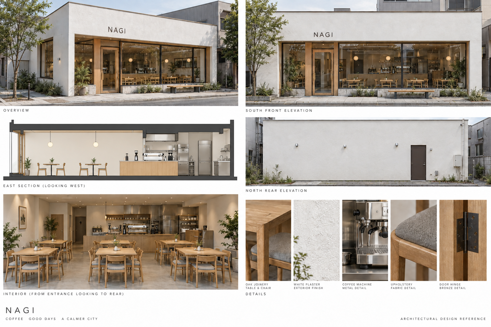
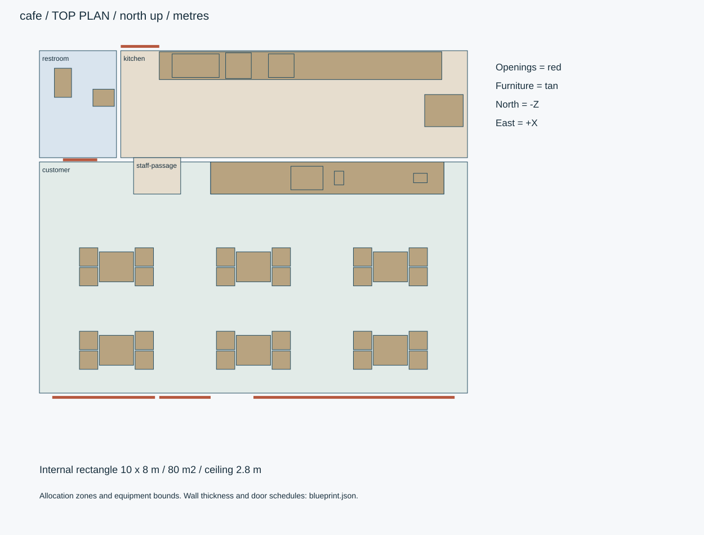
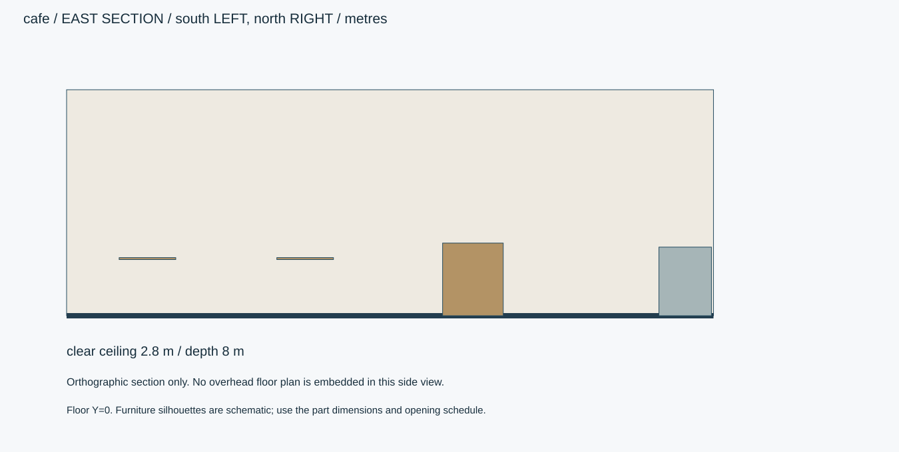
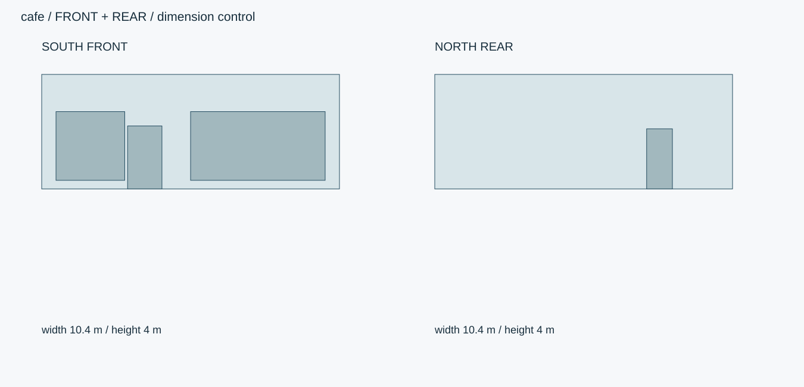

# 凪カフェ・24席の路面店

現代日本の約80㎡カフェ。白壁とオーク、24席、厨房・カウンター・家具・飲食機器を含む。

ID `cafe` / category `cafe` / 設計レビュー

## 全体・正面・側面・背面・細部



数値仕様と下の寸法図を生成基準とします。参考画像は外観資料で、実モデルの検証画像ではありません。







## 概要寸法

```json
{
  "inside_xz_m": [
    10,
    8
  ],
  "inside_envelope_area_m2": 80,
  "area_note": "内法外周矩形の面積。間仕切りを含み、有効床面積はこれより小さい。",
  "envelope_xyz_m": [
    10.4,
    4,
    8.4
  ],
  "clear_ceiling_m": 2.8,
  "outer_wall_m": 0.2,
  "partition_m": 0.1,
  "floor_slab_m": 0.2,
  "origin": "室内床中央Y=0。+X東/+Y上/+Z南。入口正面は南+Z。",
  "priority": "数値JSON・寸法SVG > 仕様文 > 参考画像"
}
```

## 平面区画

```json
[
  {
    "id": "customer",
    "rect_xz_m": [
      -5,
      -1.4,
      5,
      4
    ],
    "use": "客席・入口・注文待機"
  },
  {
    "id": "kitchen",
    "rect_xz_m": [
      -3.1,
      -4,
      5,
      -1.5
    ],
    "use": "厨房、北側作業台、機器"
  },
  {
    "id": "restroom",
    "rect_xz_m": [
      -5,
      -4,
      -3.2,
      -1.5
    ],
    "use": "便所と手洗い"
  },
  {
    "id": "counter",
    "rect_xz_m": [
      -1,
      -1.4,
      4.45,
      -0.65
    ],
    "use": "厨房前の腰高カウンター。頭上は開放。"
  },
  {
    "id": "staff-passage",
    "rect_xz_m": [
      -2.8,
      -1.5,
      -1.7,
      -0.65
    ],
    "use": "スタッフ出入り幅1.1m"
  }
]
```

## 壁と開口の作り方

```json
[
  "外周は厚200mm。各openingsの領域を壁から除去する。",
  "便所東境界X=-3.15、南境界Z=-1.45は天井まで仕切る。",
  "厨房と客席の境界はカウンターの腰壁のみ。スタッフ通路とカウンター上に壁を生成しない。",
  "屋根上端3.6m、外周パラペット上端4.0m。屋上設備はこの高さ内に収める。"
]
```

## 開口表

```json
[
  {
    "id": "entrance",
    "wall": "south",
    "center_m": [
      -1.6,
      1.1,
      4.1
    ],
    "width_m": 1.2,
    "height_m": 2.2,
    "type": "double-slide",
    "note": "南正面、左寄り。2枚戸、レールを窓と別面へ。"
  },
  {
    "id": "south-window-east",
    "wall": "south",
    "center_m": [
      2.35,
      1.5,
      4.1
    ],
    "width_m": 4.7,
    "height_m": 2.4,
    "type": "fixed-glass",
    "note": "腰高0.3m。"
  },
  {
    "id": "south-window-west",
    "wall": "south",
    "center_m": [
      -3.5,
      1.5,
      4.1
    ],
    "width_m": 2.4,
    "height_m": 2.4,
    "type": "fixed-glass",
    "note": "腰高0.3m。"
  },
  {
    "id": "rear-service",
    "wall": "north",
    "center_m": [
      -2.65,
      1.05,
      -4.1
    ],
    "width_m": 0.9,
    "height_m": 2.1,
    "type": "hinge",
    "note": "厨房への搬入扉。"
  },
  {
    "id": "restroom-door",
    "wall": "z=-1.45",
    "center_m": [
      -4.05,
      1,
      -1.45
    ],
    "width_m": 0.8,
    "height_m": 2,
    "type": "hinge",
    "note": "便所内へ開く。床段差なし。"
  }
]
```

## 席数と配置

```json
{
  "table_count": 6,
  "chairs_per_table": 4,
  "seat_count": 24,
  "table_top_xyz_m": [
    0.8,
    0.024,
    0.7
  ],
  "table_height_m": 0.72,
  "chair_footprint_xz_m": [
    0.43,
    0.43
  ],
  "chair_seat_height_m": 0.43,
  "chair_overall_height_m": 0.78,
  "instances": [
    {
      "id": "chair-0-0--1--0.23",
      "table": "table-0-0",
      "center_m": [
        -3.85,
        0,
        0.8200000000000001
      ],
      "yaw_rad": 1.5707963267948966,
      "front_axis": "ローカル+Zをテーブルへ向ける",
      "footprint_xz_m": [
        0.43,
        0.43
      ]
    },
    {
      "id": "chair-0-0--1-0.23",
      "table": "table-0-0",
      "center_m": [
        -3.85,
        0,
        1.28
      ],
      "yaw_rad": 1.5707963267948966,
      "front_axis": "ローカル+Zをテーブルへ向ける",
      "footprint_xz_m": [
        0.43,
        0.43
      ]
    },
    {
      "id": "chair-0-0-1--0.23",
      "table": "table-0-0",
      "center_m": [
        -2.5500000000000003,
        0,
        0.8200000000000001
      ],
      "yaw_rad": -1.5707963267948966,
      "front_axis": "ローカル+Zをテーブルへ向ける",
      "footprint_xz_m": [
        0.43,
        0.43
      ]
    },
    {
      "id": "chair-0-0-1-0.23",
      "table": "table-0-0",
      "center_m": [
        -2.5500000000000003,
        0,
        1.28
      ],
      "yaw_rad": -1.5707963267948966,
      "front_axis": "ローカル+Zをテーブルへ向ける",
      "footprint_xz_m": [
        0.43,
        0.43
      ]
    },
    {
      "id": "chair-0-1--1--0.23",
      "table": "table-0-1",
      "center_m": [
        -0.65,
        0,
        0.8200000000000001
      ],
      "yaw_rad": 1.5707963267948966,
      "front_axis": "ローカル+Zをテーブルへ向ける",
      "footprint_xz_m": [
        0.43,
        0.43
      ]
    },
    {
      "id": "chair-0-1--1-0.23",
      "table": "table-0-1",
      "center_m": [
        -0.65,
        0,
        1.28
      ],
      "yaw_rad": 1.5707963267948966,
      "front_axis": "ローカル+Zをテーブルへ向ける",
      "footprint_xz_m": [
        0.43,
        0.43
      ]
    },
    {
      "id": "chair-0-1-1--0.23",
      "table": "table-0-1",
      "center_m": [
        0.65,
        0,
        0.8200000000000001
      ],
      "yaw_rad": -1.5707963267948966,
      "front_axis": "ローカル+Zをテーブルへ向ける",
      "footprint_xz_m": [
        0.43,
        0.43
      ]
    },
    {
      "id": "chair-0-1-1-0.23",
      "table": "table-0-1",
      "center_m": [
        0.65,
        0,
        1.28
      ],
      "yaw_rad": -1.5707963267948966,
      "front_axis": "ローカル+Zをテーブルへ向ける",
      "footprint_xz_m": [
        0.43,
        0.43
      ]
    },
    {
      "id": "chair-0-2--1--0.23",
      "table": "table-0-2",
      "center_m": [
        2.5500000000000003,
        0,
        0.8200000000000001
      ],
      "yaw_rad": 1.5707963267948966,
      "front_axis": "ローカル+Zをテーブルへ向ける",
      "footprint_xz_m": [
        0.43,
        0.43
      ]
    },
    {
      "id": "chair-0-2--1-0.23",
      "table": "table-0-2",
      "center_m": [
        2.5500000000000003,
        0,
        1.28
      ],
      "yaw_rad": 1.5707963267948966,
      "front_axis": "ローカル+Zをテーブルへ向ける",
      "footprint_xz_m": [
        0.43,
        0.43
      ]
    },
    {
      "id": "chair-0-2-1--0.23",
      "table": "table-0-2",
      "center_m": [
        3.85,
        0,
        0.8200000000000001
      ],
      "yaw_rad": -1.5707963267948966,
      "front_axis": "ローカル+Zをテーブルへ向ける",
      "footprint_xz_m": [
        0.43,
        0.43
      ]
    },
    {
      "id": "chair-0-2-1-0.23",
      "table": "table-0-2",
      "center_m": [
        3.85,
        0,
        1.28
      ],
      "yaw_rad": -1.5707963267948966,
      "front_axis": "ローカル+Zをテーブルへ向ける",
      "footprint_xz_m": [
        0.43,
        0.43
      ]
    },
    {
      "id": "chair-1-0--1--0.23",
      "table": "table-1-0",
      "center_m": [
        -3.85,
        0,
        2.77
      ],
      "yaw_rad": 1.5707963267948966,
      "front_axis": "ローカル+Zをテーブルへ向ける",
      "footprint_xz_m": [
        0.43,
        0.43
      ]
    },
    {
      "id": "chair-1-0--1-0.23",
      "table": "table-1-0",
      "center_m": [
        -3.85,
        0,
        3.23
      ],
      "yaw_rad": 1.5707963267948966,
      "front_axis": "ローカル+Zをテーブルへ向ける",
      "footprint_xz_m": [
        0.43,
        0.43
      ]
    },
    {
      "id": "chair-1-0-1--0.23",
      "table": "table-1-0",
      "center_m": [
        -2.5500000000000003,
        0,
        2.77
      ],
      "yaw_rad": -1.5707963267948966,
      "front_axis": "ローカル+Zをテーブルへ向ける",
      "footprint_xz_m": [
        0.43,
        0.43
      ]
    },
    {
      "id": "chair-1-0-1-0.23",
      "table": "table-1-0",
      "center_m": [
        -2.5500000000000003,
        0,
        3.23
      ],
      "yaw_rad": -1.5707963267948966,
      "front_axis": "ローカル+Zをテーブルへ向ける",
      "footprint_xz_m": [
        0.43,
        0.43
      ]
    },
    {
      "id": "chair-1-1--1--0.23",
      "table": "table-1-1",
      "center_m": [
        -0.65,
        0,
        2.77
      ],
      "yaw_rad": 1.5707963267948966,
      "front_axis": "ローカル+Zをテーブルへ向ける",
      "footprint_xz_m": [
        0.43,
        0.43
      ]
    },
    {
      "id": "chair-1-1--1-0.23",
      "table": "table-1-1",
      "center_m": [
        -0.65,
        0,
        3.23
      ],
      "yaw_rad": 1.5707963267948966,
      "front_axis": "ローカル+Zをテーブルへ向ける",
      "footprint_xz_m": [
        0.43,
        0.43
      ]
    },
    {
      "id": "chair-1-1-1--0.23",
      "table": "table-1-1",
      "center_m": [
        0.65,
        0,
        2.77
      ],
      "yaw_rad": -1.5707963267948966,
      "front_axis": "ローカル+Zをテーブルへ向ける",
      "footprint_xz_m": [
        0.43,
        0.43
      ]
    },
    {
      "id": "chair-1-1-1-0.23",
      "table": "table-1-1",
      "center_m": [
        0.65,
        0,
        3.23
      ],
      "yaw_rad": -1.5707963267948966,
      "front_axis": "ローカル+Zをテーブルへ向ける",
      "footprint_xz_m": [
        0.43,
        0.43
      ]
    },
    {
      "id": "chair-1-2--1--0.23",
      "table": "table-1-2",
      "center_m": [
        2.5500000000000003,
        0,
        2.77
      ],
      "yaw_rad": 1.5707963267948966,
      "front_axis": "ローカル+Zをテーブルへ向ける",
      "footprint_xz_m": [
        0.43,
        0.43
      ]
    },
    {
      "id": "chair-1-2--1-0.23",
      "table": "table-1-2",
      "center_m": [
        2.5500000000000003,
        0,
        3.23
      ],
      "yaw_rad": 1.5707963267948966,
      "front_axis": "ローカル+Zをテーブルへ向ける",
      "footprint_xz_m": [
        0.43,
        0.43
      ]
    },
    {
      "id": "chair-1-2-1--0.23",
      "table": "table-1-2",
      "center_m": [
        3.85,
        0,
        2.77
      ],
      "yaw_rad": -1.5707963267948966,
      "front_axis": "ローカル+Zをテーブルへ向ける",
      "footprint_xz_m": [
        0.43,
        0.43
      ]
    },
    {
      "id": "chair-1-2-1-0.23",
      "table": "table-1-2",
      "center_m": [
        3.85,
        0,
        3.23
      ],
      "yaw_rad": -1.5707963267948966,
      "front_axis": "ローカル+Zをテーブルへ向ける",
      "footprint_xz_m": [
        0.43,
        0.43
      ]
    }
  ],
  "clear_main_aisle_x_ranges_m": [
    [
      -2.335,
      -0.865
    ],
    [
      0.865,
      2.335
    ]
  ],
  "note": "座席の基準配置。椅子を引いたときの通路幅は別途モデルで確認。"
}
```

## 小物

```json
{
  "mugs": {
    "count": 12,
    "diameter_m": 0.08,
    "height_m": 0.095
  },
  "plates": {
    "count": 12,
    "diameter_m": 0.18
  },
  "trays": {
    "count": 4,
    "size_xz_m": [
      0.35,
      0.25
    ]
  },
  "placement": "厨房吊戸棚内に整理。客席に自動散布しない。"
}
```

## パーツ

|ID|名称|中心XYZ m|寸法XYZ m|材質・備考|
|---|---|---|---|---|
|floor|床|[0, -0.1, 0]|[10.4, 0.2, 8.4]|tile / |
|roof|屋根スラブ|[0, 3.45, 0]|[10.4, 0.3, 8.4]|paint / |
|ceiling|天井|[0, 2.85, 0]|[10, 0.1, 8]|plaster / |
|counter|オークカウンター|[1.725, 0.45, -1.025]|[5.45, 0.9, 0.75]|oak / 天板厚40mm、角R4mm。腰壁と天板を分離。|
|back-worktop|厨房作業台|[1.1, 0.425, -3.65]|[6.6, 0.85, 0.65]|stainless / |
|espresso|エスプレッソ機|[1.25, 1.125, -1.025]|[0.75, 0.45, 0.55]|stainless / 2つの抽出口、スチームノズル、圧力計は汎用意匠。|
|grinder|グラインダー|[2.0, 1.15, -1.025]|[0.22, 0.5, 0.32]|paint / ホッパー、粒度ダイヤル、受け皿。|
|pos|レジ端末|[3.9, 1.065, -1.025]|[0.32, 0.33, 0.22]|paint / |
|sink|シンク|[-1.35, 0.855, -3.65]|[1.1, 0.02, 0.55]|stainless / 天板を切り抜き、深250mmの槽を作る。|
|fridge|業務用冷蔵庫|[4.45, 0.95, -2.6]|[0.9, 1.9, 0.75]|stainless / 扉は南+Z向き。北側作業台と接触させない。|
|oven|小型オーブン|[0.65, 1.1, -3.65]|[0.6, 0.5, 0.55]|stainless / |
|dishwasher|食洗機|[-0.35, 0.4, -3.65]|[0.6, 0.8, 0.6]|stainless / |
|wc|便器|[-4.45, 0.38, -3.25]|[0.4, 0.76, 0.68]|paint / |
|washbasin|手洗い|[-3.5, 0.425, -2.9]|[0.5, 0.85, 0.4]|paint / |
|sign|NAGI看板|[0, 3.05, 4.115]|[2.5, 0.45, 0.06]|oak / 文字はNAGIのみ、浮き文字厚8mm。|
|table-0-0|4席テーブル|[-3.2, 0.36, 1.05]|[0.8, 0.72, 0.7]|oak / 四脚、天板24mm、角R15mm。|
|chair-0-0--1--0.23|オーク椅子|[-3.85, 0.39, 0.8200000000000001]|[0.43, 0.78, 0.43]|fabric / オーク脚/背、布座。座面高0.43m、背板木目は横。|
|chair-0-0--1-0.23|オーク椅子|[-3.85, 0.39, 1.28]|[0.43, 0.78, 0.43]|fabric / オーク脚/背、布座。座面高0.43m、背板木目は横。|
|chair-0-0-1--0.23|オーク椅子|[-2.5500000000000003, 0.39, 0.8200000000000001]|[0.43, 0.78, 0.43]|fabric / オーク脚/背、布座。座面高0.43m、背板木目は横。|
|chair-0-0-1-0.23|オーク椅子|[-2.5500000000000003, 0.39, 1.28]|[0.43, 0.78, 0.43]|fabric / オーク脚/背、布座。座面高0.43m、背板木目は横。|
|table-0-1|4席テーブル|[0, 0.36, 1.05]|[0.8, 0.72, 0.7]|oak / 四脚、天板24mm、角R15mm。|
|chair-0-1--1--0.23|オーク椅子|[-0.65, 0.39, 0.8200000000000001]|[0.43, 0.78, 0.43]|fabric / オーク脚/背、布座。座面高0.43m、背板木目は横。|
|chair-0-1--1-0.23|オーク椅子|[-0.65, 0.39, 1.28]|[0.43, 0.78, 0.43]|fabric / オーク脚/背、布座。座面高0.43m、背板木目は横。|
|chair-0-1-1--0.23|オーク椅子|[0.65, 0.39, 0.8200000000000001]|[0.43, 0.78, 0.43]|fabric / オーク脚/背、布座。座面高0.43m、背板木目は横。|
|chair-0-1-1-0.23|オーク椅子|[0.65, 0.39, 1.28]|[0.43, 0.78, 0.43]|fabric / オーク脚/背、布座。座面高0.43m、背板木目は横。|
|table-0-2|4席テーブル|[3.2, 0.36, 1.05]|[0.8, 0.72, 0.7]|oak / 四脚、天板24mm、角R15mm。|
|chair-0-2--1--0.23|オーク椅子|[2.5500000000000003, 0.39, 0.8200000000000001]|[0.43, 0.78, 0.43]|fabric / オーク脚/背、布座。座面高0.43m、背板木目は横。|
|chair-0-2--1-0.23|オーク椅子|[2.5500000000000003, 0.39, 1.28]|[0.43, 0.78, 0.43]|fabric / オーク脚/背、布座。座面高0.43m、背板木目は横。|
|chair-0-2-1--0.23|オーク椅子|[3.85, 0.39, 0.8200000000000001]|[0.43, 0.78, 0.43]|fabric / オーク脚/背、布座。座面高0.43m、背板木目は横。|
|chair-0-2-1-0.23|オーク椅子|[3.85, 0.39, 1.28]|[0.43, 0.78, 0.43]|fabric / オーク脚/背、布座。座面高0.43m、背板木目は横。|
|table-1-0|4席テーブル|[-3.2, 0.36, 3.0]|[0.8, 0.72, 0.7]|oak / 四脚、天板24mm、角R15mm。|
|chair-1-0--1--0.23|オーク椅子|[-3.85, 0.39, 2.77]|[0.43, 0.78, 0.43]|fabric / オーク脚/背、布座。座面高0.43m、背板木目は横。|
|chair-1-0--1-0.23|オーク椅子|[-3.85, 0.39, 3.23]|[0.43, 0.78, 0.43]|fabric / オーク脚/背、布座。座面高0.43m、背板木目は横。|
|chair-1-0-1--0.23|オーク椅子|[-2.5500000000000003, 0.39, 2.77]|[0.43, 0.78, 0.43]|fabric / オーク脚/背、布座。座面高0.43m、背板木目は横。|
|chair-1-0-1-0.23|オーク椅子|[-2.5500000000000003, 0.39, 3.23]|[0.43, 0.78, 0.43]|fabric / オーク脚/背、布座。座面高0.43m、背板木目は横。|
|table-1-1|4席テーブル|[0, 0.36, 3.0]|[0.8, 0.72, 0.7]|oak / 四脚、天板24mm、角R15mm。|
|chair-1-1--1--0.23|オーク椅子|[-0.65, 0.39, 2.77]|[0.43, 0.78, 0.43]|fabric / オーク脚/背、布座。座面高0.43m、背板木目は横。|
|chair-1-1--1-0.23|オーク椅子|[-0.65, 0.39, 3.23]|[0.43, 0.78, 0.43]|fabric / オーク脚/背、布座。座面高0.43m、背板木目は横。|
|chair-1-1-1--0.23|オーク椅子|[0.65, 0.39, 2.77]|[0.43, 0.78, 0.43]|fabric / オーク脚/背、布座。座面高0.43m、背板木目は横。|
|chair-1-1-1-0.23|オーク椅子|[0.65, 0.39, 3.23]|[0.43, 0.78, 0.43]|fabric / オーク脚/背、布座。座面高0.43m、背板木目は横。|
|table-1-2|4席テーブル|[3.2, 0.36, 3.0]|[0.8, 0.72, 0.7]|oak / 四脚、天板24mm、角R15mm。|
|chair-1-2--1--0.23|オーク椅子|[2.5500000000000003, 0.39, 2.77]|[0.43, 0.78, 0.43]|fabric / オーク脚/背、布座。座面高0.43m、背板木目は横。|
|chair-1-2--1-0.23|オーク椅子|[2.5500000000000003, 0.39, 3.23]|[0.43, 0.78, 0.43]|fabric / オーク脚/背、布座。座面高0.43m、背板木目は横。|
|chair-1-2-1--0.23|オーク椅子|[3.85, 0.39, 2.77]|[0.43, 0.78, 0.43]|fabric / オーク脚/背、布座。座面高0.43m、背板木目は横。|
|chair-1-2-1-0.23|オーク椅子|[3.85, 0.39, 3.23]|[0.43, 0.78, 0.43]|fabric / オーク脚/背、布座。座面高0.43m、背板木目は横。|

包絡サイズは形状の基準です。建物内部・厨房機器・収納を中実Boxで塞がず、壁厚・空洞・可動部へ分解します。

## 微細構造

- 白塗り壁とオークの自然な色差を中心に、金属は機器に限定。床の汚れは入口とカウンター前に薄く入れる。
- カウンター前端Z=-0.65から第1列の椅子前端Z=0.605まで1.255m。南入口は西寄りの幅1.47m通路につなぐ。
- 客席6卓は3列×2行。椅子はテーブルの東西に2脚ずつ。家具数を画像から推定せずseatingの24インスタンスで確定。
- 厨房の背面作業台とカウンターの間を作業動線にする。冷蔵庫は東端に置き、扉の開閉域を右端の専用域へ逃がす。
- エスプレッソ機のノズル径8mm、受皿スリット3mm。配管・電源線は背面にまとめ、カウンター表へ散乱させない。
- 食器:マグ12個・小皿12枚・トレイ4枚を収納棚の別インスタンスとして含める。食品・人物は含めない。
- 客席ペンダント照明は6卓上、直径220mm、下面Y2.05m。厨房は天井面の拡散照明。外観の窓から内部を見せる。
- 背面搬入口X=-2.65、幅0.9m。作業台西端X=-2.2と便所壁X=-3.1の間を通す。冷蔵庫扉の回転域を空けるためカウンター東端はX4.45。食洗機用の作業台下収納は省略し、機器を中実キャビネットへ埋め込まない。

## PBR材質

|ID|sRGB|粗さ|金属度|テクスチャ・細部|
|---|---|---|---|---|
|oak|#C5A77A|[0.35, 0.5]|0|長手木目、導管0.1–0.3mm、木口は別方向。クリア塗膜、触れる角だけ微細摩耗。|
|plaster|#ECEBE3|[0.8, 0.9]|0|白塗り壁、左官粒0.3mm、起伏0.2mm以下。擦れは幅木・入口周辺に限定。|
|tile|#B8B6AB|[0.6, 0.8]|0|カフェ床600角、目地3mm。厨房/便所は300角の同系色で別UV。|
|stainless|#B4BBC0|[0.22, 0.4]|1|機器と水回り。ヘアライン、折返しR1mm、ねじ・溶接は独立ディテール。|
|bronze|#4B4740|[0.25, 0.45]|1|窓枠、ドアの金属。幅35mm、段差・パッキンを形状で作る。|
|glass|#DCE5E2|[0.03, 0.12]|0|透明ガラス8mm。透過/反射は別設定。曇りガラスは別材質へ分離。|
|fabric|#C4C2B9|[0.7, 0.9]|0|椅子の織り布。糸径0.3mm、縫製3mmピッチ。|
|paint|#DADDD8|[0.45, 0.65]|0|白/グレー塗装鋼板、下地金属とは分離。|
|rubber|#353A3C|[0.7, 0.9]|0|機器パッキン、防振脚、練習用具底部。|
|light|#EAECE5|[0.3, 0.4]|0|照明拡散板。器具発光と室内を照らす光源を分離。|

## 可動部

```json
[
  {
    "id": "entry-left",
    "type": "slide",
    "pivot_m": [
      -1.9,
      0,
      4.1
    ],
    "axis": [
      1,
      0,
      0
    ],
    "range": [
      -0.6,
      0
    ],
    "unit": "m",
    "note": "右戸は+0.6m。"
  },
  {
    "id": "rear-door",
    "type": "hinge",
    "pivot_m": [
      -3.1,
      0,
      -4.1
    ],
    "axis": [
      0,
      1,
      0
    ],
    "range": [
      0,
      100
    ],
    "unit": "degree",
    "note": "北へ外開き。作業台の西端を避ける。"
  },
  {
    "id": "wc-door",
    "type": "hinge",
    "pivot_m": [
      -4.45,
      0,
      -1.45
    ],
    "axis": [
      0,
      1,
      0
    ],
    "range": [
      0,
      95
    ],
    "unit": "degree",
    "note": "便所内の北側へ開く。"
  },
  {
    "id": "fridge-door",
    "type": "hinge",
    "pivot_m": [
      4.9,
      0,
      -2.225
    ],
    "axis": [
      0,
      1,
      0
    ],
    "range": [
      0,
      105
    ],
    "unit": "degree",
    "note": "扉右端支点、南へ開く。"
  },
  {
    "id": "oven-door",
    "type": "hinge",
    "pivot_m": [
      0.65,
      0.85,
      -3.37
    ],
    "axis": [
      1,
      0,
      0
    ],
    "range": [
      0,
      90
    ],
    "unit": "degree",
    "note": "下ヒンジ、南側手前へ開く。"
  },
  {
    "id": "grinder-dial",
    "type": "hinge",
    "pivot_m": [
      2.0,
      1.25,
      -1.025
    ],
    "axis": [
      0,
      1,
      0
    ],
    "range": [
      -45,
      45
    ],
    "unit": "degree",
    "note": "ダイヤルのみ、ホッパー全体を動かさない。"
  }
]
```

## 視点

```json
{
  "front": "南+Zから北-Z。画面右が東+X。",
  "east_section": "東+Xから西-X。画面左が南+Z、右が北-Z。正投影断面に俯瞰図を混ぜない。",
  "rear": "北-Zから南+Z。画面右が西-X。"
}
```

## 確認用クリップ

```json
[
  {
    "id": "walkthrough",
    "duration_s": 20,
    "description": "入口→主室→設備と背面出入口を移動し、床の連続・開口・視線を確認。"
  },
  {
    "id": "doors",
    "duration_s": 10,
    "description": "全建具を個別に開閉し、半開と全開も記録。"
  },
  {
    "id": "equipment",
    "duration_s": 8,
    "description": "カフェは機器扉/ダイヤル、道場はバッグ復元/収納扉を確認。"
  }
]
```

## 用途と納品

```json
{
  "engine": "Unity / HDRP（実装時にバージョン固定）",
  "exports": [
    "編集可能な制作ソース",
    "GLB（PBRと可動アニメ）",
    "対象エンジンの制御設定",
    "各方向/細部PNGと動作MP4"
  ],
  "triangles_lod0_max": 650000,
  "texture_resolution_max": 4096,
  "texture_policy": "共有材2K、案内と主役設備4K。床壁は実寸タイリング。色はsRGB、法線/金属/粗さはlinear。",
  "texel_density_px_per_m": 512,
  "lod_ratios": [
    1,
    0.5,
    0.2,
    0.08
  ],
  "texture_resident_budget_mib": 256
}
```

## 管理情報

```json
{
  "tags": [
    "日本",
    "現代",
    "写実",
    "cafe"
  ],
  "usage": "PC向けリアルタイム探索・映像用のモデル設計",
  "license": "独自制作物として管理。現段階は私有・配布許諾未設定。販売用ライセンスは公開時に別途設定。",
  "approval": "モデル未生成・販売未承認",
  "description": "現代日本の約80㎡カフェ。白壁とオーク、24席、厨房・カウンター・家具・飲食機器を含む。"
}
```

回転角は仕様では度、promodelerへ渡す時はラジアンへ変換。

## 実装差分

- ガラス透過、照明と可動部の制御は対象エンジンで検証する。
- 独自の設計JSON。promodelerのrecipeとして直接入力できない。

## モデル生成後の確認

- [ ] 客席6卓・椅子24脚。入口からカウンターと便所へ机を横切らず移動可能。
- [ ] 窓と入口、厨房搬入口が正面/背面図で同じ位置。
- [ ] ガラス扉と窓は異なるレール面、冷蔵庫・オーブン全開で作業台や壁へ貫通しない。
- [ ] 厨房と客席の床材境界、木目方向、機器の裏側を接写確認。
- [ ] 生成済みモデルから正面・背面・斜め・細部・可動の証拠を保存。参考画像を実モデル検証に転用しない。
