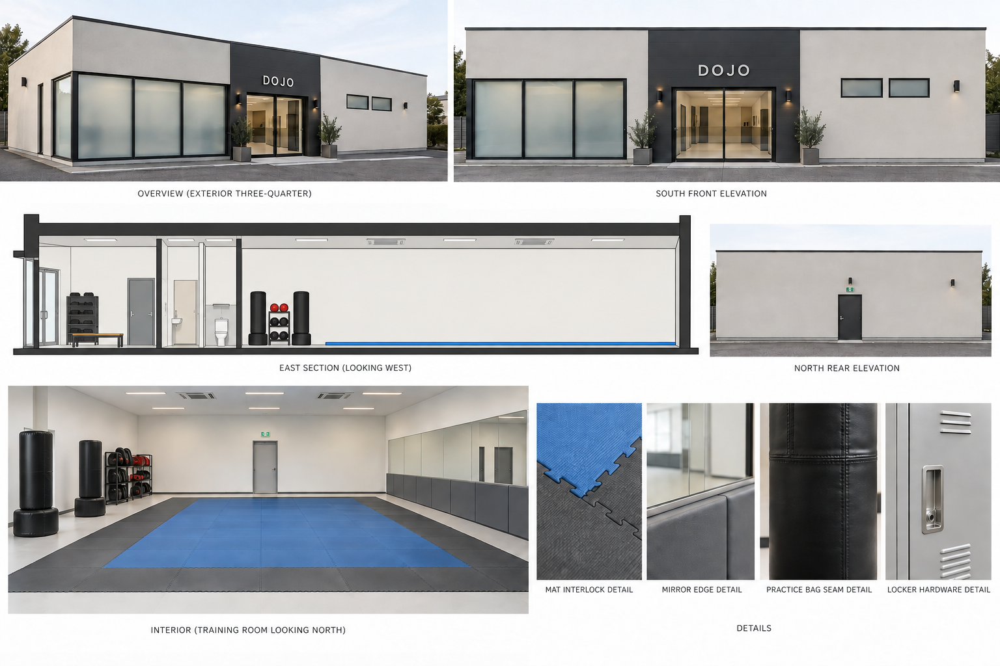
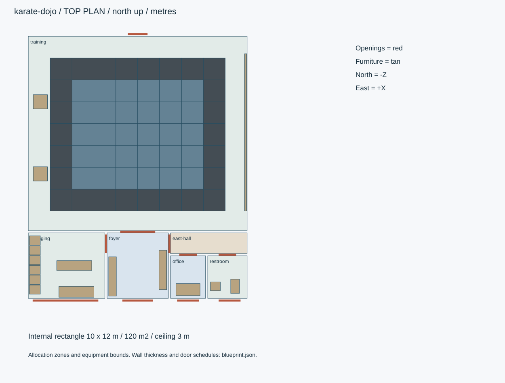
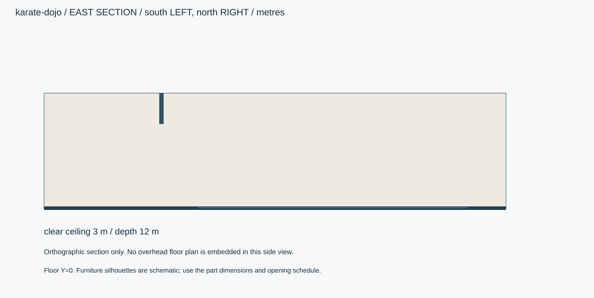
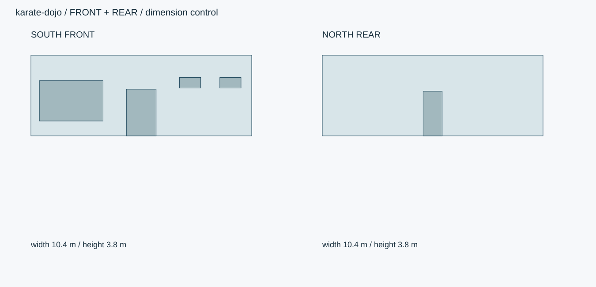

# 汐見空手道場・マット床のテナント

約120㎡の現代的なテナント道場。マット稽古場、鏡、更衣スペース、玄関、便所、事務スペースと練習用具を含む。

ID `karate-dojo` / category `karate-dojo` / 設計レビュー

## 全体・正面・側面・背面・細部



数値仕様と下の寸法図を生成基準とします。参考画像は外観資料で、実モデルの検証画像ではありません。







## 概要寸法

```json
{
  "inside_xz_m": [
    10,
    12
  ],
  "inside_envelope_area_m2": 120,
  "area_note": "内法外周矩形の面積。間仕切りを含み、有効床面積はこれより小さい。",
  "envelope_xyz_m": [
    10.4,
    3.8,
    12.4
  ],
  "clear_ceiling_m": 3.0,
  "outer_wall_m": 0.2,
  "partition_m": 0.1,
  "floor_slab_m": 0.2,
  "origin": "室内床中央Y=0。+X東/+Y上/+Z南。入口正面は南+Z。",
  "priority": "数値JSON・寸法SVG > 仕様文 > 参考画像"
}
```

## 平面区画

```json
[
  {
    "id": "training",
    "rect_xz_m": [
      -5,
      -6,
      5,
      2.9
    ],
    "use": "稽古場。北側の広い一室。"
  },
  {
    "id": "mat-field",
    "rect_xz_m": [
      -4,
      -5,
      4,
      2
    ],
    "use": "8×7mマット領域"
  },
  {
    "id": "foyer",
    "rect_xz_m": [
      -1.4,
      3,
      1.4,
      6
    ],
    "use": "土足玄関・靴棚・脱ぎ履きベンチ"
  },
  {
    "id": "changing",
    "rect_xz_m": [
      -5,
      3,
      -1.5,
      6
    ],
    "use": "目隠しした更衣室とロッカー"
  },
  {
    "id": "east-hall",
    "rect_xz_m": [
      1.5,
      3,
      5,
      3.95
    ],
    "use": "事務・便所への廊下"
  },
  {
    "id": "office",
    "rect_xz_m": [
      1.5,
      4.05,
      3.1,
      6
    ],
    "use": "小さな事務スペース"
  },
  {
    "id": "restroom",
    "rect_xz_m": [
      3.2,
      4.05,
      5,
      6
    ],
    "use": "便所・手洗い"
  }
]
```

## 壁と開口の作り方

```json
[
  "外周200mm、間仕切り100mm。玄関/更衣/事務/便所はlayoutとopeningsで区切る。",
  "南側サービス帯はZ3〜6、稽古場はZ-6〜2.9。Z2.9〜3.0に間仕切り。",
  "更衣室の窓は目隠し、便所と事務は高窓。内部が丸見えの全面透明ガラスに置き換えない。",
  "テナント区画の外皮だけを納品し、上階や隣の店舗を勝手に追加しない。"
]
```

## 開口表

```json
[
  {
    "id": "entrance",
    "wall": "south",
    "center_m": [
      0,
      1.1,
      6.1
    ],
    "width_m": 1.4,
    "height_m": 2.2,
    "type": "double-slide",
    "note": "玄関へ。"
  },
  {
    "id": "changing-front-window",
    "wall": "south",
    "center_m": [
      -3.3,
      1.65,
      6.1
    ],
    "width_m": 3,
    "height_m": 1.9,
    "type": "frosted-fixed",
    "note": "更衣室の目隠し、下端0.7m。"
  },
  {
    "id": "office-high-window",
    "wall": "south",
    "center_m": [
      2.3,
      2.5,
      6.1
    ],
    "width_m": 1,
    "height_m": 0.5,
    "type": "frosted-fixed",
    "note": "高窓。"
  },
  {
    "id": "wc-high-window",
    "wall": "south",
    "center_m": [
      4.2,
      2.5,
      6.1
    ],
    "width_m": 1,
    "height_m": 0.5,
    "type": "frosted-fixed",
    "note": "高窓。"
  },
  {
    "id": "training-door",
    "wall": "z=2.95",
    "center_m": [
      0,
      1.1,
      2.95
    ],
    "width_m": 1.6,
    "height_m": 2.2,
    "type": "double-slide",
    "note": "玄関から稽古場へ。土足境界。"
  },
  {
    "id": "changing-door",
    "wall": "x=-1.45",
    "center_m": [
      -1.45,
      1,
      3.5
    ],
    "width_m": 0.85,
    "height_m": 2,
    "type": "slide",
    "note": "更衣室への扉。"
  },
  {
    "id": "east-hall-door",
    "wall": "x=1.45",
    "center_m": [
      1.45,
      1,
      3.5
    ],
    "width_m": 0.85,
    "height_m": 2,
    "type": "open",
    "note": "玄関から東の廊下。"
  },
  {
    "id": "office-door",
    "wall": "z=4.0",
    "center_m": [
      2.3,
      1,
      4
    ],
    "width_m": 0.8,
    "height_m": 2,
    "type": "slide",
    "note": "事務スペース。"
  },
  {
    "id": "wc-door",
    "wall": "z=4.0",
    "center_m": [
      4.1,
      1,
      4
    ],
    "width_m": 0.8,
    "height_m": 2,
    "type": "hinge",
    "note": "便所内へ開く。"
  },
  {
    "id": "rear-exit",
    "wall": "north",
    "center_m": [
      0,
      1.05,
      -6.1
    ],
    "width_m": 0.9,
    "height_m": 2.1,
    "type": "hinge",
    "note": "北端の退出口。"
  }
]
```

## マット配置

```json
{
  "cols_x": 8,
  "rows_z": 7,
  "tile_count": 56,
  "tile_size_xyz_m": [
    1,
    0.025,
    1
  ],
  "field_rect_xz_m": [
    -4,
    -5,
    4,
    2
  ],
  "edge_tile_count": 26,
  "center_tile_count": 30,
  "edge_material": "eva-charcoal",
  "center_material": "eva-blue",
  "interlock_pitch_m": 0.05,
  "interlock_depth_m": 0.012,
  "transition_ramp_width_m": 0.1,
  "note": "最外周は直線エッジ片。勘合部を重ねて段差を作らない。"
}
```

## 用具と動作

```json
{
  "practice_bags": 2,
  "hand_mitt_pairs": 4,
  "kick_shields": 2,
  "locker_count": 6,
  "shoe_slots": 12,
  "mat_physics": "基本は固定した床。取外し用にタイルIDを保持。",
  "bag_dynamics": {
    "method": "基部ジョイントに減衰ばねを設定。",
    "frequency_hz": 1.6,
    "damping_ratio": 0.75,
    "max_tilt_deg": 10,
    "max_local_compression_m": 0.02,
    "collision": "壁・鏡・床と衝突。胴とベースを分ける。",
    "verification": "無入力で静止、傾けて解放後に収束。人物は生成しない。"
  }
}
```

## パーツ

|ID|名称|中心XYZ m|寸法XYZ m|材質・備考|
|---|---|---|---|---|
|floor|床|[0, -0.1, 0]|[10.4, 0.2, 12.4]|paint / |
|ceiling|天井|[0, 3.05, 0]|[10, 0.1, 12]|paint / |
|tenant-roof|区画の上端|[0, 3.65, 0]|[10.4, 0.3, 12.4]|paint / ホスト建物の他階は含めない。|
|shoe-rack|靴棚|[-1.15, 0.45, 5.0]|[0.35, 0.9, 1.8]|oak / 開口は東向き、12区画。|
|shoe-bench|玄関ベンチ|[1.15, 0.215, 4.7]|[0.35, 0.43, 1.8]|oak / |
|changing-bench|更衣ベンチ|[-2.9, 0.215, 4.5]|[1.6, 0.43, 0.45]|oak / |
|office-desk|事務机|[2.3, 0.36, 5.6]|[1.1, 0.72, 0.55]|oak / |
|wc|便器|[4.45, 0.38, 5.45]|[0.4, 0.76, 0.65]|paint / |
|washbasin|手洗い|[3.55, 0.425, 5.45]|[0.45, 0.85, 0.4]|paint / |
|front-sign|DOJO看板|[0, 3.25, 6.115]|[3, 0.45, 0.06]|paint / 文字はDOJO、実在流派・団体ロゴなし。|
|mat-0-0|マット|[-3.5, 0.0125, -4.5]|[1, 0.025, 1]|eva-charcoal / 周囲と噛み合わせる独立モジュール。|
|mat-1-0|マット|[-2.5, 0.0125, -4.5]|[1, 0.025, 1]|eva-charcoal / 周囲と噛み合わせる独立モジュール。|
|mat-2-0|マット|[-1.5, 0.0125, -4.5]|[1, 0.025, 1]|eva-charcoal / 周囲と噛み合わせる独立モジュール。|
|mat-3-0|マット|[-0.5, 0.0125, -4.5]|[1, 0.025, 1]|eva-charcoal / 周囲と噛み合わせる独立モジュール。|
|mat-4-0|マット|[0.5, 0.0125, -4.5]|[1, 0.025, 1]|eva-charcoal / 周囲と噛み合わせる独立モジュール。|
|mat-5-0|マット|[1.5, 0.0125, -4.5]|[1, 0.025, 1]|eva-charcoal / 周囲と噛み合わせる独立モジュール。|
|mat-6-0|マット|[2.5, 0.0125, -4.5]|[1, 0.025, 1]|eva-charcoal / 周囲と噛み合わせる独立モジュール。|
|mat-7-0|マット|[3.5, 0.0125, -4.5]|[1, 0.025, 1]|eva-charcoal / 周囲と噛み合わせる独立モジュール。|
|mat-0-1|マット|[-3.5, 0.0125, -3.5]|[1, 0.025, 1]|eva-charcoal / 周囲と噛み合わせる独立モジュール。|
|mat-1-1|マット|[-2.5, 0.0125, -3.5]|[1, 0.025, 1]|eva-blue / 周囲と噛み合わせる独立モジュール。|
|mat-2-1|マット|[-1.5, 0.0125, -3.5]|[1, 0.025, 1]|eva-blue / 周囲と噛み合わせる独立モジュール。|
|mat-3-1|マット|[-0.5, 0.0125, -3.5]|[1, 0.025, 1]|eva-blue / 周囲と噛み合わせる独立モジュール。|
|mat-4-1|マット|[0.5, 0.0125, -3.5]|[1, 0.025, 1]|eva-blue / 周囲と噛み合わせる独立モジュール。|
|mat-5-1|マット|[1.5, 0.0125, -3.5]|[1, 0.025, 1]|eva-blue / 周囲と噛み合わせる独立モジュール。|
|mat-6-1|マット|[2.5, 0.0125, -3.5]|[1, 0.025, 1]|eva-blue / 周囲と噛み合わせる独立モジュール。|
|mat-7-1|マット|[3.5, 0.0125, -3.5]|[1, 0.025, 1]|eva-charcoal / 周囲と噛み合わせる独立モジュール。|
|mat-0-2|マット|[-3.5, 0.0125, -2.5]|[1, 0.025, 1]|eva-charcoal / 周囲と噛み合わせる独立モジュール。|
|mat-1-2|マット|[-2.5, 0.0125, -2.5]|[1, 0.025, 1]|eva-blue / 周囲と噛み合わせる独立モジュール。|
|mat-2-2|マット|[-1.5, 0.0125, -2.5]|[1, 0.025, 1]|eva-blue / 周囲と噛み合わせる独立モジュール。|
|mat-3-2|マット|[-0.5, 0.0125, -2.5]|[1, 0.025, 1]|eva-blue / 周囲と噛み合わせる独立モジュール。|
|mat-4-2|マット|[0.5, 0.0125, -2.5]|[1, 0.025, 1]|eva-blue / 周囲と噛み合わせる独立モジュール。|
|mat-5-2|マット|[1.5, 0.0125, -2.5]|[1, 0.025, 1]|eva-blue / 周囲と噛み合わせる独立モジュール。|
|mat-6-2|マット|[2.5, 0.0125, -2.5]|[1, 0.025, 1]|eva-blue / 周囲と噛み合わせる独立モジュール。|
|mat-7-2|マット|[3.5, 0.0125, -2.5]|[1, 0.025, 1]|eva-charcoal / 周囲と噛み合わせる独立モジュール。|
|mat-0-3|マット|[-3.5, 0.0125, -1.5]|[1, 0.025, 1]|eva-charcoal / 周囲と噛み合わせる独立モジュール。|
|mat-1-3|マット|[-2.5, 0.0125, -1.5]|[1, 0.025, 1]|eva-blue / 周囲と噛み合わせる独立モジュール。|
|mat-2-3|マット|[-1.5, 0.0125, -1.5]|[1, 0.025, 1]|eva-blue / 周囲と噛み合わせる独立モジュール。|
|mat-3-3|マット|[-0.5, 0.0125, -1.5]|[1, 0.025, 1]|eva-blue / 周囲と噛み合わせる独立モジュール。|
|mat-4-3|マット|[0.5, 0.0125, -1.5]|[1, 0.025, 1]|eva-blue / 周囲と噛み合わせる独立モジュール。|
|mat-5-3|マット|[1.5, 0.0125, -1.5]|[1, 0.025, 1]|eva-blue / 周囲と噛み合わせる独立モジュール。|
|mat-6-3|マット|[2.5, 0.0125, -1.5]|[1, 0.025, 1]|eva-blue / 周囲と噛み合わせる独立モジュール。|
|mat-7-3|マット|[3.5, 0.0125, -1.5]|[1, 0.025, 1]|eva-charcoal / 周囲と噛み合わせる独立モジュール。|
|mat-0-4|マット|[-3.5, 0.0125, -0.5]|[1, 0.025, 1]|eva-charcoal / 周囲と噛み合わせる独立モジュール。|
|mat-1-4|マット|[-2.5, 0.0125, -0.5]|[1, 0.025, 1]|eva-blue / 周囲と噛み合わせる独立モジュール。|
|mat-2-4|マット|[-1.5, 0.0125, -0.5]|[1, 0.025, 1]|eva-blue / 周囲と噛み合わせる独立モジュール。|
|mat-3-4|マット|[-0.5, 0.0125, -0.5]|[1, 0.025, 1]|eva-blue / 周囲と噛み合わせる独立モジュール。|
|mat-4-4|マット|[0.5, 0.0125, -0.5]|[1, 0.025, 1]|eva-blue / 周囲と噛み合わせる独立モジュール。|
|mat-5-4|マット|[1.5, 0.0125, -0.5]|[1, 0.025, 1]|eva-blue / 周囲と噛み合わせる独立モジュール。|
|mat-6-4|マット|[2.5, 0.0125, -0.5]|[1, 0.025, 1]|eva-blue / 周囲と噛み合わせる独立モジュール。|
|mat-7-4|マット|[3.5, 0.0125, -0.5]|[1, 0.025, 1]|eva-charcoal / 周囲と噛み合わせる独立モジュール。|
|mat-0-5|マット|[-3.5, 0.0125, 0.5]|[1, 0.025, 1]|eva-charcoal / 周囲と噛み合わせる独立モジュール。|
|mat-1-5|マット|[-2.5, 0.0125, 0.5]|[1, 0.025, 1]|eva-blue / 周囲と噛み合わせる独立モジュール。|
|mat-2-5|マット|[-1.5, 0.0125, 0.5]|[1, 0.025, 1]|eva-blue / 周囲と噛み合わせる独立モジュール。|
|mat-3-5|マット|[-0.5, 0.0125, 0.5]|[1, 0.025, 1]|eva-blue / 周囲と噛み合わせる独立モジュール。|
|mat-4-5|マット|[0.5, 0.0125, 0.5]|[1, 0.025, 1]|eva-blue / 周囲と噛み合わせる独立モジュール。|
|mat-5-5|マット|[1.5, 0.0125, 0.5]|[1, 0.025, 1]|eva-blue / 周囲と噛み合わせる独立モジュール。|
|mat-6-5|マット|[2.5, 0.0125, 0.5]|[1, 0.025, 1]|eva-blue / 周囲と噛み合わせる独立モジュール。|
|mat-7-5|マット|[3.5, 0.0125, 0.5]|[1, 0.025, 1]|eva-charcoal / 周囲と噛み合わせる独立モジュール。|
|mat-0-6|マット|[-3.5, 0.0125, 1.5]|[1, 0.025, 1]|eva-charcoal / 周囲と噛み合わせる独立モジュール。|
|mat-1-6|マット|[-2.5, 0.0125, 1.5]|[1, 0.025, 1]|eva-charcoal / 周囲と噛み合わせる独立モジュール。|
|mat-2-6|マット|[-1.5, 0.0125, 1.5]|[1, 0.025, 1]|eva-charcoal / 周囲と噛み合わせる独立モジュール。|
|mat-3-6|マット|[-0.5, 0.0125, 1.5]|[1, 0.025, 1]|eva-charcoal / 周囲と噛み合わせる独立モジュール。|
|mat-4-6|マット|[0.5, 0.0125, 1.5]|[1, 0.025, 1]|eva-charcoal / 周囲と噛み合わせる独立モジュール。|
|mat-5-6|マット|[1.5, 0.0125, 1.5]|[1, 0.025, 1]|eva-charcoal / 周囲と噛み合わせる独立モジュール。|
|mat-6-6|マット|[2.5, 0.0125, 1.5]|[1, 0.025, 1]|eva-charcoal / 周囲と噛み合わせる独立モジュール。|
|mat-7-6|マット|[3.5, 0.0125, 1.5]|[1, 0.025, 1]|eva-charcoal / 周囲と噛み合わせる独立モジュール。|
|mirror-0|鏡|[4.96, 1.5, -4.6]|[0.008, 1.7, 1.2]|mirror / 底部Y0.65、枠目地3mm。表面は西向き。|
|locker-0|更衣ロッカー|[-4.7, 0.9, 3.35]|[0.5, 1.8, 0.42]|paint / 扉は東+X向き、独立ヒンジ。|
|mirror-1|鏡|[4.96, 1.5, -3.3999999999999995]|[0.008, 1.7, 1.2]|mirror / 底部Y0.65、枠目地3mm。表面は西向き。|
|locker-1|更衣ロッカー|[-4.7, 0.9, 3.8000000000000003]|[0.5, 1.8, 0.42]|paint / 扉は東+X向き、独立ヒンジ。|
|mirror-2|鏡|[4.96, 1.5, -2.1999999999999997]|[0.008, 1.7, 1.2]|mirror / 底部Y0.65、枠目地3mm。表面は西向き。|
|locker-2|更衣ロッカー|[-4.7, 0.9, 4.25]|[0.5, 1.8, 0.42]|paint / 扉は東+X向き、独立ヒンジ。|
|mirror-3|鏡|[4.96, 1.5, -1.0]|[0.008, 1.7, 1.2]|mirror / 底部Y0.65、枠目地3mm。表面は西向き。|
|locker-3|更衣ロッカー|[-4.7, 0.9, 4.7]|[0.5, 1.8, 0.42]|paint / 扉は東+X向き、独立ヒンジ。|
|mirror-4|鏡|[4.96, 1.5, 0.20000000000000018]|[0.008, 1.7, 1.2]|mirror / 底部Y0.65、枠目地3mm。表面は西向き。|
|locker-4|更衣ロッカー|[-4.7, 0.9, 5.15]|[0.5, 1.8, 0.42]|paint / 扉は東+X向き、独立ヒンジ。|
|mirror-5|鏡|[4.96, 1.5, 1.4000000000000004]|[0.008, 1.7, 1.2]|mirror / 底部Y0.65、枠目地3mm。表面は西向き。|
|locker-5|更衣ロッカー|[-4.7, 0.9, 5.6]|[0.5, 1.8, 0.42]|paint / 扉は東+X向き、独立ヒンジ。|
|mirror-low-pad|鏡下の壁パッド|[4.93, 0.3, -1.6]|[0.1, 0.6, 7.2]|vinyl / |
|bag-0|自立式パンチングバッグ|[-4.45, 0.85, -3]|[0.65, 1.7, 0.65]|vinyl / 円形ベース径650mm、胴径320mm。マット外の西帯。|
|bag-1|自立式パンチングバッグ|[-4.45, 0.85, 0.3]|[0.65, 1.7, 0.65]|vinyl / 円形ベース径650mm、胴径320mm。マット外の西帯。|
|gear-shelf|練習用具棚|[-2.8, 1.0, 5.7]|[1.6, 2, 0.5]|paint / 更衣室内。ミット・キックシールドを収納。|

包絡サイズは形状の基準です。建物内部・厨房機器・収納を中実Boxで塞がず、壁厚・空洞・可動部へ分解します。

## 微細構造

- 稽古場と土足玄関を分離し、靴棚と脱ぎ履きベンチは玄関帯に置く。玄関中央の通路は幅1.95m。
- マットは1m角×56枚、厚25mm。8×7mの領域で、外周26枚がチャコール、中央30枚が落ち着いた青。周囲は100mm幅の見切り。
- 東壁の鏡は1200mm幅6枚、合計7.2m。下端650mm、上端2350mm。鏡面の平面性を保持し、反射を色テクスチャだけで代用しない。
- バッグ2本はマット外の西側。ミット4組・シールド2枚は棚に収納し、稽古面に散乱させない。
- 北端退出口の前はマット端から1mの床を空ける。玄関から稽古場へは扉と見切りのみで接続し、上り階段を追加しない。
- ロッカーは6台、通気孔径5mm・3列。バッグの縫製ピッチ4mm、マットの接合線に厚みの二重計上をしない。
- 光源は天井の拡散ライン照明。鏡に同じ光源が過剰に重なる見え方を実モデルで確認する。
- ミット1個の包絡180×250×60mm、キックシールド400×650×120mm。ロッカーと用具棚は空洞・棚板・収納物を分離。照明は稽古場に長さ1.2mの器具を3列×3行、天井下面Y3.0mに配置。

## PBR材質

|ID|sRGB|粗さ|金属度|テクスチャ・細部|
|---|---|---|---|---|
|plaster|#ECEBE3|[0.8, 0.9]|0|白塗り壁、左官粒0.3mm、起伏0.2mm以下。擦れは幅木・入口周辺に限定。|
|paint|#DADDD8|[0.45, 0.65]|0|白/グレー塗装鋼板、下地金属とは分離。|
|bronze|#4B4740|[0.25, 0.45]|1|窓枠、ドアの金属。幅35mm、段差・パッキンを形状で作る。|
|glass|#DCE5E2|[0.03, 0.12]|0|透明ガラス8mm。透過/反射は別設定。曇りガラスは別材質へ分離。|
|frosted-glass|#E3E7E3|[0.4, 0.6]|0|道場更衣スペースの目隠しガラス。裏の人物や備品の輪郭が読めない曇り表現。|
|oak|#C5A77A|[0.35, 0.5]|0|長手木目、導管0.1–0.3mm、木口は別方向。クリア塗膜、触れる角だけ微細摩耗。|
|rubber|#353A3C|[0.7, 0.9]|0|機器パッキン、防振脚、練習用具底部。|
|eva-blue|#648294|[0.75, 0.9]|0|EVA風マット、表面の細かい凹凸0.3mm、継目と使用箇所の弱い色差。|
|eva-charcoal|#444D54|[0.75, 0.9]|0|同じマットの外周色。樹脂らしい低い反射、過度な濡れ感なし。|
|mirror|#D9DEDF|[0.005, 0.02]|1|鏡の平面反射。枠と飛散抑制用の裏層は別パーツ。エンジンでは反射機能を別途設定。|
|vinyl|#424A51|[0.5, 0.7]|0|パンチングバッグとミットの合皮。縫い合わせ、ファスナー、パッドのふくらみ。|
|stainless|#B4BBC0|[0.22, 0.4]|1|機器と水回り。ヘアライン、折返しR1mm、ねじ・溶接は独立ディテール。|
|light|#EAECE5|[0.3, 0.4]|0|照明拡散板。器具発光と室内を照らす光源を分離。|

## 可動部

```json
[
  {
    "id": "front-left",
    "type": "slide",
    "pivot_m": [
      -0.35,
      0,
      6.1
    ],
    "axis": [
      1,
      0,
      0
    ],
    "range": [
      -0.7,
      0
    ],
    "unit": "m",
    "note": "右戸は反転。"
  },
  {
    "id": "training-left",
    "type": "slide",
    "pivot_m": [
      -0.4,
      0,
      2.95
    ],
    "axis": [
      1,
      0,
      0
    ],
    "range": [
      -0.8,
      0
    ],
    "unit": "m",
    "note": "右戸は反転。"
  },
  {
    "id": "changing-door",
    "type": "slide",
    "pivot_m": [
      -1.45,
      0,
      3.5
    ],
    "axis": [
      0,
      0,
      1
    ],
    "range": [
      0,
      0.85
    ],
    "unit": "m",
    "note": "壁内戸袋。靴棚はZ4.1以南に置き、出入口を空ける。"
  },
  {
    "id": "wc-door",
    "type": "hinge",
    "pivot_m": [
      3.7,
      0,
      4
    ],
    "axis": [
      0,
      1,
      0
    ],
    "range": [
      0,
      -95
    ],
    "unit": "degree",
    "note": "便所内+Zへ開く。"
  },
  {
    "id": "rear-exit",
    "type": "hinge",
    "pivot_m": [
      -0.45,
      0,
      -6.1
    ],
    "axis": [
      0,
      1,
      0
    ],
    "range": [
      0,
      100
    ],
    "unit": "degree",
    "note": "北側へ外開き。"
  },
  {
    "id": "bag-tilt",
    "type": "hinge",
    "pivot_m": [
      -4.45,
      0.18,
      -3
    ],
    "axis": [
      1,
      0,
      0
    ],
    "range": [
      -10,
      10
    ],
    "unit": "degree",
    "note": "ベースは固定、胴を傾けて復元する。"
  },
  {
    "id": "office-door",
    "type": "slide",
    "pivot_m": [
      2.3,
      0,
      4
    ],
    "axis": [
      1,
      0,
      0
    ],
    "range": [
      0,
      0.8
    ],
    "unit": "m",
    "note": "東側へ引く。便所扉の開口手前で止まる。"
  },
  {
    "id": "locker-0-door",
    "type": "hinge",
    "pivot_m": [
      -4.45,
      0,
      3.14
    ],
    "axis": [
      0,
      1,
      0
    ],
    "range": [
      0,
      95
    ],
    "unit": "degree",
    "note": "東へ開く。各扉は別々に操作する。"
  },
  {
    "id": "locker-1-door",
    "type": "hinge",
    "pivot_m": [
      -4.45,
      0,
      3.5900000000000003
    ],
    "axis": [
      0,
      1,
      0
    ],
    "range": [
      0,
      95
    ],
    "unit": "degree",
    "note": "東へ開く。各扉は別々に操作する。"
  },
  {
    "id": "locker-2-door",
    "type": "hinge",
    "pivot_m": [
      -4.45,
      0,
      4.04
    ],
    "axis": [
      0,
      1,
      0
    ],
    "range": [
      0,
      95
    ],
    "unit": "degree",
    "note": "東へ開く。各扉は別々に操作する。"
  },
  {
    "id": "locker-3-door",
    "type": "hinge",
    "pivot_m": [
      -4.45,
      0,
      4.49
    ],
    "axis": [
      0,
      1,
      0
    ],
    "range": [
      0,
      95
    ],
    "unit": "degree",
    "note": "東へ開く。各扉は別々に操作する。"
  },
  {
    "id": "locker-4-door",
    "type": "hinge",
    "pivot_m": [
      -4.45,
      0,
      4.94
    ],
    "axis": [
      0,
      1,
      0
    ],
    "range": [
      0,
      95
    ],
    "unit": "degree",
    "note": "東へ開く。各扉は別々に操作する。"
  },
  {
    "id": "locker-5-door",
    "type": "hinge",
    "pivot_m": [
      -4.45,
      0,
      5.390000000000001
    ],
    "axis": [
      0,
      1,
      0
    ],
    "range": [
      0,
      95
    ],
    "unit": "degree",
    "note": "東へ開く。各扉は別々に操作する。"
  }
]
```

## 視点

```json
{
  "front": "南+Zから北-Z。画面右が東+X。",
  "east_section": "東+Xから西-X。画面左が南+Z、右が北-Z。正投影断面に俯瞰図を混ぜない。",
  "rear": "北-Zから南+Z。画面右が西-X。"
}
```

## 確認用クリップ

```json
[
  {
    "id": "walkthrough",
    "duration_s": 20,
    "description": "入口→主室→設備と背面出入口を移動し、床の連続・開口・視線を確認。"
  },
  {
    "id": "doors",
    "duration_s": 10,
    "description": "全建具を個別に開閉し、半開と全開も記録。"
  },
  {
    "id": "equipment",
    "duration_s": 8,
    "description": "カフェは機器扉/ダイヤル、道場はバッグ復元/収納扉を確認。"
  }
]
```

## 用途と納品

```json
{
  "engine": "Unity / HDRP（実装時にバージョン固定）",
  "exports": [
    "編集可能な制作ソース",
    "GLB（PBRと可動アニメ）",
    "対象エンジンの制御設定",
    "各方向/細部PNGと動作MP4"
  ],
  "triangles_lod0_max": 400000,
  "texture_resolution_max": 4096,
  "texture_policy": "共有材2K、案内と主役設備4K。床壁は実寸タイリング。色はsRGB、法線/金属/粗さはlinear。",
  "texel_density_px_per_m": 512,
  "lod_ratios": [
    1,
    0.5,
    0.2,
    0.08
  ],
  "texture_resident_budget_mib": 256
}
```

## 管理情報

```json
{
  "tags": [
    "日本",
    "現代",
    "写実",
    "karate-dojo"
  ],
  "usage": "PC向けリアルタイム探索・映像用のモデル設計",
  "license": "独自制作物として管理。現段階は私有・配布許諾未設定。販売用ライセンスは公開時に別途設定。",
  "approval": "モデル未生成・販売未承認",
  "description": "約120㎡の現代的なテナント道場。マット稽古場、鏡、更衣スペース、玄関、便所、事務スペースと練習用具を含む。"
}
```

回転角は仕様では度、promodelerへ渡す時はラジアンへ変換。

## 実装差分

- ガラス透過、照明と可動部の制御は対象エンジンで検証する。
- 独自の設計JSON。promodelerのrecipeとして直接入力できない。
- 鏡の実反射、バッグの減衰ばね/圧縮変形はランタイム実装が必要。設定済みや検証済みと扱わない。

## モデル生成後の確認

- [ ] マット56枚・外周26/中央30、バッグ2、鏡6枚、ロッカー6台。
- [ ] 土足区域は玄関と更衣/事務/便所。稽古面へ靴棚や可動備品を重ねない。
- [ ] 56枚が同一上面Y0.025で接続し、接合部に隙間・二重面・突起の重なりなし。
- [ ] 鏡の映りがビュー依存で変化し、鏡裏・枠が正しく遮蔽される。
- [ ] バッグ傾斜10度と扉全開で壁・鏡・収納へ貫通しない。
- [ ] 生成済みモデルから正面・背面・斜め・細部・可動の証拠を保存。参考画像を実モデル検証に転用しない。
