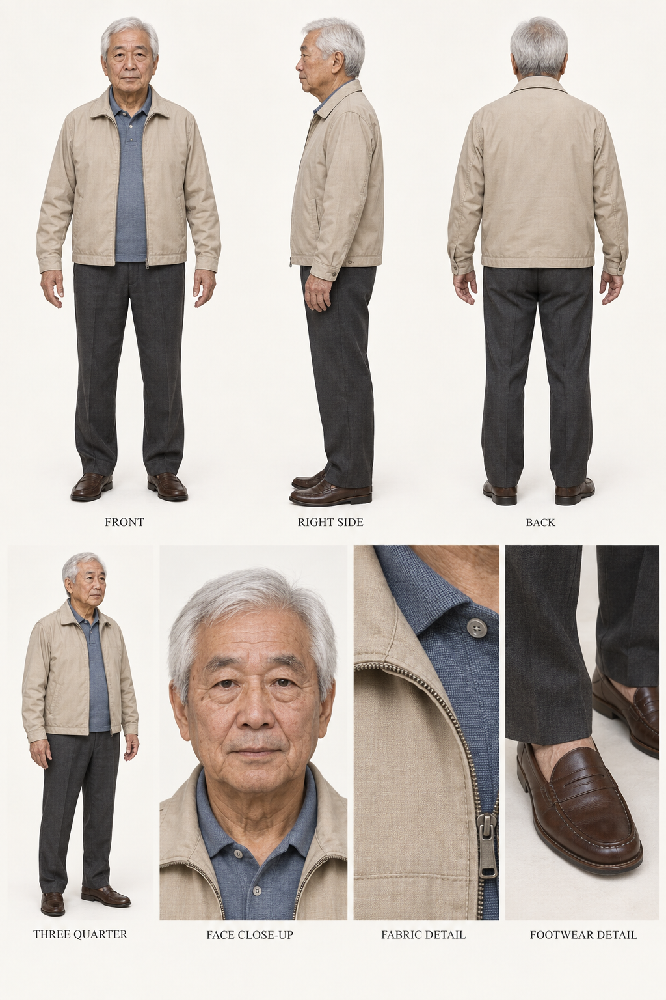
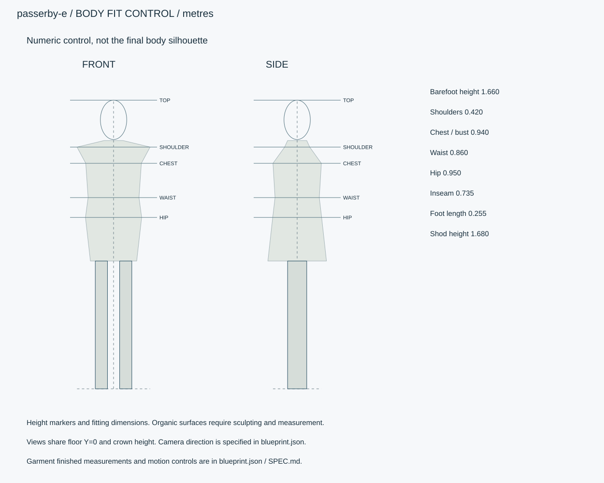

# 通行人E・白髪の男性

架空の日本人成人、71歳、裸足166cm。ベージュの薄手ジャケット、青灰色ポロ、チャコールパンツ、茶色ローファー。

ID `passerby-e` / category `male-character` / kind `humanoid` / 設計レビュー



参考画像は外観資料です。数値仕様を制作基準とし、画像を生成済み3Dモデルの証拠として扱いません。



## 人物設定

```json
{
  "fictional": true,
  "sex": "male",
  "age": 71,
  "face_shape_hair": "短い白髪、額と頬の自然なしわ、少し丸い肩",
  "outfit_palette": "ベージュの薄手ジャケット、青灰色ポロ、チャコールパンツ、茶色ローファー"
}
```

## 外観

短い白髪、額と頬の自然なしわ、少し丸い肩

## 身体寸法

```json
{
  "barefoot_height_m": 1.66,
  "standing_shod_height_m": 1.68,
  "shoe_sole_m": 0.02,
  "age": 71,
  "shoulder_width_m": 0.42,
  "inseam_m": 0.735,
  "foot_length_m": 0.255,
  "body_circumferences_m": {
    "chest": 0.94,
    "waist": 0.86,
    "hip": 0.95
  },
  "origin": "裸足両足底の中央。+Y上/+Z正面。解剖学的右=-X。",
  "priority": "数値JSON > 寸法SVG > 仕様文 > 参考画像",
  "cross_sections": [
    {
      "landmark": "chest",
      "height_m": 1.297,
      "width_m": 0.3196,
      "depth_m": 0.2781,
      "circumference_m": 0.94
    },
    {
      "landmark": "waist",
      "height_m": 1.1,
      "width_m": 0.2924,
      "depth_m": 0.2544,
      "circumference_m": 0.86
    },
    {
      "landmark": "hip",
      "height_m": 0.986,
      "width_m": 0.323,
      "depth_m": 0.2811,
      "circumference_m": 0.95
    }
  ]
}
```

## 衣装の完成寸法・構造

```json
[
  {
    "id": "upper",
    "name": "薄手ベージュジャケット",
    "material": "top",
    "finished_measurements_m": {
      "back_length": 0.689,
      "chest_circumference": 1.06,
      "shoulder_width": 0.445,
      "sleeve_length": 0.575
    },
    "construction": "左右前身頃・背身頃・袖・襟・見返し・裏地を分離。縫い目2.5mmピッチ、袖口に20mm折返し。",
    "deformation": "cloth"
  },
  {
    "id": "inner",
    "name": "青灰色ポロ",
    "material": "accent",
    "finished_measurements_m": {
      "chest_circumference": 1.04,
      "back_length": 0.604,
      "thickness": 0.0006
    },
    "construction": "不透明な身頃。襟・肩・脇の縫合。裾は下衣との重なりを保持。",
    "deformation": "cloth"
  },
  {
    "id": "lower",
    "name": "チャコールパンツ",
    "material": "bottom",
    "finished_measurements_m": {
      "waist_circumference": 0.89,
      "hip_circumference": 1.03,
      "inseam": 0.71,
      "hem_circumference": 0.34
    },
    "construction": "左右脚・前後身頃・股ぐり・ベルト部・袋布を分離。股と膝に関節補正。",
    "deformation": "cloth"
  }
]
```

## 足元

```json
{
  "barefoot": false,
  "internal_length_m": 0.267,
  "sole_height_m": 0.02,
  "construction": "左右別。靴甲1.5mm、内張り1mm、紐径4mm。靴底の屈曲を足趾に追従。パンプスは踵高と足裏傾斜を別に調整。",
  "color_and_type": "ベージュの薄手ジャケット、青灰色ポロ、チャコールパンツ、茶色ローファー",
  "forefoot_sole_m": 0.02,
  "heel_height_m": 0.02
}
```

## 付属品

```json
[]
```

## 微細構造

- ナイロン混の微細しわ、襟の摩耗、手の年齢表現
- 顔は眼球径24mm、虹彩径11.5mmを起点に個体へ調整。顔高・頬幅・顎・鼻を人物別に造形し、髪と色の変更だけで同じ顔を使い回さない。
- 肌の左右差は弱く、全身に同じノイズを一様に貼らない。髪・眉・まつ毛は独立。
- 衣服は完成寸法。身体円周と混同しない。外衣の裏地とインナーは別層、一般部に4–8mmの衝突余裕。
- バッグは本体・持ち手・ストラップ・留具を分け、収納空洞を作る。時計と眼鏡は身体へ一体化しない。
- 履物の色と形はoutfit/footwearを優先。共通rubber/leatherの色を全員の靴へ無条件に適用しない。

## PBR材質

|ID|色 sRGB|粗さ|金属度|微細構造|
|---|---|---|---|---|
|skin|#DFC1AD|[0.35, 0.58]|0|肌色はデザイン基準。顔・耳・手で弱い色差。毛穴0.1–0.4mm、年齢に応じた目尻/額/手のしわ。SSSはエンジン側で調整。|
|hair|#D3D1C8|[0.25, 0.48]|0|短い白髪、額と頬の自然なしわ、少し丸い肩。束幅2–12mm、異方性、頭皮との境界を自然に。 白髪比率は師範35%、通行人D65%、E90%を目標に束単位で混色。|
|top|#C4B49B|[0.65, 0.85]|0|ナイロン混の微細しわ、襟の摩耗、手の年齢表現。厚さと縫合はgarments表。|
|bottom|#43474D|[0.65, 0.85]|0|織目は脚の長手方向。股下の縫い合わせ、ポケット口、裾折返しを別形状で作る。|
|accent|#7C929F|[0.6, 0.85]|0|帯/エプロン/インナー/配色。異なる生地は必要に応じてスロット分離。|
|leather|#302C29|[0.28, 0.52]|0|革靴/バッグのしぼ、折れしわ。塗膜がある革も金属度0。縁塗り厚0.3mm。|
|rubber|#3D4142|[0.65, 0.85]|0|靴底の溝深2mm、接地部の軽い擦れ。白い靴は個別配色を適用。|
|metal|#92989C|[0.25, 0.4]|1|ファスナー、バックル、眼鏡ヒンジ、時計の金属部。布に金属度を伝播しない。|
|eye|#574335|[0.1, 0.2]|0|茶の虹彩、白目は薄い灰白色、角膜は別層・IOR1.376を初期目標。|
|teeth|#DCD4C3|[0.3, 0.5]|0|歯と口腔を分離。歯間を黒線で塗り潰さない。|
|inner|#ECE9E0|[0.65, 0.85]|0|不透明な白/生成りインナー。外衣の配色とは独立。|

## リグ・関節・ウェイト

```json
{
  "basis": "Aポーズ、腕は体幹から約35度。裸足座標、+Y上、+Z正面。解剖学的右は-X。骨位置は形状に合わせる初期設計。",
  "joints": [
    {
      "id": "root",
      "parent": null,
      "head_m": [
        0.0,
        0.0,
        0.0
      ],
      "tail_m": [
        0.0,
        0.01037,
        0.0
      ]
    },
    {
      "id": "pelvis",
      "parent": "root",
      "head_m": [
        0.0,
        0.87,
        0.0
      ],
      "tail_m": [
        0.0,
        1.00637,
        0.0
      ]
    },
    {
      "id": "spine01",
      "parent": "pelvis",
      "head_m": [
        0.0,
        1.00637,
        0.0
      ],
      "tail_m": [
        0.0,
        1.14125,
        0.0
      ]
    },
    {
      "id": "spine02",
      "parent": "spine01",
      "head_m": [
        0.0,
        1.14125,
        0.0
      ],
      "tail_m": [
        0.0,
        1.26575,
        0.0
      ]
    },
    {
      "id": "chest",
      "parent": "spine02",
      "head_m": [
        0.0,
        1.26575,
        0.0
      ],
      "tail_m": [
        0.0,
        1.39025,
        0.0
      ]
    },
    {
      "id": "neck",
      "parent": "chest",
      "head_m": [
        0.0,
        1.39025,
        0.0
      ],
      "tail_m": [
        0.0,
        1.45769,
        0.0
      ]
    },
    {
      "id": "head",
      "parent": "neck",
      "head_m": [
        0.0,
        1.45769,
        0.0
      ],
      "tail_m": [
        0.0,
        1.66,
        0.0
      ]
    },
    {
      "id": "clavicle.R",
      "parent": "chest",
      "head_m": [
        -0.041499999999999995,
        1.379875,
        0
      ],
      "tail_m": [
        -0.21,
        1.3695,
        0
      ]
    },
    {
      "id": "upperarm.R",
      "parent": "clavicle.R",
      "head_m": [
        -0.21,
        1.3695,
        0
      ],
      "tail_m": [
        -0.365625,
        1.1412499999999999,
        0
      ]
    },
    {
      "id": "forearm.R",
      "parent": "upperarm.R",
      "head_m": [
        -0.365625,
        1.1412499999999999,
        0
      ],
      "tail_m": [
        -0.5005,
        0.9441249999999999,
        0.015562499999999998
      ]
    },
    {
      "id": "hand.R",
      "parent": "forearm.R",
      "head_m": [
        -0.5005,
        0.9441249999999999,
        0.015562499999999998
      ],
      "tail_m": [
        -0.5731249999999999,
        0.840375,
        0.020749999999999998
      ]
    },
    {
      "id": "thigh.R",
      "parent": "pelvis",
      "head_m": [
        -0.09025,
        0.87,
        0
      ],
      "tail_m": [
        -0.09025,
        0.47390625,
        0.015562499999999998
      ]
    },
    {
      "id": "shin.R",
      "parent": "thigh.R",
      "head_m": [
        -0.09025,
        0.47390625,
        0.015562499999999998
      ],
      "tail_m": [
        -0.09025,
        0.07781249999999999,
        0
      ]
    },
    {
      "id": "foot.R",
      "parent": "shin.R",
      "head_m": [
        -0.09025,
        0.07781249999999999,
        0
      ],
      "tail_m": [
        -0.09025,
        0.0363125,
        0.17340000000000003
      ]
    },
    {
      "id": "clavicle.L",
      "parent": "chest",
      "head_m": [
        0.041499999999999995,
        1.379875,
        0
      ],
      "tail_m": [
        0.21,
        1.3695,
        0
      ]
    },
    {
      "id": "upperarm.L",
      "parent": "clavicle.L",
      "head_m": [
        0.21,
        1.3695,
        0
      ],
      "tail_m": [
        0.365625,
        1.1412499999999999,
        0
      ]
    },
    {
      "id": "forearm.L",
      "parent": "upperarm.L",
      "head_m": [
        0.365625,
        1.1412499999999999,
        0
      ],
      "tail_m": [
        0.5005,
        0.9441249999999999,
        0.015562499999999998
      ]
    },
    {
      "id": "hand.L",
      "parent": "forearm.L",
      "head_m": [
        0.5005,
        0.9441249999999999,
        0.015562499999999998
      ],
      "tail_m": [
        0.5731249999999999,
        0.840375,
        0.020749999999999998
      ]
    },
    {
      "id": "thigh.L",
      "parent": "pelvis",
      "head_m": [
        0.09025,
        0.87,
        0
      ],
      "tail_m": [
        0.09025,
        0.47390625,
        0.015562499999999998
      ]
    },
    {
      "id": "shin.L",
      "parent": "thigh.L",
      "head_m": [
        0.09025,
        0.47390625,
        0.015562499999999998
      ],
      "tail_m": [
        0.09025,
        0.07781249999999999,
        0
      ]
    },
    {
      "id": "foot.L",
      "parent": "shin.L",
      "head_m": [
        0.09025,
        0.07781249999999999,
        0
      ],
      "tail_m": [
        0.09025,
        0.0363125,
        0.17340000000000003
      ]
    },
    {
      "id": "toes.R",
      "parent": "foot.R",
      "head_m": [
        -0.09025,
        0.0363125,
        0.17340000000000003
      ],
      "tail_m": [
        -0.09025,
        0.0259375,
        0.22440000000000002
      ]
    },
    {
      "id": "upperarm_twist.R",
      "parent": "upperarm.R",
      "head_m": [
        -0.28781249999999997,
        1.255375,
        0.0
      ],
      "tail_m": [
        -0.365625,
        1.1412499999999999,
        0
      ],
      "constraint": "親ボーン軸ねじれの50%を追従。別のIKチェーンには含めない。"
    },
    {
      "id": "forearm_twist.R",
      "parent": "forearm.R",
      "head_m": [
        -0.43306249999999996,
        1.0426875,
        0.007781249999999999
      ],
      "tail_m": [
        -0.5005,
        0.9441249999999999,
        0.015562499999999998
      ],
      "constraint": "親ボーン軸ねじれの50%を追従。別のIKチェーンには含めない。"
    },
    {
      "id": "thigh_twist.R",
      "parent": "thigh.R",
      "head_m": [
        -0.09025,
        0.6719531249999999,
        0.007781249999999999
      ],
      "tail_m": [
        -0.09025,
        0.47390625,
        0.015562499999999998
      ],
      "constraint": "親ボーン軸ねじれの50%を追従。別のIKチェーンには含めない。"
    },
    {
      "id": "toes.L",
      "parent": "foot.L",
      "head_m": [
        0.09025,
        0.0363125,
        0.17340000000000003
      ],
      "tail_m": [
        0.09025,
        0.0259375,
        0.22440000000000002
      ]
    },
    {
      "id": "upperarm_twist.L",
      "parent": "upperarm.L",
      "head_m": [
        0.28781249999999997,
        1.255375,
        0.0
      ],
      "tail_m": [
        0.365625,
        1.1412499999999999,
        0
      ],
      "constraint": "親ボーン軸ねじれの50%を追従。別のIKチェーンには含めない。"
    },
    {
      "id": "forearm_twist.L",
      "parent": "forearm.L",
      "head_m": [
        0.43306249999999996,
        1.0426875,
        0.007781249999999999
      ],
      "tail_m": [
        0.5005,
        0.9441249999999999,
        0.015562499999999998
      ],
      "constraint": "親ボーン軸ねじれの50%を追従。別のIKチェーンには含めない。"
    },
    {
      "id": "thigh_twist.L",
      "parent": "thigh.L",
      "head_m": [
        0.09025,
        0.6719531249999999,
        0.007781249999999999
      ],
      "tail_m": [
        0.09025,
        0.47390625,
        0.015562499999999998
      ],
      "constraint": "親ボーン軸ねじれの50%を追従。別のIKチェーンには含めない。"
    }
  ],
  "fingers": "左右各5指×3節。掌長は身長×0.055、掌幅は身長×0.045を初期目標。中指全長は身長×0.047、示指/環指は中指の95%、小指は75%、親指は70%。個別根元と関節ループを設け、実メッシュの指節位置に合わせる。",
  "ik_fk": "腕・脚IK/FK切替、足接地IK、膝肘ポール、手首補正、鎖骨追従。",
  "weights": "最大4影響を初期目標。肩・脇・股関節・肘・膝は手動相当の補正工程と姿勢別変形検証必須。距離ウェイトだけで完了にしない。",
  "face": "瞬き、視線、笑顔、口開閉、母音5種。shape key/morphと眼球・顎ボーンを併用。",
  "limits_deg": {
    "elbow_flexion": [
      0,
      135
    ],
    "knee_flexion": [
      0,
      130
    ],
    "hip_flexion": [
      0,
      115
    ],
    "shoulder_raise": [
      0,
      160
    ],
    "neck_yaw": [
      -65,
      65
    ],
    "finger_curl": [
      0,
      90
    ]
  }
}
```

## 服・胸部・髪の物理

```json
{
  "common": {
    "execution": "ランタイムで継続する物理演算。GLB単体では再現不可。",
    "fixed_step_s": 0.016666666666666666,
    "substeps": 4,
    "gravity_m_s2": [
      0,
      -9.81,
      0
    ],
    "initial_settle_s": 2,
    "collision_margin_m": 0.004,
    "penetration_tolerance": "通常動作の可視貫通0。計測最大2mm未満かつ2フレーム以内。基準超過時は設定または形状を修正。"
  },
  "clothing": {
    "method": "低解像度クロスを部品別に300–1800頂点、合計6000頂点以内。スキニングの基準形状へ追従し表示メッシュへ転送。",
    "areal_density_kg_m2": 0.2,
    "stretch_ratio_max": 1.03,
    "bend_radius_min_m": 0.005,
    "pin": "肩・襟・ウエスト100%。ジャケット身頃上部80%、袖口/裾20%。帯結びとエプロン紐は固定、遊び端のみ可動。",
    "collision": "身体の胸・腹・骨盤・大腿・腕の追従コライダー。自己衝突ON。靴と裾の接近時も検証。",
    "range": "一般衣服の遊び部は静止形状から80mm以内、空手着袖裾は120mm以内。細部は拘束付き、身体を伸縮させて代用しない。"
  },
  "breast": {
    "method": "左右独立のばね質点/補助ボーン動力学。胸郭ローカルで求解し布側コライダーへ反映。",
    "effective_mass_kg": 0.08,
    "stiffness_n_m": 350,
    "damping_n_s_m": 12,
    "max_translation_m": [
      0.001,
      0.001,
      0.001
    ],
    "max_rotation_deg": 1,
    "collision": "胸郭へのめり込み制限、左右相互衝突、衣服は追従コライダーに衝突。基準姿勢を拘束中心とする。",
    "note": "実人体の推定物性ではない演出初期値。女性はインナー支持、男性は胸部軟部のごく小さな追従として設定。服へコライダーを反映。"
  },
  "hair": {
    "method": "短髪の主形状は頭へスキニング、前髪・毛先4–8束に2–3節の補助ボーン。",
    "root_pin": 1,
    "max_segment_angle_deg": 10,
    "max_tip_displacement_m": 0.008,
    "collision": "頭・肩・胸・背中のカプセル。髪は服の外側4mmの代理面と衝突。",
    "damping_ratio": 0.8
  },
  "solve_order": [
    "身体アニメーションとIK",
    "胸の動力学",
    "胸コライダー更新",
    "服クロス",
    "髪動力学",
    "表示メッシュ更新"
  ],
  "accessories": {
    "method": "バッグ本体は補助ボーン+ばね、持ち手は手または肩に固定。内容物は空にせず形状保持。",
    "max_swing_deg": 15,
    "collision": "骨盤・大腿・腕の代理面と衝突。着座時はバッグを外す/膝に置くアニメを別にする。"
  }
}
```

## 可動確認クリップ

```json
[
  {
    "id": "idle",
    "duration_s": 4,
    "loop": true,
    "description": "呼吸、瞬き、視線"
  },
  {
    "id": "walk",
    "duration_s": 1.2,
    "loop": true,
    "description": "左右足接地、1周期の移動1.1m、腕振り"
  },
  {
    "id": "turn",
    "duration_s": 2,
    "loop": false,
    "description": "180度方向転換"
  },
  {
    "id": "sit",
    "duration_s": 3,
    "loop": false,
    "description": "座面高0.43mへ着座。靴底の高さを接地IKに含める。"
  },
  {
    "id": "physics-settle",
    "duration_s": 6,
    "loop": false,
    "description": "静止2秒、歩行2秒、停止2秒。服/胸部/髪のON/OFF比較"
  },
  {
    "id": "look-around",
    "duration_s": 8,
    "loop": false,
    "description": "歩行から停止し左右を見回す。"
  }
]
```

## 撮影方向

```json
{
  "front": "+Zから-Z。正投影、頭頂と足底の高さを揃える。",
  "side": "+Xから-X。画面左が身体正面+Z。人物の解剖学的左側が見える。画像のSIDE/RIGHT SIDEは画面上の右側面ビューを表す。",
  "back": "-Zから+Z。同じ立位。",
  "three_quarter": "正面斜めの立位、全身。",
  "details": "顔、縫合、留具、手、靴/裸足。服単独では型紙と支持構造も。"
}
```

## 納品・品質予算

```json
{
  "engine": "Unity / HDRP を主想定。バージョンはモデル実装時に固定。",
  "exports": [
    "BLEND（編集可能な形状・リグ・物理設定、実装時に制作）",
    "GLB（形状・PBR・ベイクした骨アニメ）",
    "Unity用物理設定",
    "検証PNGとMP4"
  ],
  "triangles_lod0_max": 80000,
  "texture_resolution_max": 4096,
  "texture_policy": "共有材2K、主役・顔4K。BaseColor=sRGB、Normal/Roughness/Metallic=linear。AOをBaseColorへ焼き込まない。",
  "texel_density_px_per_m": 1024,
  "lod_ratios": [
    1,
    0.5,
    0.2,
    0.08
  ],
  "triangles_by_part": {
    "body": 30000,
    "hair": 14000,
    "clothing": 23000,
    "shoes_accessories_eyes": 13000
  },
  "texture_resident_budget_mib": 112
}
```

## 管理情報

```json
{
  "tags": [
    "日本",
    "現代",
    "写実",
    "pedestrian",
    "male"
  ],
  "usage": "PC向けリアルタイム探索・映像用のモデル設計",
  "license": "独自制作物として管理。現段階は私有・配布許諾未設定。販売用ライセンスは公開時に別途設定。",
  "approval": "モデル未生成・販売未承認",
  "description": "架空の日本人成人、71歳、裸足166cm。ベージュの薄手ジャケット、青灰色ポロ、チャコールパンツ、茶色ローファー。"
}
```

## 検証状態

```json
{
  "rig": {
    "status": "not_verified",
    "evidence": []
  },
  "clothing": {
    "status": "not_verified",
    "evidence": []
  },
  "breast": {
    "status": "not_verified",
    "evidence": []
  },
  "hair": {
    "status": "not_verified",
    "evidence": []
  }
}
```

## 実装差分

- リアルタイムクロス・胸・髪物理、IK/FK制御、顔morph、SSS・異方性を追加実装する。
- ClothDrapeは静止形状を凍結するだけ。物理実装済みの根拠として扱わない。
- GLBの骨アニメに物理結果をベイクする場合も、編集可能な物理設定と検証動画を別納品。
- 設計JSONは独自形式でありpromodelerのrecipeへ直接投入不可。適合変換・モデル制作・動作検証は別工程。

## モデル制作後の確認

- [ ] 裸足身長±2mm、指定円周±5mmを実メッシュで計測。
- [ ] 正面/側面/背面で髪型・顔・服・アクセサリーが同一。
- [ ] 指5本×左右、関節の体積、肩・脇・股・肘・膝のウェイトを確認。
- [ ] 各clipを正面/側面で60fps記録。服・胸部・髪は物理ON/OFF比較を保存。
- [ ] 通常動作で可視貫通0。計測上2mm未満かつ2フレーム以内、超える場合は修正。
- [ ] 停止後2秒で胸部1mm未満・髪と裾5mm未満へ収束するよう調整。
- [ ] checksは未検証のまま。実モデル証拠を確認してから更新。
