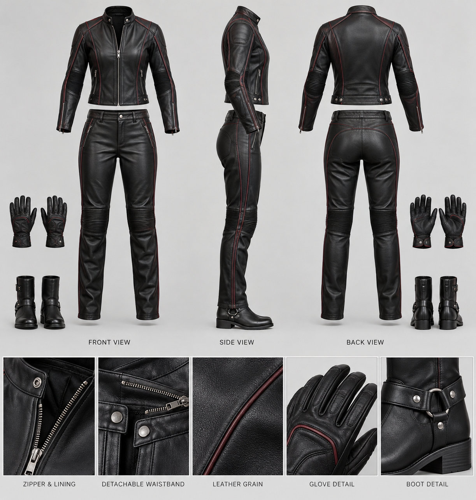
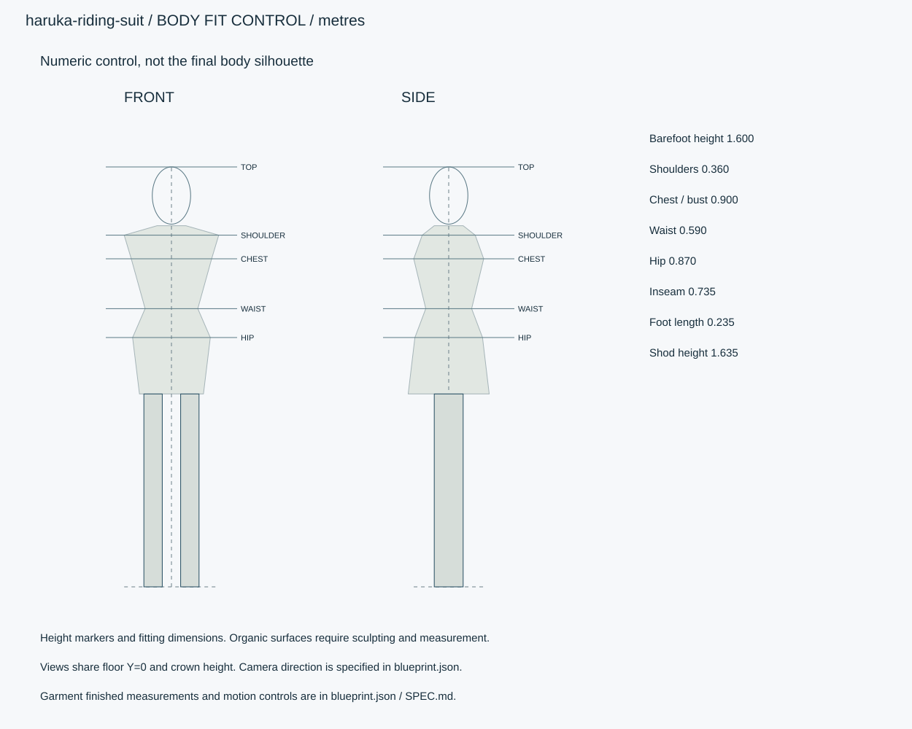
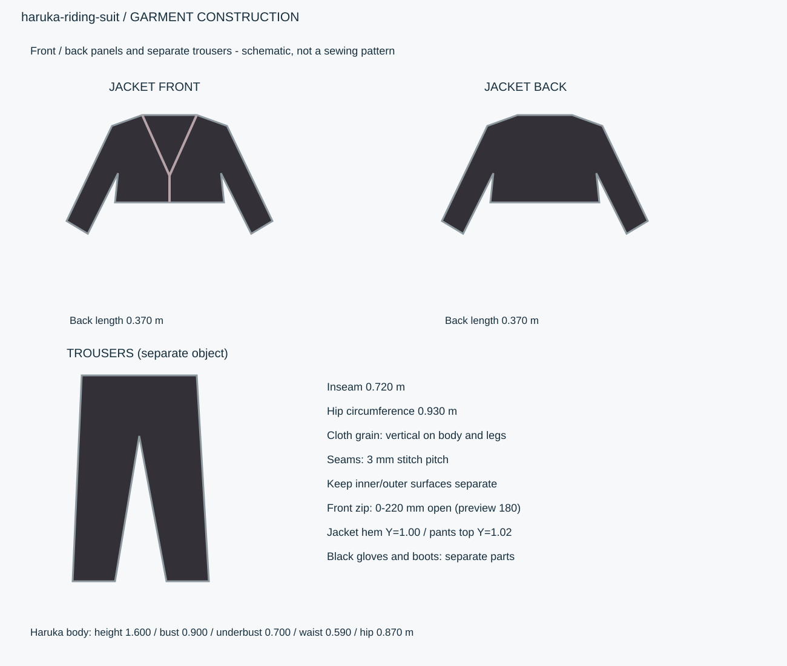

# 春香用・胸元開閉のセパレートライダース

春香の既存体型に合わせる着替え用衣装。黒革の上下分離型、胸元ファスナー開閉、深紅パイピング、グローブとブーツ付き。

ID `haruka-riding-suit` / category `character-outfit` / kind `wearable` / 設計レビュー



参考画像は外観資料です。数値仕様を制作基準とし、画像を生成済み3Dモデルの証拠として扱いません。





## 身体寸法

```json
{
  "origin": "地面・床面の平面中心。女性は裸足の両足接地中央。",
  "axis": "右手系: +X東/画面右、+Y上、+Z南/正面。北=-Z。人物の解剖学的右は-X。",
  "priority": "数値JSON > 寸法SVG > 仕様書 > 参考画像",
  "barefoot_height_m": 1.6,
  "shoe_sole_m": 0.035,
  "standing_shod_height_m": 1.635,
  "age": 23,
  "body_circumferences_m": {
    "bust": 0.9,
    "underbust": 0.7,
    "waist": 0.59,
    "hip": 0.87
  },
  "shoulder_width_m": 0.36,
  "inseam_m": 0.735,
  "foot_length_m": 0.235,
  "head_height_m": 0.218,
  "hair_length_m": 0.66
}
```

## 既存モデルへの適合

```json
{
  "base_character": "../05-woman/blueprint.json",
  "base_id": "woman",
  "included": "衣服・手袋・ブーツ。春香の身体は05-womanを参照し、別人物として複製しない。参考画像は衣装単体。",
  "body_morph_policy": "B90/UB70/W59/H87cm、身長160cmを保持。衣服に合わせて胸や腰を縮小しない。",
  "bind": "春香のレスト骨格と同じ名前・姿勢へバインドし、原点/スケールを一致。身体と同一メッシュへ結合しない。",
  "layers": "元ワンピースとスニーカーを外し、この衣装セットを有効化。インナーを含む。",
  "hair_variant": "低いポニーテール",
  "hair_note": "既存の顔・髪色・髪総長を保持した着用用束ね方。元のロングヘアは上書きしない。"
}
```

## 衣装の完成寸法・構造

```json
[
  {
    "id": "jacket",
    "name": "セパレート革ジャケット",
    "material": "leather",
    "finished_measurements_m": {
      "back_length": 0.37,
      "bust_circumference": 0.96,
      "waist_circumference": 0.65,
      "shoulder_width": 0.385,
      "sleeve_length": 0.55,
      "leather_thickness": 0.0011
    },
    "construction": "左右前身頃は胸ダーツ/曲面パネル。背身頃と袖を分離、肘にストレッチパネル。上下を縫合しない。ウエスト隠し連結ファスナーは着脱式。",
    "deformation": "skinned_with_secondary_cloth"
  },
  {
    "id": "pants",
    "name": "ハイウエスト革パンツ",
    "material": "leather",
    "finished_measurements_m": {
      "waist_circumference": 0.63,
      "hip_circumference": 0.93,
      "inseam": 0.72,
      "knee_circumference": 0.39,
      "hem_circumference": 0.28,
      "leather_thickness": 0.0011
    },
    "construction": "股下マチ、膝前曲げダーツ、膝裏ストレッチ、左脇開閉。腰高はY1.02m。",
    "deformation": "skinned_with_correctives"
  },
  {
    "id": "support",
    "name": "内蔵支持ライニング",
    "material": "lining",
    "finished_measurements_m": {
      "underbust_circumference": 0.7,
      "band_width": 0.035,
      "thickness": 0.0008
    },
    "construction": "不透明な左右カップと下縁バンドを内蔵、胸開口の内側に収める。ファスナーが開いてもカップを保持。",
    "deformation": "skinned"
  },
  {
    "id": "gloves",
    "name": "左右グローブ",
    "material": "leather",
    "finished_measurements_m": {
      "palm_length": 0.085,
      "middle_finger_length": 0.073,
      "cuff_length": 0.045,
      "thickness": 0.0008
    },
    "construction": "5指を分離、指関節の折り、掌の薄い補強。",
    "deformation": "skinned"
  },
  {
    "id": "boots",
    "name": "左右ショートブーツ",
    "material": "leather",
    "finished_measurements_m": {
      "internal_length": 0.247,
      "shaft_height": 0.2,
      "sole_height": 0.035,
      "upper_thickness": 0.0015
    },
    "construction": "踵カウンター、内側ファスナー、足首パッド、屈曲部。",
    "deformation": "skinned"
  }
]
```

## 開閉・着用仕様

```json
{
  "front_zip_track_length_m": 0.42,
  "zip_path": "胸前面の曲面上を襟元から裾へ。胸部体積に沿った曲線。",
  "open_from_top_m": [
    0,
    0.22
  ],
  "preview_open_m": 0.18,
  "max_opening_width_m": 0.12,
  "coverage": "胸元にV字の開きを作り、左右の胸と下縁は支持ライニングと革身頃で覆う。開口を広げるために身体を削らない。",
  "separation": "ジャケット裾Y1.00m、パンツ上端Y1.02mで20mm重なり。正面と背面に独立した裾/腰帯の境界を出す。",
  "waist_connector": "内側の着脱ファスナーで上下を任意接続。上衣と下衣のメッシュは常に別。",
  "helmet_included": false,
  "back_neck_height_m": 1.37
}
```

## 微細構造

- 春香の顔・身長・身体円周を変えずにフィットを取る。
- 参考画像は衣装単体の製品図。春香との組合せは数値適合仕様に従い、モデル制作時に確認する。
- 構成部は外表面・裏面・縫い代・留具を分離。縫合3mmピッチ、縁のベベル0.3–0.8mm。
- ライダースは衣装意匠モデル。現物の保護性能や認証を仕様に含めない。
- 製品画像の上下間の空白は分離を示す展示用の間隔。着用時は仕様通り20mm重ね、露出した腰の隙間を生成しない。

## PBR材質

|ID|色 sRGB|粗さ|金属度|微細構造|
|---|---|---|---|---|
|leather|#242225|[0.3, 0.48]|0|黒革、細かいしぼ0.4mm、肘と股の曲げしわ。濡れたラテックスの光沢にしない。|
|lining|#302D31|[0.65, 0.8]|0|内蔵支持部と裏地。不透明。|
|stretch|#2B2B2D|[0.7, 0.9]|0|肘内側・膝裏・股下。局所伸長率の上限1.12、革面へ適用しない。|
|piping|#6B2637|[0.35, 0.55]|0|深紅パイピング径3mm。|
|metal|#A3A5A7|[0.22, 0.4]|1|ファスナー歯ピッチ4mm、引手25×8mm。|
|rubber|#292C2E|[0.7, 0.85]|0|ブーツ底、溝深2.5mm。|
|inner|#ECE9E0|[0.65, 0.85]|0|不透明な白/生成りインナー。外衣の配色とは独立。|

## リグ・関節・ウェイト

```json
{
  "basis": "../05-woman/blueprint.json のrigを継承",
  "ik_fk": "腕・脚IK/FK切替、足接地IK、膝肘ポール、手首補正、鎖骨追従。",
  "weights": "最大4影響を初期目標。肩・脇・股関節・肘・膝は手動相当の補正工程と姿勢別変形検証必須。距離ウェイトだけで完了にしない。",
  "extra_bones": [
    "zipper-front",
    "waist-tab.L",
    "waist-tab.R"
  ],
  "body_included": false,
  "pose_corrections": "肩挙上、肘曲げ、股屈曲、膝曲げの衣服補正morphを追加。胸支持の補助ボーンと布コライダーを共有。"
}
```

## 服・胸部・髪の物理

```json
{
  "common": {
    "execution": "ランタイムで継続する物理演算。GLB単体では再現不可。",
    "fixed_step_s": 0.016666666666666666,
    "substeps": 4,
    "gravity_m_s2": [
      0,
      -9.81,
      0
    ],
    "initial_settle_s": 2,
    "collision_margin_m": 0.004,
    "penetration_tolerance": "通常動作の可視貫通0。計測最大2mm未満かつ2フレーム以内。基準超過時は設定または形状を修正。"
  },
  "clothing": {
    "method": "衣装別の低解像度クロス3000–5000頂点と補助ボーンを表示へ転送。革の主身頃はスキン主体、開いた襟と遊び部に限定して物理を加える。",
    "areal_density_kg_m2": 0.75,
    "stretch_ratio_max": 1.02,
    "bend_radius_min_m": 0.005,
    "pin": "襟後ろ・肩・袖付け80–100%、腰ベルト100%、ファスナー結合部100%。胸開口の縁は裏打ち付きで保持。",
    "collision": "身体の胸・腹・骨盤・大腿・腕の追従コライダー。自己衝突ON。靴と裾の接近時も検証。",
    "range": "革の遊び部40mm、胸開口はgarment_controlsの上限で拘束。"
  },
  "breast": {
    "method": "左右独立のばね質点/補助ボーン動力学。胸郭ローカルで求解し布側コライダーへ反映。",
    "effective_mass_kg": 0.35,
    "stiffness_n_m": 260,
    "damping_n_s_m": 15,
    "max_translation_m": [
      0.003,
      0.004,
      0.003
    ],
    "max_rotation_deg": 2,
    "collision": "胸郭へのめり込み制限、左右相互衝突、衣服は追従コライダーに衝突。基準姿勢を拘束中心とする。",
    "note": "衣装の内側支持を反映。既存身体を縮小せず、元のワンピース用物理値とは衣装プリセットを分ける。"
  },
  "hair": {
    "method": "結び根元は固定、ポニーテール/編み込みを6–8節の代理チェーンで求解。元の髪長を保持。",
    "root_pin": 1,
    "max_segment_angle_deg": 25,
    "max_tip_displacement_m": 0.12,
    "collision": "頭・肩・胸・背中のカプセル。髪は服の外側4mmの代理面と衝突。",
    "damping_ratio": 0.8
  },
  "solve_order": [
    "身体アニメーションとIK",
    "胸の動力学",
    "胸コライダー更新",
    "服クロス",
    "髪動力学",
    "表示メッシュ更新"
  ]
}
```

## 可動確認クリップ

```json
[
  {
    "id": "idle",
    "duration_s": 4,
    "loop": true,
    "description": "呼吸、瞬き、視線"
  },
  {
    "id": "walk",
    "duration_s": 1.2,
    "loop": true,
    "description": "左右足接地、1周期の移動1.1m、腕振り"
  },
  {
    "id": "turn",
    "duration_s": 2,
    "loop": false,
    "description": "180度方向転換"
  },
  {
    "id": "sit",
    "duration_s": 3,
    "loop": false,
    "description": "座面高0.43mへ着座。靴底の高さを接地IKに含める。"
  },
  {
    "id": "physics-settle",
    "duration_s": 6,
    "loop": false,
    "description": "静止2秒、歩行2秒、停止2秒。服/胸部/髪のON/OFF比較"
  },
  {
    "id": "device",
    "duration_s": 8,
    "loop": false,
    "description": "スマホ操作、書類を持つ、鞄を持ち替える。"
  },
  {
    "id": "zip-open-close",
    "duration_s": 6,
    "loop": false,
    "description": "閉→標準180mm開→最大220mm開→閉。襟と支持部の被覆を確認。"
  },
  {
    "id": "riding-pose",
    "duration_s": 6,
    "loop": false,
    "description": "仮シート高0.76m、前傾30度、肘曲げ60度、膝100度。肘/膝/股下を確認。バイク本体は含めない。"
  }
]
```

## 撮影方向

```json
{
  "front": "+Zから-Z。正投影、頭頂と足底の高さを揃える。",
  "side": "衣装単体の-Xから+Xの側面、画面右が正面+Z。寸法制御図は左右対称の断面基準。",
  "back": "-Zから+Z。同じ立位。",
  "three_quarter": "正面斜めの立位、全身。",
  "details": "顔、縫合、留具、手、靴/裸足。服単独では型紙と支持構造も。"
}
```

## 納品・品質予算

```json
{
  "engine": "Unity / HDRP を主想定。バージョンはモデル実装時に固定。",
  "exports": [
    "BLEND（衣装形状・春香リグへのバインド・衣装別物理、実装時に制作）",
    "GLB（形状・PBR・ベイクした骨アニメ）",
    "Unity用物理設定",
    "検証PNGとMP4"
  ],
  "triangles_lod0_max": 60000,
  "texture_resolution_max": 4096,
  "texture_policy": "共有材2K、主役・顔4K。BaseColor=sRGB、Normal/Roughness/Metallic=linear。AOをBaseColorへ焼き込まない。",
  "texel_density_px_per_m": 2048,
  "lod_ratios": [
    1,
    0.5,
    0.2,
    0.08
  ],
  "triangles_by_part": {
    "jacket": 20000,
    "pants": 18000,
    "gloves_boots": 17000,
    "hardware_lining": 5000
  },
  "texture_resident_budget_mib": 96
}
```

## 管理情報

```json
{
  "tags": [
    "春香",
    "着替え",
    "写実",
    "ライダース",
    "上下分離"
  ],
  "usage": "PC向けリアルタイム探索・映像用のモデル設計",
  "license": "独自制作物として管理。現段階は私有・配布許諾未設定。販売用ライセンスは公開時に別途設定。",
  "approval": "モデル未生成・販売未承認",
  "description": "春香の既存体型に合わせる着替え用衣装。黒革の上下分離型、胸元ファスナー開閉、深紅パイピング、グローブとブーツ付き。"
}
```

## 検証状態

```json
{
  "rig": {
    "status": "not_verified",
    "evidence": []
  },
  "clothing": {
    "status": "not_verified",
    "evidence": []
  },
  "breast": {
    "status": "not_verified",
    "evidence": []
  },
  "hair": {
    "status": "not_verified",
    "evidence": []
  }
}
```

## 実装差分

- リアルタイムクロス・胸・髪物理、IK/FK制御、顔morph、SSS・異方性を追加実装する。
- ClothDrapeは静止形状を凍結するだけ。物理実装済みの根拠として扱わない。
- GLBの骨アニメに物理結果をベイクする場合も、編集可能な物理設定と検証動画を別納品。
- 身体の制作済みリグはまだないため、着用適合は数値設計のみ。実装時に再検証する。
- 独自設計JSONでありpromodelerのrecipeではない。

## モデル制作後の確認

- [ ] 既存春香の身体寸法と骨名を保持。衣装交換時に身体を重複表示しない。
- [ ] 黒帯/セパレート構造など指定した意匠を全方向で確認。
- [ ] 通常動作で可視貫通0、計測2mm未満かつ2フレーム以内。
- [ ] 物理と補正morphのON/OFF、動作停止後の収束を録画。
- [ ] 人体のrig、服、胸、髪のチェックは親モデル依存も含め未検証。
